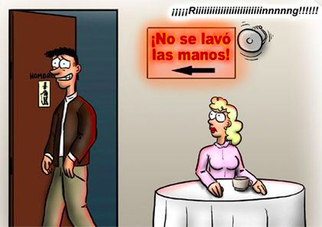
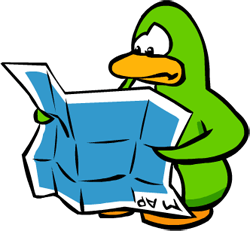
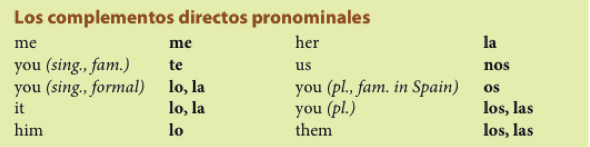
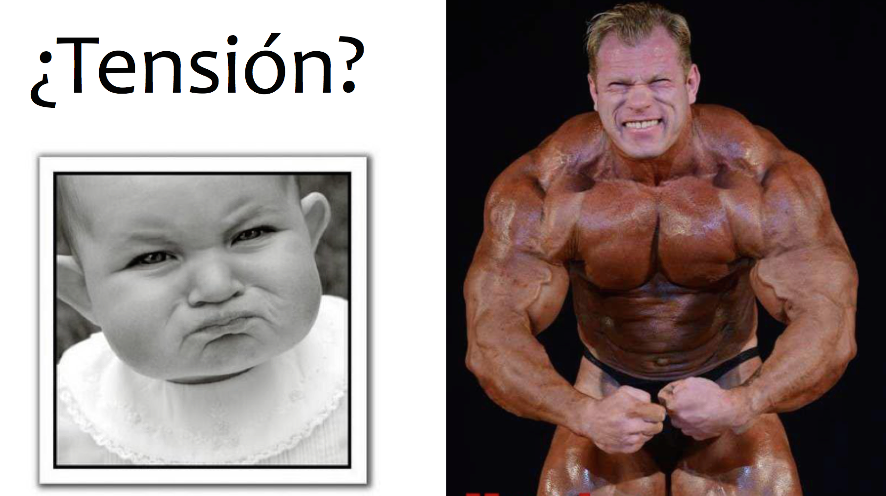
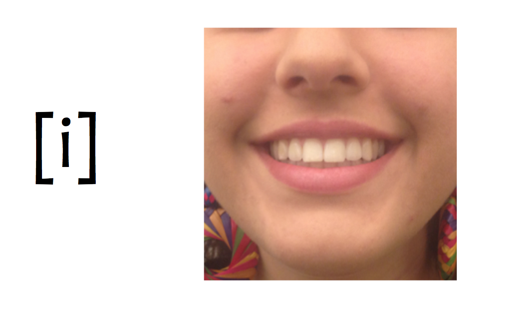
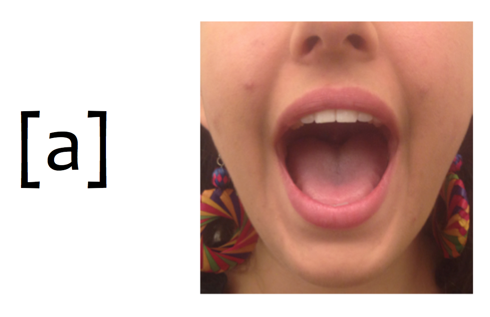
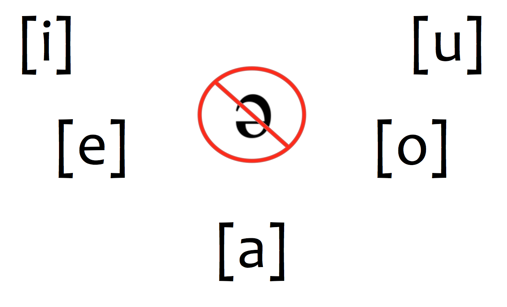
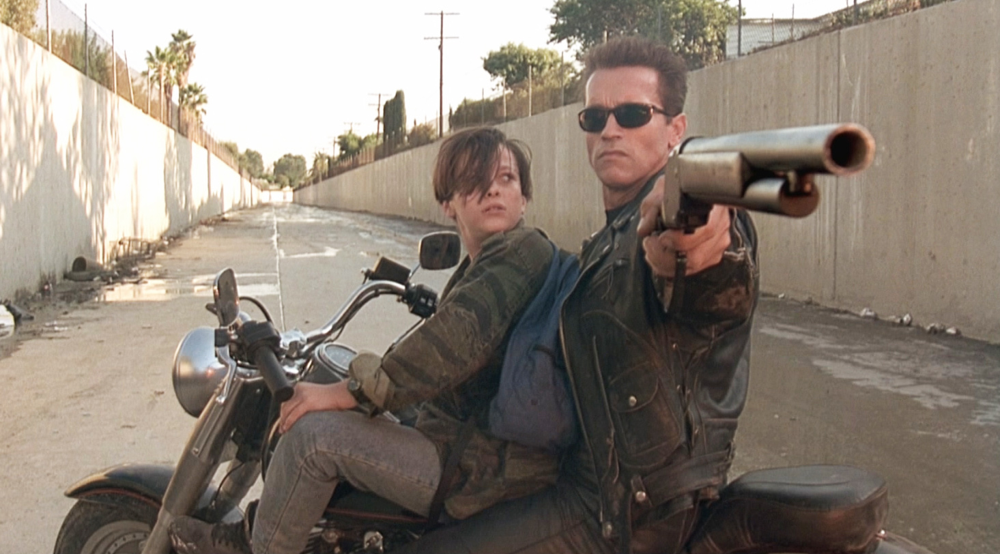

## Vocabulario

- El hotel/los viajes
- Más números
- La familia
- Más descripción
- La casa/los muebles
- La rutina

---

## Gramática

- Los verbos irregulares
- Los adjetivos comparativos
- Ser y estar
- Los verbos reflexivos

--- &twocol

## Gramática

*** {name: left}

- Los verbos irregulares
	- e > ie
	- e > i
	- o > ue
	- u > ue
	- verbos -go
- Los adjetivos comparativos
	- inferioridad
	- superioridad
	- igualdad
	- superlativo

*** {name: right}

- Ser y estar
- Los verbos reflexivos
	- los pronombres reflexivos

---

## Los reflexivos

  

---

## Los reflexivos

  

---

## Los reflexivos

  

---

## El señor Bean

  <video width="420" height="315" allowfullscreen controls>
    <source src="./assets/videos/beanReflexive.mp4" type="video/mp4">
    <source src="./assets/videos/beanReflexive.ogg" type="video/ogg">
  </video>

---

## Con un compañero

> - Explicad la rutina diaria del Señor Bean
- Escoged una persona famosa y describid su rutina cotidiana

--- .segue bg:grey

# Capítulo 4: “¡Buen provecho!”

---

## El plan

  

- Vocabulario:
	- Las comidas
- Gramática:
	- El participio pasado 
	- Complemento directo
- Como preparar una presentación con elementos visuales

---

## El desayuno: ¿Qué te gusta desayunar?

<iframe width="420" height="315" src="https://www.youtube.com/embed/SilOmnTK-z8" frameborder="0" allowfullscreen></iframe>

<!-- pregunta qué les gusta desayunar -->

---

## El desayuno: ¿Qué te gusta desayunar?

  

---

## El almuerzo: ¿Qué almuerzas?

  

<!-- preguntar al compa;ero lo que suele almorzar -->

---

## La merienda: ¿Qué meriendas?

  

<!-- que es una merienda? -->

---

## La cena: ¿Qué prefieres cenar?

  

---

## ¿A qué no puedes adivinar?

En grupos de tres...

- Cread (individualmente) una lista de 5 comidas (desayuno, almuerzo, merienda, cena)
- En turnos, describid una de las comidas de tu lista para que vuestros compañeros la adivnen

Ejemplo:

- **Tú**: Es un plato de huevos y queso
- <BLUE>Compañero</BLUE>: ¡Es una tortilla!

Ejemplo:

- <BLUE>Compañero</BLUE>: Es algo que comemos por la mañana con mermelada o mantequilla.
- **Tú**: Es el pan tostado.

---

## En el restaurante: antes de pedir

  

<!-- track 2-4 -->

---

## Para pedir en un restaurante...

  

<!-- track 2-5 -->

---

## Después de comer: la cuenta

  

<!-- track 2-6 -->

---

## Los cubiertos

  

---

## Ejercicios

- En grupos de 3, describid la situación más buena/mala/divertida/rara/graciosa que habéis tenido en un restaurante
- Después de contar vuestras historias, escoged una y haced un mini diálogo para compartir con la clase.

> - Actividad 4-6, p. 135

<audio controls>
  <source src="../../libraries/assets/audio/disco2/7.ogg" type="audio/ogg">
  <source src="../../libraries/assets/audio/disco2/7.aiff" type="audio/mpeg">
Your browser does not support the audio element.
</audio>

<!-- track 2-7 -->

--- .segue bg:grey

# Descanso (10 minutos)

  

--- .segue bg:grey

# El participio pasado

---

## El participio pasado

> - Podemos formar **adjetivos** a partir de cualquier verbo

> - Hay una forma para los verbos -ar (-**ado**)

> - Hay otra forma para los verbos -er/-ir (-**ido**)

---

## El participio pasado

> - quitar la terminación 
    - hablar > habl
    - comer > com 
    - dormir > dorm

> - añadir -ado/-ido 
	- habl + ado = habl**ado**
	- com + ido = com**ido**
	- dorm + ido = dorm**ido**

---

## El participio pasado

- El participio pasado funciona bien con los verbos **ser** y **estar** y también después de un sustantivo

	- El trabajo *está* **terminado**

	- El español *es* **hablado** por muchas personas

	- El bicho **aplastado** en el piso *estaba* **muerto**

---

## El participio pasado

**Ojo**: 

> - ¡No te confundas con el gerundio!
> - Hay formas irregulares
    - <blue>hacer</blue> > **hecho**
    - <blue>escribir</blue> > **escrito**
    - <blue>abrir</blue> > **abierto**
    - <blue>decir</blue> > **dicho**
    - <blue>poner</blue> > **puesto**
    - <blue>morir</blue> > **muerto**
    - <blue>romper</blue> > **roto**
    - <blue>ver</blue> > **visto**
    - <blue>volver</blue> > **vuelto**

---

## Ejercicios

- Con tu compañero, escribid 4 oraciones que describan Middlebury usando el participio pasado (2 con ser y 2 con estar).

--- .segue bg:grey

# Los complementos directos

---

## Los complementos directos reciben la acción del verbo

   
 

> - Voy a probar **el flan**.
> - ¿Qué voy a probar? **El flan**.

 

> - Veo a **nuestro camarero**.
> - ¿A quién veo? A **nuestro camarero**.

---

## Para evitar la repitición: los pronombres de complementos directos

   
 

> - Voy a probar **el flan**.
> - **Lo** como con frecuencia.

 

> - Veo a **nuestro camarero**.
> - **Lo** veo enfrente del restaurante.

---

## Los complementos directos

Los complementos directos requieren la concordancia de número y género. 

<!-- 

  

 -->

|   Persona   |  Singular  |    Plural    |
| :---------- | :--------- | :----------- |
| 1a          | **me**     | **nos**      |
| 2a          | **te**     | **os**       |
| 3a          | **lo, la** | **los, las** |
| sustantivos | **lo, la** | **los, las** |

> - ¿Cómo quieres **el café**?
> - **Lo** tomo con azúcar.
> - ¿Tienes **las galletas**?
> - Sí, **las** tengo.
> - ¿Tú **me** ves?
> - Sí, yo **te** veo. 

---

## Los complementos directos

**La posición de los complementos directos pronominales depende de la forma verbal.**

> - Con un verbo conjugado
	- ¿Necesitas **el menú**?
	- No, no **lo** necesito.

> - Con un verbo conjugado y un infinitivo 
	- ¿Vas a servir **la torta** ahora?
	- No, **la** voy a servir un poco más tarde.
	- No, voy a servir**la** un poco más tarde.

---

## Ejercicios

- Actividad 4-11, p. 138
- Actividad 4-12, p. 138

--- .segue bg:grey

# Repaso

---

## Repaso

- Vocabulario:
	- Las comidas
- Gramática:
	- El participio pasado 
	- Complemento directo
- Como preparar una presentación con elementos visuales

---

## TAREA

- Pensar en tu lugar favorito **de Middlebury**
- Participio pasado
	- Descripción gramatical: p. 338-339
	- [Ejercicio de práctica](http://conjuguemos.com/activity.php?id=23&source=public&language=spanish&type=fillin)
	- Ejercicio de práctica: GS3-1, p. 339
- Complemento Directo
	- Actividad 4-11, p. 138
	- Actividad 4-12, p. 138

---

## El plan

  

**Repasar** 

- Mi lugar preferido
- Los complementos directos
- Los complementos indirectos
- El participio pasado

<!-- - Evaluación del programa -->

---

## Mi lugar preferido

### Tenéis que... 

> - escoger vuestro lugar favorito/preferido del campus
> - preparar una presentación de 2 minutos (¡máximo!)
> - describir el lugar
> - explicar por qué os gusta

### Pistas para la descripción

> - Usad las estructuras que hemos visto en clase
> - Exterior al interior, concreto al abstracto 
> - Ensayad en casa (¡con grabaciones!)

---

## En grupos de 3

- Describid la situación más buena/mala/divertida/rara/graciosa que habéis tenido en un restaurante
- Después de contar vuestras historias, escoged una y haced un mini diálogo para compartir con la clase

> - Actividad 4-12, p. 138

---

## Las vocales del inglés

  

---

## Las vocales del español

  

---

## Las vocales del español

  

> - **Son cortas**
> - **Requieren MÁS tensión articulatoria**

---

  

---

## Las vocales del español

  

---

## Las vocales del español

  

---

## Las vocales del español

  

---

## Las vocales del español

  

---

## Las vocales del español

  

---

## Hay que evitar la schwa

  

---
## ¿Qué ves?

  
  
  

---

## ¿Qué comes?

  
  

---

## ¿Qué ves?

  
  
  

---

## ¿Qué ves?

  
  

---

## Los complementos directos (repaso)

<!-- 

  

 -->

|   Persona   |  Singular  |    Plural    |
| :---------- | :--------- | :----------- |
| 1a          | **me**     | **nos**      |
| 2a          | **te**     | **os**       |
| 3a          | **lo, la** | **los, las** |
| sustantivos | **lo, la** | **los, las** |

 

> - ¿Cómo quieres **el café**?
> - **Lo** tomo con azúcar.
> - ¿Tienes **las galletas**?
> - Sí, **las** tengo.

> - [jeopardy](http://www.superteachertools.com/jeopardy/usergames/May201021/game1274920385.php)

--- .segue bg:grey

# Descanso (10 minutos)

  

--- .segue bg:grey

# Los complementos indirectos

---

## Los complementos indirectos expresan ¿a quién? o ¿para quién?

Siempre **les** sirvo *vino* **a mis invitados**.

> - ¿Qué sirvo? 
> -  *El vino* (el complemento directo)

> - ¿A quién sirvo? 
> - **A mis invitados** (el complemento indirecto)

---

## Los complementos indirectos

<!-- 

  

 -->

|                           |        |                       |              |
| :------------------------ | :----- | :-------------------- | :----------- |
| to/for me                 | **me** | to/for us             | **nos**      |
| to/for you (sing. fam.)   | **te** | to/for you (pl. fam.) | **os**       |
| to/for you (sing. formal) | **le** | to/for you (pl.)      | **les**      |
| to/for him or her         | **le** | to/for them           | **les**      |

 

- ¿**Me** puede traer una cuchara?

- Siempre **les** preparo las galletas.

---

## La posición de los complementos indirectos pronominales depende de la forma verbal

> - Con un verbo conjugado
	- ¿Cuánto **le** debo?

 

> - Con un verbo conjugado y un infinitivo
	- ¿**Me** puede traer un tenedor?
	- ¿Puede traer**me** un tenedor?

---

## La duplicación de los complementos indirectos y los pronominales evita confusión

el complemento indirecto = un sustantivo  

- Siempre **le** sirvo platos vegetarianos **a María**.

 

- **Les** voy a servir corvina **a mis invitados**.

---

## Dos complementos: directo e indirecto

| **CD** | singular |  plural  |
| :----- | :------- | :------- |
| 1a     | me       | nos      |
| 2a     | te       | os       |
| 3a     | lo, la   | los, las |

 

| **CI** | singular | plural |
| :----- | :------- | :----- |
| 1a     | me       | nos    |
| 2a     | te       | os     |
| 3a     | le       | les    |

---

## Dos complementos: directo e indirecto

> - Mami, ¿**me** haces *unas galletas*?

> - Sí, **te** ***las*** hago esta tarde.

---

## Dos complementos: directo e indirecto

> - Mami, ¿**me** haces *unas galletas*?
	- ¿Qué haces?  unas galletas (el complemento directo)
	- ¿A quién sirvo?   a mí (me) (el complemento indirecto)

> - Sí, **te** ***las*** hago esta tarde.
	- Te = para ti
	- las = las galletas

---

## Le y les cambian a se a veces

  

 

> - ¿Me puede traer un menú?
> - Ahora **se** lo traigo. 

---

## ¡Cálmate!

Tu amiga Sofía va a montar una fiesta para su novio. Ella está un poco preocupada con los preparativos y tú tienes que calmarla. Con un(a) compañero(a) de clase, seguid el modelo y completad los diálogos. ¡Ojo! Hay que usar participios pasados en las respuestas. 

- **Sofía**: ¿Quién va a **decorar** el pastel?
- **Tú**: ¡No te preocupes! El pastel ya *está* **decorado**. 

---

## ¡Cálmate!

**Sofía**: ¿Quién va a **decorar** el pastel?  
**Tú**: ¡No te preocupes! El pastel ya *está* **decorado**. 

> - ¿Por qué no **preparamos** los sándwiches ahora?
> - ¿Quién va a **poner** la mesa?
> - Ahora tenemos que **hacer** las camas.
> - ¿Cuándo vamos a **envolver** los regalos?
> - Debemos **abrir** las ventanas; hace calor hoy.
> - ¿Hay más platos sucios? Tenemos que **lavar**los antes de que lleguen los invitados. 

---

## El participio pasado (repaso)

> - quitar la terminación 
	- hablar > habl
	- comer > com 
	- dormir > dorm

> - añadir -ado/-ido 
	- habl + ado = habl**ado**
	- com + ido = com**ido**
	- dorm + ido = dorm**ido**

---

## El participio pasado (repaso)

**Ojo**: 

> - ¡No te confundas con el gerundio!
> - Hay formas irregulares
	- <blue>hacer</blue> = **hecho**
	- <blue>escribir</blue> = **escrito**
	- <blue>abrir</blue> = **abierto**
	- <blue>decir</blue> = **dicho**
	- <blue>poner</blue> = **puesto**
	- <blue>morir</blue> = **muerto**
	- <blue>romper</blue> = **roto**
	- <blue>ver</blue> = **visto**
	- <blue>volver</blue> = **vuelto**

---

## Ejercicios

- 4-21, p. 145

---

<!-- ## Evaluación del programa -->

--- .segue bg:grey

# Repaso

---

## Repaso

- El participio pasado
- Los complementos directos e indirectos

**Tarea**  

- Preparar presentación oral #2

