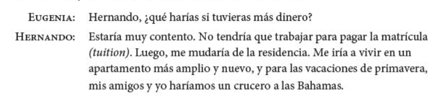

## El participio pasado (repaso)

> - quitar la terminación 
  - hablar > habl
  - comer > com 
  - dormir > dorm

 

> - añadir -ado/-ido 
  - habl + ado = habl**ado**
  - com + ido = com**ido**
  - dorm + ido = dorm**ido**

---

## El participio pasado (repaso)

**Ojo**: 

> - ¡No te confundas con el gerundio!
> - Hay formas irregulares
  - <blue>hacer</blue> = **hecho**
  - <blue>escribir</blue> = **escrito**
  - <blue>abrir</blue> = **abierto**
  - <blue>decir</blue> = **dicho**
  - <blue>poner</blue> = **puesto**
  - <blue>morir</blue> = **muerto**
  - <blue>romper</blue> = **roto**
  - <blue>ver</blue> = **visto**
  - <blue>volver</blue> = **vuelto**

---

## ¡Cálmate!

Tu amiga Sofía va a montar una fiesta para su novio. Ella está un poco preocupada con los preparativos y tú tienes que calmarla. Con un(a) compañero(a) de clase, seguid el modelo y completad los diálogos. ¡Ojo! Hay que usar participios pasados en las respuestas. 

- **Sofía**: ¿Quién va a **decorar** el pastel?
- **Tú**: ¡No te preocupes! El pastel ya *está* **decorado**. 

---

## ¡Cálmate!

**Sofía**: ¿Quién va a **decorar** el pastel?  
**Tú**: ¡No te preocupes! El pastel ya *está* **decorado**. 

> - ¿Por qué no **preparamos** los sándwiches ahora?
> - ¿Quién va a **poner** la mesa?
> - Ahora tenemos que **hacer** las camas.
> - ¿Cuándo vamos a **envolver** los regalos?
> - Debemos **abrir** las ventanas; hace calor hoy.
> - ¿Hay más platos sucios? Tenemos que **lavar**los antes de que lleguen los invitados. 

---

## ¿Notáis algo diferente?

> - **Diego**: ¿Has comprado el vino para la fiesta? 

> - **Ada**: Sí, y también he preparado las tapas. 

> - **Diego**: Y el postre, ¿has hecho algún postre especial? 

> - **Ada**: Sí, he preparado una torta de chocolate. 

> - **Diego**: Gracias, mi amor. Me encanta la torta de chocolate.

---

## El presente perfecto

Sirve para indicar cosas que **han pasado** y siguen siendo relevantes en el presente. 

<!-- 

  

 -->

- ¿Has comprado el vino para la fiesta?
- Sí, y también he preparado las tapas.

 

- ¿Qué han hecho ustedes hoy?
- Hemos trabajado mucho 

---

## El verbo haber

|     |          Singular          |              Plural               |
| :-- | :------------------------- | :-------------------------------- |
| 1a  | yo **he** trabajado        | nosotros **hemos** dormido        |
| 2a  | tú **has** comido          | vosotros **habéis** dormido       |
| 3a  | él/ella/usted **ha** visto | ellos/ellas/ustedes **han** hecho |

 

> - **haber** + participio pasado = el presente perfecto

> - **¡OJO!** ¡No se pronuncia la "h"!

> - **¡Recordad!** Algunos verbos son irregulares.

> - ¿Qué habéis hecho hoy? ¿Esta semana? ¿Este verano? ¿Este año?

---

## Nunca he hecho...

> - Empiezas con 5 puntos
> - Tienes que formar una frase usando el *presente perfecto*
> - Si los miembros de tu grupo han hecho lo que propones en tu frase, pierden puntos.
> - El objetivo es de NO PERDER PUNTOS
> - El último que se quede con puntos es el ganador

**Ej.**

> - Nunca **he sacado** una F en un examen.

--- .segue bg:grey

# Descanso (10 minutos)

  

---

## ¿Qué pasa?

  

 

*** {name: left}

> - El perro come *las pelotas de tenis*

*** {name: right}

> - *Las* come. 

--- &twocol

## ¿Qué pasa?

  

 

*** {name: left}

> - Bradford **le** da *una manzana* **a Lisa**.

*** {name: right}

> - **Se** *la* da.

--- &twocol

## ¿Qué pasa?

  

*** {name: left}

> - Jing **le** da *uvas* **a Kim**.

*** {name: right}

> - **Se** *las* da.

--- &twocol

## ¿Qué pasa?

  

*** {name: left}

> - El niño **le** va a regalar *una sorpresa* **a la niña**.

*** {name: right}

> - **Se** *la* va a regalar.  
> - Va a regalár**se***la*.

---

## ¿Qué pasa?

  

---

## ¿Qué pasa?

  

---

## Jeopardy

- [jeopardy](http://www.superteachertools.com/jeopardy/usergames/May201021/game1274920385.php)

---

## Los horarios

  

---

## Las carreras

  

---

## Las carreras

  
    

---

## Cómo pedir y dar opiniones sobre las clases

  

---

## Los profesores y las notas

    

  

---

## Dos verbos como gustar: interesar y encantar

- A Sara le gusta la clase de inglés. 

- Me encanta la clase de biología. 

- Nos interesan las ciencias. 

|     |            Singular            |              Plural              |
| :-- | :----------------------------- | :------------------------------- |
| 1a  | me encanta(n) / me interesa(n) | nos encanta(n) / nos interesa(n) |
| 2a  | te encanta(n) / te interesa(n) | os encanta(n) / os interesa(n)   |
| 3a  | le encanta(n) / le interesa(n) | les encanta(n) / les interesa(n) |

---

## Ejercicio

- 5-8, p. 164

---

## Como preparar una presentación con elementos visuales

> - Con un compañero, haz una lista de los elementos necesarios para hacer una buena presentación
> - Haz otra lista de las cosas que no te gusten en una presentación
> - ¿Qué sugerencias tenéis para mejorar las presentaciones orales?
> - ¿Es necesario utilizar elementos visuales? ¿Por qué?
> - ¿Cómo deben usarse?

--- .segue bg:grey

# Repaso

---

## Repaso

- Vocabulario
	- El horario
	- Pedir y dar opiniones 
	- Las profesiones

- Gramática 
	- El presente perfecto
	- Encantar, interesar
	- Estrategias para hablar dell futuro
- Como preparar una presentación con elementos visuales

--- 

## Tarea

- https://www.youtube.com/watch?v=iFUAWMMdE7c
- http://www.studyspanish.com/practice/presperfect.htm

---

## Dos verbos como gustar: interesar y encantar

- A Sara le gusta la clase de inglés. 

- Me encanta la clase de biología. 

- Nos interesan las ciencias. 

|     |            Singular            |              Plural              |
| :-- | :----------------------------- | :------------------------------- |
| 1a  | me encanta(n) / me interesa(n) | nos encanta(n) / nos interesa(n) |
| 2a  | te encanta(n) / te interesa(n) | os encanta(n) / os interesa(n)   |
| 3a  | le encanta(n) / le interesa(n) | les encanta(n) / les interesa(n) |

---

## Con un compañero...

- ¿Qué has hecho **hoy**/**esta semana**/**este mes**/**este año**?  

- 4 oraciones, podéis mentir

---

## El plan

  

- Vocabulario:
	- Hablar del futuro
	- Hablar del pasado
- Gramática:
	- Pretérito

---

## Los planes para el futuro

  

---

## Las profesiones y las ocupaciones

  

---

## Estrategias para hablar del futuro

  

 

> - 5-13, p. 167

---

## ¿Qué hiciste ayer?: el pasado

  

---

## ¿Qué hiciste ayer?: el pasado

  

---

## ¿Qué hiciste ayer?: el pasado

  

---

## El pretérito expresa el pasado con una referencia a un tiempo particular

> - Salí con unos compañeros de clase **anoche**.

> - **Ayer** fuimos a Dos Hermanos.

> - **La semana pasada** corrimos dos millas.

> - Me bañé en el mar **el año pasado**. 

---

## El pretérito

<!-- 

  

 -->
|                  |     tomar     |     volver     |     salir     |
| :--------------- | :------------ | :------------- | :------------ |
| yo               | tom**é**      | volv**í**      | sal**í**      |
| tú               | tom**aste**   | volv**iste**   | sal**iste**   |
| Ud./él/ella      | tom**ó**      | volv**ió**     | sal**ió**     |
| nosotros(as)     | tom**amos**   | volv**imos**   | sal**imos**   |
| vosotros(as)     | tom**asteis** | volv**isteis** | sal**isteis** |
| Uds./ellos/ellas | tom**aron**   | volv**ieron**  | sal**ieron**  |

---

**¡OJO!**

> -  Los verbos reflexivos requieren el pronombre reflexivo.
	- **Me desperté** a las ocho ayer.

> -  El verbo gustar solo usa dos formas en el pretérito.
	- **Me gustó** el concierto. No **me gustaron** esas dos películas.

---

## Cambios ortográficos en la forma yo

> - -car   (buscar, tocar, sacar) 
	- c > qu
	- toqué, tocaste, tocó, tocamos, tocasteis, tocaron
> - -gar   (llegar, jugar, pagar) 
	- g > gu
	- llegué, llegaste, llegó, llegamos, llegasteis, llegaron
> - -zar   (empezar, almorzar) 
	- z > c
	- empecé, empezaste, empezó, empezamos, empezasteis, empezaron

---

## Ejercicios

- 5-19, p. 172*
- 5-20, p. 172*

---

## Los verbos de –er y –ir con una vocal: Leer, creer y caerse

> - Leer
	- leí, leíste, le**y**ó, leímos, leísteis, le**y**eron
- Creer
	- creí, creíste, cre**y**ó, creímos, creísteis, cre**y**eron
- Caerse
	- me caí, te caíste, se ca**y**ó, nos caímos, os caísteis, se ca**y**eron

---

## Verbos con cambios en la raíz en el pretérito: 

**e > i; o > u**

<!-- 

  

 -->

|                  |       e > i        |     o > u     |
| :--------------- | :----------------- | :------------ |
|                  | **divertirse**     | **dormir**    |
| yo               | me divertí         | dormí         |
| tú               | te divertiste      | dormiste      |
| Ud./él/ella      | se div**i**rtieron | d**u**rmió    |
| nosotros(as)     | nos divertimos     | dormimos      |
| vosotros(as)     | os divertisteis    | dormisteis    |
| Uds./ellos/ellas | se div**i**rtieron | d**u**rmieron |

 

- ¡OJO!: Estos cambios sólo ocurren en la segunda y tercera persona (Ud., él, ella y Uds., ellos, ellas)

---  &multitext

## Prueba - CD/CI

1. Voy a buscar a mi perro.
2. Te doy las respuestas. 
3. Nos cuentas muchos chistes.
4. Pedro le dice la verdad a su madre.
5. La madre le pone las chanclas a su hijo.
6. Juan me va a regalar dos gatos. 

*** .explanation

1. Voy a buscarlo/Lo voy a buscar
2. Te las doy
3. Nos los cuentas
4. Se la dice
5. Se las pone
6. Me los va a ragalar/Va a regalármelos

--- .segue bg:grey

# Repaso - semana 3

---

## Gramática

> - El participio pasado
- El complemento directo
- El complemento indirecto
- El presente perfecto
- Verbos como gustar (encantar/interesar)
- Cómo hablar del futuro (usando el presente)
- El pretérito

---

## Vocabulario

> - Las comidas
- El mercado
- El horario
- Pedir y dar opiniones 
- Las profesiones

---

## El plan

  

 

- Vocabulario
    - hablar del pasado
- Gramática
    - el pretérito

---

## El pretérito expresa un momento particular en el pasado.

**Palabras importantes: ayer, anoche, la semana pasada**  

 

- Anoche miramos la televisión.
- Mi abuela me visitó hace dos semanas.

---

## El pretérito expresa un evento que ocurrió varias veces

**Palabras importantes: una vez, dos veces, varias veces**

 

- Fuimos a la piscina dos veces la semana pasada.

---

## El pretérito expresa cuánto tiempo duró un evento.

**Palabras importantes: por veinte minutos, por dos días**

 

- Arturo habló por teléfono por quince minutos.

---

## El pretérito resume una experiencia (al principio o al final de una historia)

 

- Ayer fue un día fantástico en la uni. Primero...

--- .segue bg:grey

# Descanso (10 minutos)

  

---

## Ejercicios

- 5-21, p. 174
- 5-23, p. 175

---

## Los verbos irregulares en el pretérito:

<!-- 

  

 -->

|                  |    ir    |   ser    |   dar   |   ver   |
| :--------------- | :------- | :------- | :------ | :------ |
| yo               | fui      | fui      | di      | vi      |
| tú               | fuiste   | fuiste   | diste   | viste   |
| Ud./él/ella      | fue      | fue      | dio     | vio     |
| nosotros(as)     | fuimos   | fuimos   | dimos   | vimos   |
| vosotros(as)     | fuisteis | fuisteis | disteis | visteis |
| Uds./ellos/ellas | fueron   | fueron   | dieron  | vieron  |

---

## Los verbos irregulares en el pretérito: los verbos con u en la raíz

<!-- 

  

 -->

|      estar      |     poder     |     poner     |     saber     |     tener     |
| :-------------- | :------------ | :------------ | :------------ | :------------ |
| estuv**e**      | pud**e**      | pus**e**      | sup**e**      | tuv**e**      |
| estuv**iste**   | pud**iste**   | pus**iste**   | sup**iste**   | tuv**iste**   |
| estuv**o**      | pud**o**      | pus**o**      | sup**o**      | tuv**o**      |
| estuv**imos**   | pud**imos**   | pus**imos**   | sup**imos**   | tuv**imos**   |
| estuv**isteis** | pud**isteis** | pus**isteis** | sup**isteis** | tuv**isteis** |
| estuv**ieron**  | pud**ieron**  | pus**ieron**  | sup**ieron**  | tuv**ieron**  |

---

## Los verbos irregulares en el pretérito: los verbos con i en la raíz

<!-- 

  

 -->

|     hacer     |     querer     |     venir     |
| :------------ | :------------- | :------------ |
| hic**e**      | quis**e**      | vin**e**      |
| hic**iste**   | quis**iste**   | vin**iste**   |
| hiz**o**      | quis**o**      | vin**o**      |
| hic**imos**   | quis**imos**   | vin**imos**   |
| hic**isteis** | quis**isteis** | vin**isteis** |
| hic**ieron**  | quis**ieron**  | vin**ieron**  |

---

## Los verbos irregulares en el pretérito: los verbos con j en la raíz

<!-- 

  

 -->

|     conducir     |     decir     |     traer      |
| :--------------- | :------------ | :------------- |
| conduj**e**      | dij**e**      | traj**e**      |
| condu**jiste**   | di**jiste**   | tra**jiste**   |
| condu**jo**      | di**jo**      | tra**jo**      |
| condu**jimos**   | di**jimos**   | tra**jimos**   |
| condu**jisteis** | di**jisteis** | tra**jisteis** |
| condu**jeron**   | di**jeron**   | tra**jeron**   |

---

## ¿Qué pasó?

  <video width="550" allowfullscreen controls>
    <source src="./assets/videos/maya.mp4" type="video/mp4">
    <source src="./assets/videos/maya.ogg" type="video/ogg">
  </video>

---

## Estrategias para aprender vocabulario

> - ¿Cómo sueles aprender vocabulario nuevo? ¿En qué situaciones? ¿Con quién sueles estar?
- ¿Qué haces para recordar el vocabulario nuevo que aprendes?
- ¿Qué sugerencias tienes para aprender y memorizar vocabulario nuevo (haz una lista)?
- ¿Cómo puedes mejorar tu estrategias?

--- &multitext

## Prueba - Pretérito y CD/CI (2)

Escoged un verbo (-ar, -er, -ir) y conjugadlo en el pretérito (todas las formas). Luego 
reescribid las siguientes oraciones usando pronombres de CD/CI.

1. Joseph quiere a Maya.
2. Nos dan la información. 
3. Os escribo una carta.
4. Les vamos a contar muchas mentiras.

*** .explanation

1. La quiere
2. Nos la dan
3. Os la escribo
4. Se las vamos a contar/Vamos a contárselas

---

## El plan

  

- Vocabulario:
    - Excursiones académicas
- Gramática:
    - Pretérito irregular 
    - Resumen de tiempos verbales
    - El condicional

--- &twocol

## El pretérito (irregulares)

*** {name: left}

- tener
- estar
- ir
- ser
- poner
- poder
- traer
- hacer

*** {name: right}

- haber
- saber
- querer
- decir
- venir
- ver
- dar

---

## El pretérito (irregulares)

<iframe width="560" height="315" src="https://www.youtube.com/embed/iFUAWMMdE7c" frameborder="0" allowfullscreen></iframe>

---

## El pretérito (irregulares)

  

<BLUE>tener</BLUE> es tuve, <BLUE>estar</BLUE> es estuve  
<BLUE>ir</BLUE> es fui, y tambien <BLUE>ser</BLUE>  
<BLUE>poner</BLUE> es puse, <BLUE>poder</BLUE> es pude  
traje es para <BLUE>traer</BLUE>  

<BLUE>hacer</BLUE> hice, <BLUE>haber</BLUE> hube  
<BLUE>saber</BLUE> supe, <BLUE>querer</BLUE> quise  
<BLUE>decir</BLUE> dije, <BLUE>venir</BLUE> vine  
<BLUE>ver</BLUE> vi, <BLUE>dar</BLUE> di  
sin acentos

<audio controls>
  <source src="../../libraries/assets/audio/pretIrreg.ogg" type="audio/ogg">
  <source src="../../libraries/assets/audio/pretIrreg.m4a" type="audio/mpeg">
Your browser does not support the audio element.
</audio>

---

## Hay verbos con significados particulares en el pretérito.

  

---

## Resumen - los tiempos verbales

Las conversaciones normalmente incluyen el presente, el pasado y el futuro.

  

---

## Resumen - los tiempos verbales

El futuro puede expresarse con verbos en el tiempo presente.

> - Ir + a + infinitivo
    - **Voy a estudiar** este fin de semana.
> - Expresiones del futuro
    - La próxima semana
    - el año que viene
> - Otros verbos que expresan el futuro
    - **Pienso vivir** en la residencia el próximo semestre.
    - **Espero trabajar** en un banco en el futuro. 

---

## Ejercicio

- 5-13, p. 167

---

## Resumen - los tiempos verbales

El tiempo presente expresa las costumbres de la vida diaria.

> - Palabras importantes: 
    - todos los días, frecuentemente, a menudo, a veces
- Todos los días estudio por dos o tres horas.

---

## Resumen - los tiempos verbales

En este capítulo, se usa **el pretérito** para expresar el pasado.  

> - UNA acción o evento que ocurrió UNA vez.
- una SERIE de acciones en el pasado.
- una acción que DURÓ un tiempo específico.
- UN EVENTO ESPECÍFICO en el pasado.

 

**Palabras asociadas al pretérito:**

> - ayer, la semana pasada, el año pasado, primero, luego
- antes de/después de + infinitivo, por último

---

## Ahora, identifiquen los tiempos verbales en esta conversación:

  

<!-- ## Ejercicios -->

<!-- - 5-21, p. 174 -->
<!-- - 5-23, p. 175 -->

--- .segue bg:grey

# Descanso (10 minutos)

  

---

## Ejercicios

<!-- - 5-29, p. 180 -->
<!-- - 5-33, p. 183 -->

> - 5-31, p. 180
> - 5-35, p. 183

---

## Cómo hablar de excursiones académicas

  

---

## Cómo hablar de excursiones académicas

  

---

## Cómo hablar de excursiones académicas

  

---

## Con un compañero

> - Describe una excursión que has hecho en el pasado
- Menciona...
    - adónde fuiste
    - qué hiciste
    - por qué fuiste
    - y cualquier otra cosa relevante
> - 5-25, p. 177

---

## Ejercicio

- 5-35, p. 183

---

## El condicional (p. 343)

> - La forma **condicional** se utiliza para hablar de acciones hipotéticas o posibles
- Leed el siguiente párrafo e identificad los verbos en la forma condicional

  

---

## El condicional (p. 343)

- La forma condicional describe lo que las personas ***harían*** o ***podrían*** hacer bajo ciertas circunstancias

  

---

## El condicional (p. 343)

- La forma condicional se usa para indicar cortesía, sobre todo con los verbos **gustar**, **poder** y **deber**.

  

---

## El condicional (p. 343)

- La forma condicional se usa para indicar **probabilidad** o **duda** en el pasado

  

---

## El condicional (p. 343)

|      forma       | terminación |      llegar     |      volver     |     vivir      |
| :--------------- | :---------- | :-------------- | :-------------- | :------------- |
| yo               | **ía**      | llegar**ía**    | volver**ía**    | vivir**ía**    |
| tú               | **ías**     | llegar**ías**   | volver**ías**   | vivir**ías**   |
| usted/él/ella    | **ía**      | llegar**ía**    | volver**ía**    | vivir**ía**    |
| nosotros         | **íamos**   | llegar**íamos** | volver**íamos** | vivir**íamos** |
| vosotros         | **íais**    | llegar**íais**  | volver**íais**  | vivir**íais**  |
| uds./ellos/ellas | **ían**     | llegar**ían**   | volver**ían**   | vivir**ían**   |

---

## Formas irregulares

| Verbo  | raíz irregular |       Ejemplos      |
| :----- | :------------- | :------------------ |
| decir  | dir-           | Yo diría            |
| hacer  | har-           | Tú harías           |
| tener  | tendr-         | Nosotros tendríamos |
| poner  | pondr-         | Vosotros pondríais  |
| venir  | vendr-         | Usteden vendrían    |
| salir  | saldr-         | Yo saldría          |
| saber  | sabr-          | Tú sabrás           |
| querer | querr-         | Ella querría        |
| poder  | podr-          | Él podría           |

---

## Ejercicio

- GS5-1, p. 344
- GS5-3, p. 345

