## Instrucciones para el examen oral 2

--- .segue bg:grey

# Repaso

---

## El pretérito (irregulares)

  

<BLUE>tener</BLUE> es tuve, <BLUE>estar</BLUE> estuve  
<BLUE>ir</BLUE> es fui, y tambien <BLUE>ser</BLUE>  
<BLUE>poner</BLUE> es puse, <BLUE>poder</BLUE> es pude  
traje es para <BLUE>traer</BLUE>  

<BLUE>hacer</BLUE> hice, <BLUE>haber</BLUE> hube  
<BLUE>saber</BLUE> supe, <BLUE>querer</BLUE> quise  
<BLUE>decir</BLUE> dije, <BLUE>venir</BLUE> vine  
<BLUE>ver</BLUE> vi, <BLUE>dar</BLUE> di  
sin acentos

<audio controls>
  <source src="../../libraries/assets/audio/pretIrreg.ogg" type="audio/ogg">
  <source src="../../libraries/assets/audio/pretIrreg.m4a" type="audio/mpeg">
Your browser does not support the audio element.
</audio>

---

## Cambios ortográficos en la forma yo

> - -car   (buscar, tocar, sacar) 
	- c > qu
	- **toqué**, tocaste, tocó, tocamos, tocasteis, tocaron
> - -gar   (llegar, jugar, pagar) 
	- g > gu
	- **llegué**, llegaste, llegó, llegamos, llegasteis, llegaron
> - -zar   (empezar, almorzar) 
	- z > c
	- **empecé**, empezaste, empezó, empezamos, empezasteis, empezaron

---

## Los verbos de –er y –ir con una vocal: Leer, creer y caerse

> - Leer
	- leí, leíste, le**y**ó, leímos, leísteis, le**y**eron
- Creer
	- creí, creíste, cre**y**ó, creímos, creísteis, cre**y**eron
- Caerse
	- me caí, te caíste, se ca**y**ó, nos caímos, os caísteis, se ca**y**eron

---

## Verbos con cambios en la raíz en el pretérito: 

|                  |       e > i        |     o > u     |
| :--------------- | :----------------- | :------------ |
|                  | **divertirse**     | **dormir**    |
| yo               | me divertí         | dormí         |
| tú               | te divertiste      | dormiste      |
| Ud./él/ella      | se div**i**rtieron | d**u**rmió    |
| nosotros(as)     | nos divertimos     | dormimos      |
| vosotros(as)     | os divertisteis    | dormisteis    |
| Uds./ellos/ellas | se div**i**rtieron | d**u**rmieron |

 

- ¡OJO!: Estos cambios sólo ocurren en la segunda y tercera persona (Ud., él, ella y Uds., ellos, ellas)

---

## ¿Qué harías si...

> - te tocara la lotería?
> - se te olvidara hacer la tarea?
> - tu mejor amigo/a te traicionara?
> - no supieras la respuesta en clase?
> - tu pelo fuera un lío caliente?

--- .segue bg:grey

# Capítulo 6 “De compras”

---

## Plan

  

- Vocabulario:
	- La ropa
	- Los pisos 
- Gramática:
	- Adjetivos
	- Más verbos como gustar
- Instrucciones Examen Oral 2

---

## Con un compañero...

- Haced una lista de la ropa que se suele llevar en las siguientes situaciones:
	- en una boda
	- en clase
	- en la misa
	- en la playa
	- en la primera cita
	- para dormir
	- en casa

---

## De compras en un gran almacén

<!-- actividad: ¿qué te pondrías si te fueras a la playa... etc. -->

  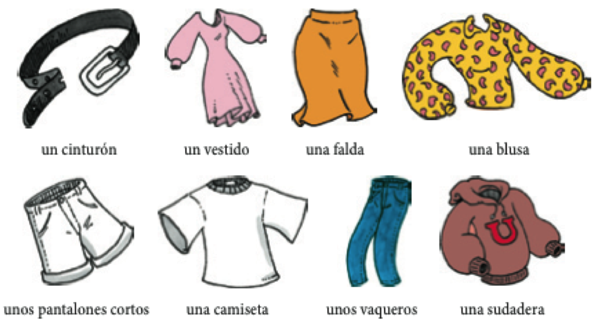
  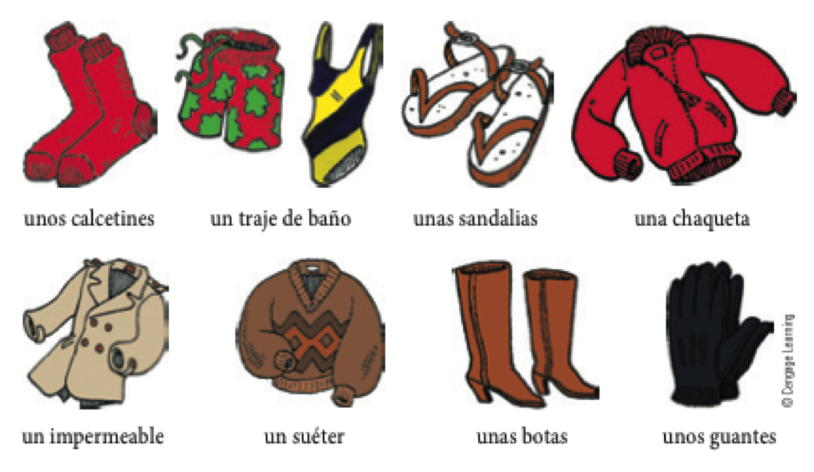  
  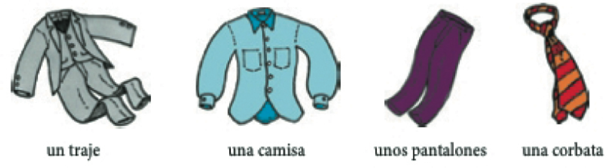

---
## Los colores y otros detalles de la ropa

  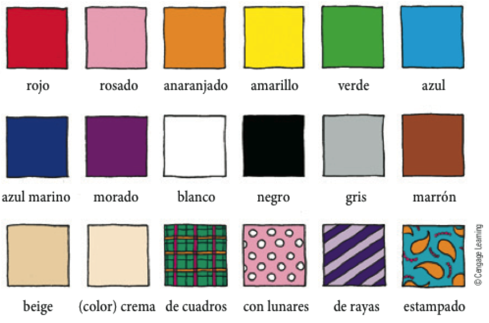

 

> - ¿Cuál es tu color favorito? 
- ¿Cuál es el color favorito de uno o dos de tus compañeros?
- ¿Cuál es el color que menos te gusta y por qué?

---

## Los colores son adjetivos

> - Se colocan después del sustantivo.
	- Me gustaría comprar un vestido **rosado**.

 

> - Comparten el número y género con el sustantivo.
	- Quiero unos calcetines **rojos**.
	- No quiero ninguna camiseta **roja**.
> - Ej. 6-2, p. 197

---

## Los adjetivos demostrativos

|   Género  |  Número  |       |      |          |
| :-------- | :------- | :---- | :--- | :------- |
| masculino | singular | este  | ese  | aquel    |
| masculino | plural   | estos | esos | aquellos |
| femenino  | singular | esta  | esa  | aquella  |
| femenino  | plural   | estas | esas | aquellas |

 

> - Se colcocan antes del sustantivo.
	- Prefiero **ese** vestido.
- Comparten el número y género con el sustantivo.
	- **Estas** chaquet**as** cuestan 20 dólares.

---

<!-- no terminamos esto ayer -->

## Con un compañero...

- Describe la ropa de algunas de las personas de la clase. Tu compañero/a tiene que adivinar a
quién describes. 

- Audio, 35, p. 200

<audio controls>
  <source src="../../libraries/assets/audio/disco2/35.ogg" type="audio/ogg">
  <source src="../../libraries/assets/audio/disco2/35.aiff" type="audio/mpeg">
Your browser does not support the audio element.
</audio>

---

## Encuesta (prueba)

<!-- <iframe src="https://PollEv.com/josephcasill735"></iframe> -->

<iframe src="https://www.polleverywhere.com/multiple_choice_polls/aTt9JFzxIrEg6PI"></iframe>

---

## ¿Dónde vive el/la compañero/a?

  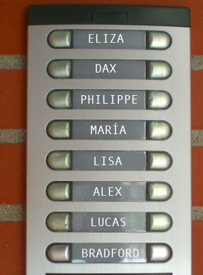

---

## Los pisos

<!-- incluir imagen de un edificio -->

  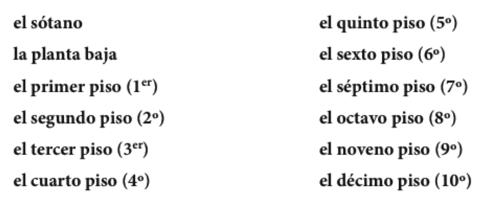

---

## Los números ordinales

> - Se colocan antes del sustantivo.
	- Austin vive en el **cuarto** piso.

 

> - Comparten el número y género con el sustantivo.
	- Prefiero la segund**a** fald**a**.
	- Trabajaríamos los **primeros** días

---

## Un repaso: el verbo gustar

> - El verbo gustar usa dos formas: **gusta y gustan**
> - Un complemento indirecto expresa **a quién** le gusta.  
(**me, te, le, nos, os, les**)

 

> - Me gusta la blusa.
> - A Sara le gustan las camisas. 

---

## Importar, faltar y quedar siguen el modelo de gustar.

> - Importar > importa / importan
	- A Marisa no le importa el precio.
> - Faltar > falta / faltan
	- Les falta un dólar.
> - Quedar > queda / quedan
	- No me quedan más suéteres azules

---

## El verbo parecer va acompañado de un adjetivo.

> - **Nos** *parecen* ***caros*** *esos pantalones*. 
	- Pantalones > masculino, plural
> - Me pareció divertid**a** la película.
	- la película > femenina, singular
> - ¿Qué te parece(n)...
	- el club de cocina?
	- las fiestas en el grill?
	- la comida de proctor?
	- los partidos de fútbol?

---

## El verbo quedar tiene otro significado para la ropa

> - Se usa con bien / mal.
	- Me quedan **bien** esos pantalones.
> - Se usa con los adjetivos para describir más.
	- Le quedan **un poco apretados** esos zapatos.

---

## Ejercicios

- 6-11, p. 203
- 6-12, p. 204

<!-- buscar actividad para trabajar verbos como gustar -->

---

## Plan

  

- Vocabulario:
	- Los recuerdos
	- La ropa
- Gramática:
	- palabras indefinidas negativas 
	- por y para
- Preparación Examen Oral 2: en parejas (capítulos 4, 5 y 6)

---

## Los recuerdos 

> - ¿Qué cosas se suelen comprar cuando se viaja?
> - ¿Qué es lo que (no) te gusta comprar cuando estás en el extranjero?

---

## Los recuerdos (p. 205)

  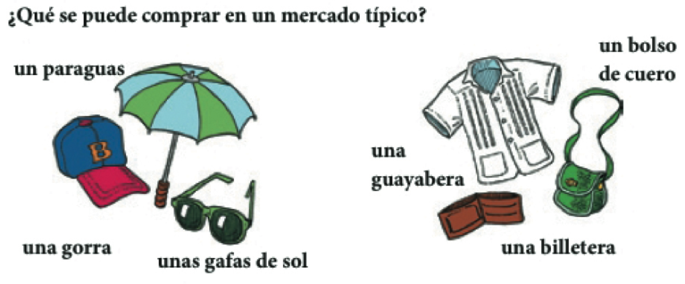
  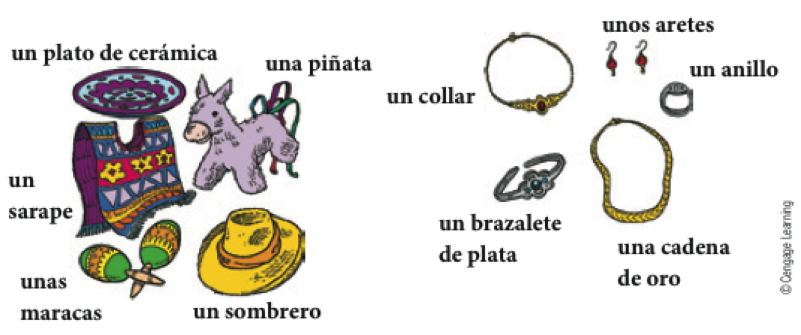  
  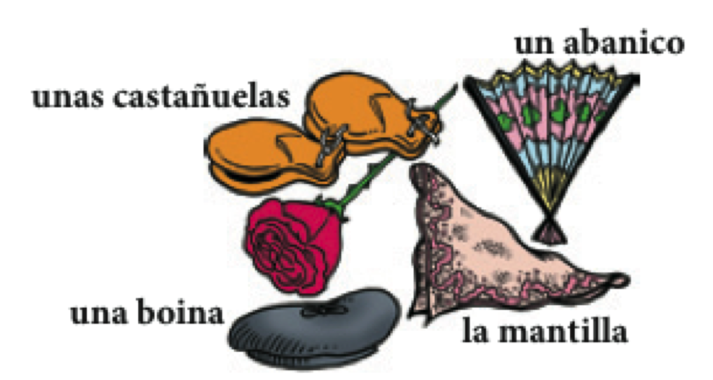
    

---

## Para regatear

  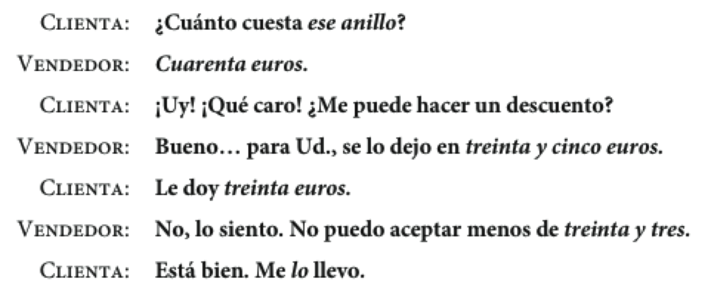

 

> - ¿Regateaste el precio de algo alguna vez? 
- Cuéntale la historia a tu compañero (o invéntate una) usando el pretérito.

--- .segue bg:grey

# Repaso

---

## Gramática

- Pretérito
- Pretérito irregular 
- El condicional
- Adjetivos
- Más verbos como gustar
- palabras indefinidas negativas

---

## Vocabulario

- Hablar del pasado
- Excursiones académicas
- Los pisos 
- La ropa
- Los recuerdos

---

## Las palabras indefinidas y negativas

|     |    Indefinidas    |     Negativas      |
| :-- | :---------------- | :----------------- |
|     | algo              | nada               |
|     | alguien           | nadie              |
|     | alguno(a, os, as) | ninguno(a)         |

 

> - En una misma frase pueden aparecer varias palabras negativas.
	- **No** conozco a **nadie** aquí.

---

## Alguno(a, os, as) y ninguno(a) son adjetivos.

> - Delante de un sustantivo masculino y singular: 
	- alguno > algún 
    - ninguno > ningún
		- ¿Hay **algún** mercadillo por aquí?
		- No, no hay **ningún** mercadillo.
> - Ninguno(a) se usa solo en la forma singular.
	- No veo ningún anillo de plata.
	- No me queda ninguno.
> - 6-20, p. 210
> - Inventad 2/3 oraciones usando palabras indefinidas/negativas

---

  

---

## Los usos de por (p. 211)

  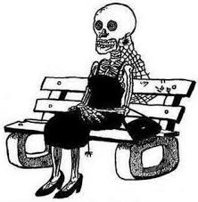

**La duración de un evento**

> - Estuvimos de compras **por** dos horas.
- Nos quedamos en la casa de mi suegra **por** 1 semana.

---

## Los usos de por (p. 211)

  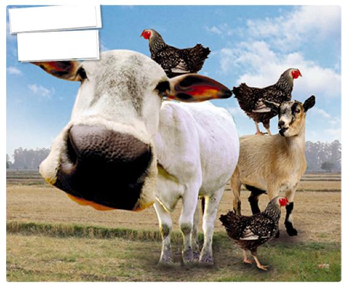

"**A cambio de**", "**por el precio de**"

> - Compramos esas mantillas **por** 100 euros.
- Le di dos gallinas **por** una vaca.

---

## Los usos de por (p. 211)

  

"**cada persona paga**"

> - La entrada a la exposición de artesanías cuesta 6 euros **por** persona.

---

## Los usos de por (p. 211)

  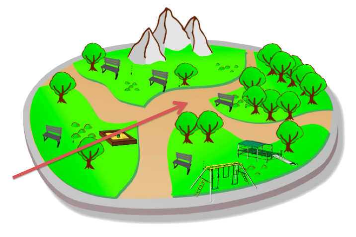  
  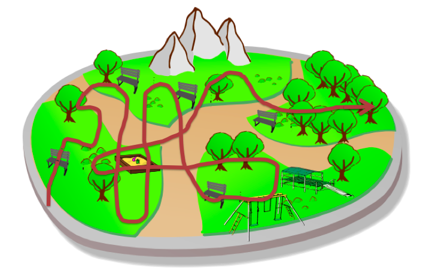

"**en**"  
"**alrededor de**"  
"**atravesando**"  

 
 
 

> - El domingo di un paseo **por** el parque

---

## Expresiones fijas con "por"

> - por ejemplo
> - por eso
> - por fin
> - por supuesto

---

## Los usos de para (p. 211)

  
  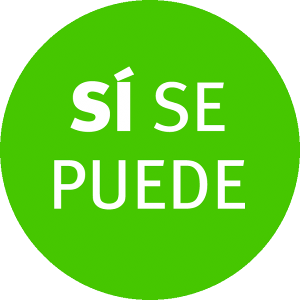

**para + infinitivo** "con el propósito de"

> - Vamos al mercadillo **para** comprar algunos recuerdos
> - **Para** llegar a Proctor tienes que subir la cuesta
> - Es necesario estudiar mucho **para** entender bien el subjuntivo

---

## Los usos de para (p. 211)

  
  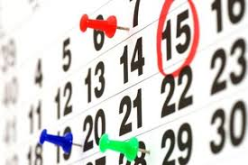

**indicar límite temporal**

> - Tienes que hacer la tarea **para** mañana.
> - El proyecto final es **para** la semana que viene. 
> - Es necesario comprar un disfraz **para** el sábado.

---

## Los usos de para (p. 211)

  

**indicar destinación**

> - Estos recuerdos son **para** mi familia. 
> - Ese regalo es **para** mi hermana. 

---

## Los usos de para (p. 211)

  

**indicar propósito**

> - Necesito un botón **para** mi camisa
> - El disfraz es **para** la fiesta

---

## Examen oral 2

> - Escoge la persona con la que quieres hacer el examen oral
- Poneros de acuerdo con respecto a la hora (más o menos)
- Escoged una de las situaciones que vimos ayer y practicad

### Ejercicios opcionales 

> - 6-23, p. 212
- 6-24, p. 212
- 6-25, p. 213

