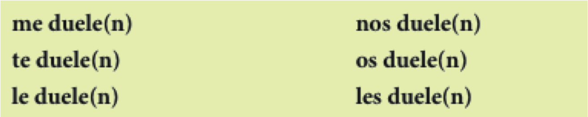

<!-- precalentamiento pluscuamperfecto -->

## Cuenta, cuenta, cuenta

> - Cuéntale a tu vecino algo que hiciste durante el fin de semana pasado

> - Incluye lo siguiente:
	- 2 oraciones que contengan acciones que ocurren al mismo tiempo
	- 2 o más acciones que ocurran en secuencia
	- 2 ejemplos de una acción que interrumpe otra
	- 2 oraciones en las que enfatices que una acción ocurre antes que la otra

--- .segue bg:grey

# La semana pasada

---

## Gramática

- Imperfecto
- Pretérito/Imperfecto (para contar un cuento)
- El pluscuamperfecto

## Vocabulario

- El tiempo libre
- Las estaciones 
- De viaje
- Contar un cuento

---

## Esta semana

 

  

---

## La semana que viene

 

  

--- .segue bg:grey

# CAPÍTULO 8 “Somos turistas”

---

## Plan

  

### Vocabulario:

- Por La ciudad

### Gramática:

- El se pasivo 
- Los mandatos

---

## Leed el siguiente párrafo...

En la escuela de español sólo se habla español. No se puede hablar en inglés. En general, se participa en muchas actividades, como el club de cocina, la clínica de pronunciación y el fútbol. 
Además, se llevan a cabo otras actividades como el teatro y el taller de salsa. Las clases son 
muy difíciles. Se tiene que trabajar mucho y las tareas se entregan todos los días. En fin, en Middlebury se aprenden muchas lenguas y se divierte mucho.

---

## El "se" pasivo

> - El "se" pasivo pone énfasis en la acción de la frase.
> - **se** + <blue>verbo conjugado</blue> + sustantivo
> - Un verbo **singular** con un sustantivo **singular**
	- Se **produce** mucho **software** en Ecuador.
> - Un verbo <blue>plural</blue> con un sustantivo <blue>plural</blue>
	- También se <blue>cultivan</blue> muchas <blue>flores</blue>.

---

## El "se" impersonal

> - El "se" impersonal no pone énfasis en ninguna persona como sujeto.
> - Podemos pensar que la(s) persona(s) que realiza(n) la acción son "ellos", "la gente", "las personas", "tú" o "uno".
> - **se** + <blue>verbo singular</blue> + un infinitivo/un adverbio
> - Ej. 
	- En Ecuador, se almuerza a la una.
	- ¿Se puede ir a pie?
	- ¿Dónde se puede comprar aspirina?

---

## "Se" impersonal vs. "se" pasivo

- Pasivo
	- **se** + <blue>verbo conjugado</blue> + sustantivo  

 

- Impersonal
	- **se** + <blue>verbo singular</blue> + un infinitivo/un adverbio

---

<!-- ejercicio -->

## Ejerecicios

- 8-5, p. 269

---

## Releed el siguiente párrafo...

En la escuela de español sólo **se** habla español. No **se** puede hablar en inglés. En general, **se** participa en muchas actividades, como el club de cocina, la clínica de pronunciación y el fútbol. Además, **se** llevan a cabo otras actividades como el teatro y el taller de salsa. Las clases son muy difíciles. **Se** tiene que trabajar mucho y las tareas **se** entregan todos los días. En fin, en Middlebury **se** aprenden muchas lenguas y **se** divierte mucho.

---

## Para pedir y dar instrucciones

    

  

--- .segue bg:grey

# Descanso (10 minutos)

  

---

## Mandatos formales

<!-- 

  

 -->

### Se pueden dar instrucciones con mandatos formales (Ud. y Uds.)

> 1. <blue>Se conjuga el verbo en la forma "yo"</blue>
2. <blue>Se elimina la "o"</blue>
3. <blue>Se pone la terminación apropiada</blue>

### Las terminaciones

> - -**ar** > <BLUE>e</BLUE>(n)  
- -**er**/-**ir** > <BLUE>a</BLUE>(n)

|     |    -ar    |    -er     |    -ir    |
| :-- | :-------- | :--------- | :-------- |
|     | **tomar** | **volver** | **salir** |
| 1.  | tomo      | vuelvo     | salgo     |
| 2.  | tomø      | vuelvø     | salgø     |
| 3.  | tome(n)   | vuelva(n)  | salga(n)  |

---

## Los mandatos formales

> - Se pone **no** delante de un mandato negativo.
	- No vuelvan tarde.

 

> - Hay mandatos irregulares:
	- **ir**: Vaya(n) a la esquina.                                                    
	- **saber**: Sepa(n) que aquí no se permite fumar.
	- **dar**: Déle (Denle) el pasaporte al recepcionista.
	- **ser**: Sea(n) puntual(es)
	- **estar**: Por favor, esté(n) aquí antes de la seis.

---

## Los mandatos con cambios ortográficos

<!-- 

  

 -->

> - -car > que(n)
> - -gar > gue(n)
> - -zar > ce(n)

 

|     |   buscar   |   llegar   |   empezar   |
| :-- | :--------- | :--------- | :---------- |
| 1.  | busco      | llego      | empiezo     |
| 2.  | buscø      | llegø      | empiezø     |
| !   | ~~busce~~  | ~~llege~~  | ~~empieze~~ |
| 3.  | bus**que** | lle**gue** | empie**ce** |

---

## Los complementos y los mandatos

### Se pone el complemento:  

> - Al final de un mandato afirmativo...
	- ¡Acuéstense ahora mismo!

 

> - Delante de un mandato negativo...
	- ¡No se acuesten en el sofá!

---

<!-- ejerciciosface -->

## Ejercicios

- hoja

---

## Repaso: Se pasivo, se impersonal

> - Explícale al vecino la diferencia entre el se pasivo y el se impersonal. 
- ¿Cómo se forma una frase utilizando cada uno?
- ¿Para qué sirve cada uno?
- Construid 2 frases de cada tipo.

 

> - 8-6, p. 271 (audio)

<audio controls>
  <source src="../../libraries/assets/audio/disco3/29.ogg" type="audio/ogg">
  <source src="../../libraries/assets/audio/disco3/29.aiff" type="audio/mpeg">
Your browser does not support the audio element.
</audio>

> - 8-8, p. 272

---

## Plan

  

Vocabulario:

- Las partes del cuerpo
- Los verbos doler/romperse

Gramática:

- El subjuntivo

---

## Simón dice...

---

## Las partes del cuerpo:

  

<!-- ejercicio partes del cuerpo 
Si tengo X, qué me duele?
-->

---

## El verbo doler sigue el modelo de gustar

  
  

> - Me duel**e** <blue>la espalda</blue>.
> - Me duel**en** <blue>los pies</blue>.
> - ¿Cuál es la situación más dolerosa que has experimentado en tu vida?

<!-- 

  

 -->

|   Singular  |    plural    |
| :---------- | :----------- |
| me duele(n) | nos duele(n) |
| te duele(n) | os duele(n)  |
| le duele(n) | les duele(n) |

---

## Romperse es un verbo reflexivo

  
  

> - Paco <blue>se rompió</blue> el brazo. 
> - <blue>Me rompí</blue> la pierna.
> - ¿Alguna vez **te has roto** un hueso? ¿Qué pasó?
> - 8-14, p. 277

--- .segue bg:grey

# Descanso (10 minutos)

  

---

## ¿Cómo damos consejos?

    

---

## ¿Cómo damos consejos?

    

> - Con un mandato formal:
	- **Use** esta crema cada seis horas.

 

> - Con un consejo indirecto:
	- Es importante que Ud. **use** un protector solar.

---

## El subjuntivo

- Con un consejo indirecto, se usa la forma de un mandato para formar **el subjuntivo**.

<!-- 

    

 -->

|          Mandato          |           Presente del subjuntivo           |
| :------------------------ | :------------------------------------------ |
| **Guarde** cama           | Es necesario que Ud. **guarde** cama        |
| **Beban** muchos líquidos | Es mejor que Uds. **beban** muchos líquidos |

 

> - Con la forma tú:
    - Es necesario que (tú) **guardes** cama.

---

## El subjuntivo

- El uso del subjuntivo requiere una frase con dos cláusulas.

    

---

## El subjuntivo

> - Algunas cláusulas que requieren el subjuntivo:
    - Le/te recomiendo que...
    - Quiero que...
    - Es necesario que...
    - Es aconsejable que...
    - Es preferible que...
    - Es mejor que...
    - Es recomendable que...
    - Es importante que...

<!-- 

    

 -->

---

<!-- ejercicios subj del libro -->

## Ejerecicios

- 8-24, p. 284 (con un compañero)
- 8-25, p. 285 (con un compañero)

---

## Yo nunca había...

- En grupos de 3-5, jugad una ronda completa de "Yo nunca he..."
- Para poder usar el pluscuamperfecto, utiliza el siguiente contexto:  

 

### Antes de venir a Middlebury, yo nunca había...

---

## Repaso: los mandatos formales

> - ¿Cuál es el proceso que se sigue para formar un mandato formal?
- ¿Qué es lo que se tiene que saber para colocar ***bien*** los pronombres (i.e. mandar, le, lo)
- Mándele al compañero que haga algo.

 

> - 8-10, p. 274
- 8-11, p. 274

--- &twocol

## Tu comida preferida

  
    

- ¿Cuál es tu comida preferida? Escribe una receta explicando cómo se cocina.
- Utiliza el se pasivo y el se impersonal  

**Verbos útiles**  

*** {name: left}

- poner
- agarrar/coger
- batir/revolver
- hervir
- echar
- untar
- juntar
- medir

*** {name: right}

- cocinar
- hornear
- sazonar
- probar

---

## Plan

  

- Vocabulario:
    - Las partes del cuerpo

- Gramática:
    - El subjuntivo

---

## Las enfermedades y los síntomas

    
     
  

> - sentir vs. sentirse
- encontrarse bien
- estar malo/a
- hacerse daño

 

> - ¿Cuándo fue la última vez que te encontraste mal? 
- ¿Qué tenías? 
- ¿Qué hiciste para curarte?

---

## El diagnóstico y los remedios

    
  

---

## Otros remedios y consejos

  
    

> - ¿Cuándo fue la última vez que fuiste al médico? 
> - ¿Qué tenías? 
> - ¿Qué te recomendó?

---

## Ejercicios

> - 8-16, p. 278
- 8-18, p. 280 (audio, 35)
- 8-22, p. 282

--- .segue bg:grey

# Descanso (10 minutos)

  

---

## Repasito

  
    

- ¿Cómo formamos el subjuntivo en el presente?

> - **forma "yo"** > **quitar la "o"** > **añadir la vocal opuesta**

- ¿Qué tiene en común con los mandatos formales?

> - **Se forma de la misma manera**

- ¿En qué se diferencia de los mandatos formales?

> - **Los pronombres se colocan antes del verbo conjugado**

---

## Ejercicios

- 8-26, p. 285

---

## Querida Abby

Tengo un problema con mi vida personal. Tengo mucho trabajo este semestre. Tengo cuatro clases los lunes, miércoles y viernes y dos clases en martes y jueves. Tengo mucha tarea y nunca hay tiempo para completarla. Quiero recibir buenas notas en mis clases pero también quiero mantener mi vida social. Estoy muy triste y cansada. ¡Ayudame!  

--Trabajadora

> - ¿Qué consejos tienes para "Trabajadora"?

---

## Querida Abby

> - Con un compañero, escribidle a Abby un párrafo corto explicando un problema que has tenido en Middlebury. Pedidle consejos para que os ayude. 
> - Utilizad el pretérito/imperfecto para contar el problema
> - Intercambiad consejos con otro grupo y haced el papel de Abby

---

## Simón dice que...

