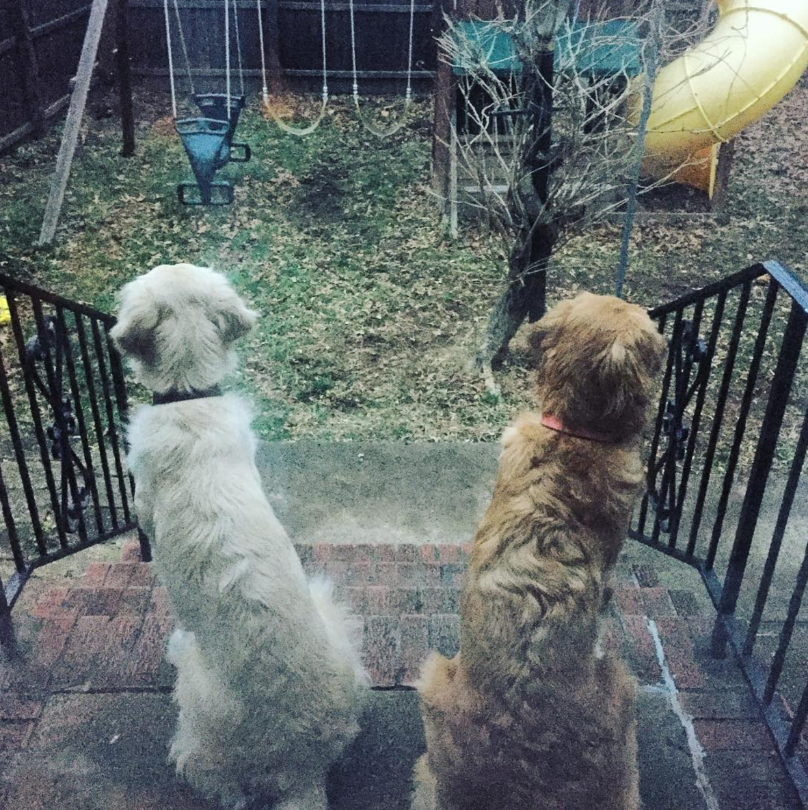
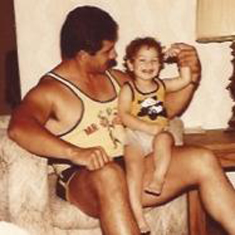
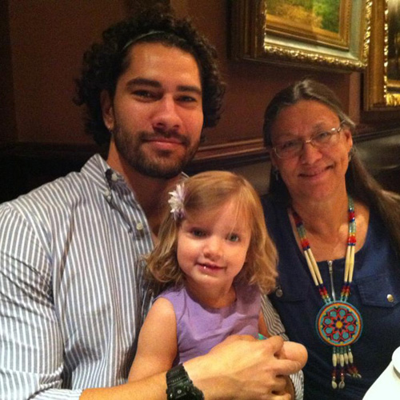
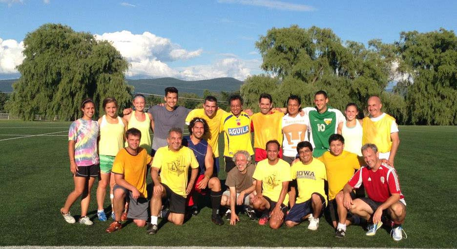
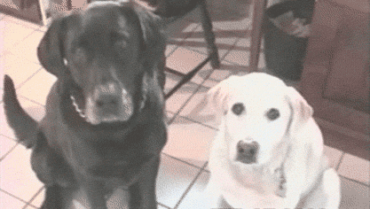
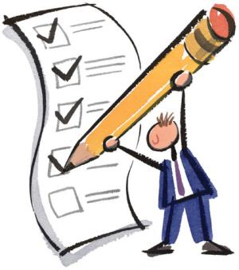
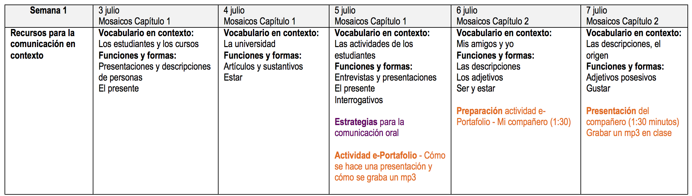
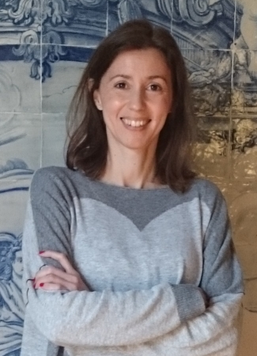
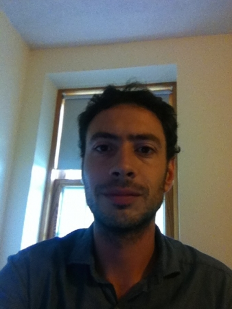

```{r setup, include=FALSE, cache=FALSE}
options(htmltools.dir.version = FALSE)
```

```{r, eval=FALSE, echo=FALSE, cache=FALSE}
rmarkdown::render("./slides/0_intro/index.Rmd")
xaringan::inf_mr('./slides/0_intro/index.Rmd')
xaringan::inf_mr()
```

class: inverse, center, middle

# Acerca del profe

---
background-image: url("./assets/img/yo1.jpg")
background-size: contain

# Mi nombre es Joseph Casillas.

---
background-image: url("./assets/img/az.jpg")
background-size: contain
class: inverse

# **Soy de Arizona.**

---

# Tengo dos perros.

<div>
  
  
</div>

---
background-image: url("./assets/img/perros1.png")
background-size: contain
class: inverse

---

# Mi Padre.

<div align="center">
  
</div>

---
background-image: url("./assets/img/world.jpg")
background-size: contain

---
background-image: url("./assets/img/mexico.png"), url("./assets/img/espana.gif")
background-size: 400px, 500px
background-position: 20% 50%, 80% 50%

---

# Mi madre.

<div align="center">
  
</div>

---
background-image: url("./assets/img/eeuu.jpg")
background-size: contain

---
background-image: url("./assets/img/lena.jpg")
background-size: contain

---
background-image: url("../../site_libs/assets/img/ru.png"), url("./assets/img/ua.png")
background-size: 120px, 150px
background-position: 33% 90%, 66% 90%

# Soy lingüista.

<div align="center">
  
  
</div>

---
background-color: black

# Estudio el bilingüismo y la adquisición de segundas lenguas.

<div align="center">
  
</div>

---

# Es mi verano \#9 en Middlebury.

<div align="center">
  
</div>

---

# Me gusta el fútbol. 

<div align="center">
  
</div>

---

# Con un compañero...

<div style="float: right">
  
</div>

- Contesta las siguientes preguntas  
	- ¿De dónde soy?

	- ¿Cómo se llaman mis perros?

	- ¿Qué estudio?

	- ¿Dónde trabajo?

- ¿Alguna pregunta para mí?

---

# Con un compañero nuevo...

<div style="float: right">
  
</div>

- Pregúntale tres cosas **nuevas** y cuéntanoslas

---
class: inverse, middle, center

# Introducción al curso

---

# El plan

<div style="float: right">
  
</div>

- ¿Qué vais a aprender?

--

- ¿Cómo lo vamos a hacer? El programa.

--

- Sugerencias para tener éxito.

---

# Objetivos

<div style="float: right">
  
  
</div>

- Desarrollar y controlar las estructuras básicas de gramática

--

- Ampliar el vocabuario

--

- Consolidar la habilidad de negociar situaciones básicas en español dentro de un contexto cultural 

--

- Preparación para estudiar la lengua independientemente

---
background-image: url("./assets/img/toolbox1.jpg")
background-size: contain

---
background-image: url("./assets/img/toolbox2.jpg")
background-size: contain

---
background-image: url("./assets/img/toolbox3.jpg")
background-size: contain

---

# Objetivos

<div style="float: right">
  
  
</div>

- describir experiencias de la vida diaria (rutinas, actividades, etc.)

- describir personas (familia, amigos, etc.) y lugares

- narrar eventos en los tiempos del presente y del futuro

- describir y reflexionar sobre los contrastes culturales

- hacer preguntas para solicitar información 

- presentar a la clase temas investigados y contestar preguntas

- dar instrucciones y direcciones

---

# El programa

.left-column[
- **Materiales**
- Materiales recomendados
- Normas del curso (p. 2)
]

.right-column[

## Texto obligatorio Elige una opción:

- Opción 1. Printed Loose Leaf text of “Mosaicos” with MySpanishLab 5 month access (includes eText): ISBN:0134306325
**MySpanishLab includes the digital SAM + additional resources**

- Opción 2. MySpanishLab for “Mosaicos” with eText of Mosaicos (no print component) 5 month access. ISBN:0205849709

- Materiales en internet a través de go/hub/
]

---

# El programa

.left-column[
- Materiales
- **Materiales recomendados**
- Normas del curso (p. 2)
]

.right-column[

- Un diccionario bilingüe como por ejemplo: Diccionario Oxford Compacto 

- Un diccionario monolingüe dictionary como por ejemplo: Diccionario Larousse del español moderno 

- Una gramática de referencia como por ejemplo: **A New Reference Grammar of Modern Spanish**. John Butt & Carmen Benjamin

- Un libro de conjugaciones verbales como por ejemplo: **Bescherelle - El arte de conjugar en español**.  Mateo & Rojo Sastre

- Herramientas de Microsoft Word en español
]

---

# El programa

.left-column[
- Materiales
- Materiales recomendados
- **Normas del curso**
]

.right-column[

### Normas del curso (p. 2)
]

---

# Las notas

</br>
</br>


|         |        |        |       |
|:--------|-------:|:-------|------:|
|  **A**  | 94-100 | **C+** | 77-79 |
|  **A-** | 90-93  | **C**  | 74-76 |
|  **B+** | 87-89  | **C-** | 70-73 |
|  **B**  | 84-86  | **D**  | 64-69 |
|  **B-** | 80-83  | **F**  | 0-64  |


</br>
</br>

- La evaluación (p. 3)

---

# Esquema de la semana

- Cada semana vais a recibir un esquema

<div align="center">
  
</div>

---

# 

<div align="center">
  
</div>

---

# 

</br>
</br>

<div align="center">
  
</div>

---

# Algunas sugerencias

- Habla siempre español 

- Haz muchas preguntas. 

- No tengas miedo de hacer errores; lo que importa es la comunicación. 

- Pide ayuda cuando estés confundido/a.

- Ven a clase con la tarea preparada. 

- No asumas nada, pídele al profesor que confirme las expectativas. 

- Participa activamente en clase; procura hablar por lo menos 10 minutos en cada clase. 

---

# Más sugerencias

- Lee mucho en español. La lectura es muy buena para desarrollar la producción oral. 

- Escucha la radio en español. 

- Escucha música en español. 

- Ve a todas las películas de la escuela española. 

- **Participa en muchas actividades co-curriculares.**

- Habla con otros profesores y con estudiantes de todos los niveles.

- ¡Diviértete!

---

# Aun más sugerencias

<div style="float: right">
  
</div>

- Actividades cocurriculares  
	- el teatro
	- el baile
	- **la clínica de pronunciación**

- Madrinos/padrinos  
	- hacer amigos con más nivel
	- hablar con estudiantes del MA

- **NO** tener miedo  
	- de hablar
	- de hacer preguntas
	- de intentar

- Estudiar (pero ¡no demasiado!)

---

# Tutores

<div style="float:right">
    
  </br>
  
</div>

- De lunes a jueves de 9:30 a 11:30, 14.30 a 18.30

- Los viernes de 9.30 a 11.30

- Hay que apuntarse previamente en turnos de 20 minutos

- Hay que tener dudas concretas (nada de "repasar" o temas generales)

- 2da planta de milikin

---
class: inverse, center, middle

# Descanso (10 minutos)

<div style="float:right">
  
</div>


