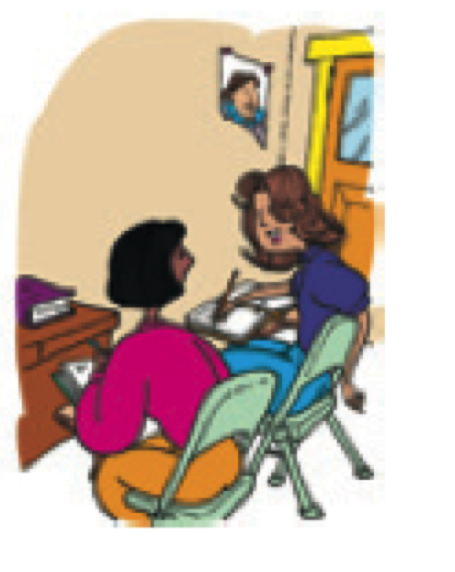
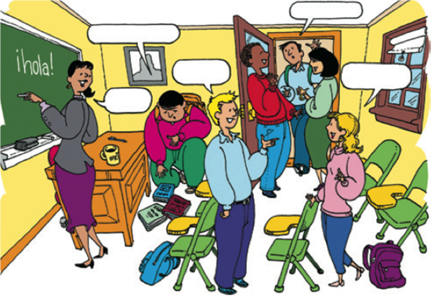

```{r setup, include=FALSE, cache=FALSE}
options(htmltools.dir.version = FALSE)
```

```{r, eval=FALSE, echo=FALSE, cache=FALSE}
rmarkdown::render("./slides/0_paso_prelim/index.Rmd")
xaringan::inf_mr('./slides/0_paso_prelim/index.Rmd')
xaringan::inf_mr()
```

class: inverse, center, middle

# Para sobrevivir

---

# Plan

- Para presentarnos
- Instrucciones básicas
- Para hablar con la gente

<!-- p5 -->

---

# Para presentarnos

|            |                                 |
|:-----------|:--------------------------------|
| SARA:      | “Hola. ***Me llamo*** Sara.”    |
| AMANDA:    | “Hola, Sara. ***Soy*** Amanda.” |
| SARA:      | “Mucho gusto.”                  |
| AMANDA:    | “Mucho gusto.”                  |


</br>

<div style="float: right">
  
</div>

- ¿Sabéis otras opciones?

--

- Mi nombre es Sara

--

- ~~Me llamo es Sara~~

---

# Instrucciones básicas

- **Abran/Cierren** el libro en la página...

- **Trabajad** con un compañero.

- **Escuchen** a la profesora.

- **Leed** la información.

- **Contesten** en español.

- **Escribid** vuestros nombres.

---

# Para hablar con la gente (1)

<div style="float: right">
  
</div>

- ¿Cómo se dice... ?

- Con permiso/Perdón.

- Gracias... De nada.

- Sí/No

---

# Para hablar con la gente (2)

<div style="float: right">
  
</div>

- Más despacio, por favor.

- ¿Puede repetir, por favor?

- ¿Qué quiere decir... ?

- ¿En qué página?

- Tengo una pregunta.

---

# ¿Qué se dice?

- Con un compañero, crea un diálogo corto usando este vocabuario 
útil. 

- Pensad en situaciones típicas que puedan pasar aquí en Middlebury.

---

# La clase

<div align="center">
  
</div>  

<!-- actividad ¿qué ves? ¿qué es? -->

---

# Los sustantivos

- **Los sustantivos** son personas, lugares o cosas.

- En español tienen **género** y **número**

- ¿Puedes pensar en algunos sustantivos?

<div align="center">


</div>

---

# Género

<div style="float: right">
  
</div>

Normalmente...

- **el** libr**o**
- **la** mes**a**

--

Pero a veces...

- **el/la** estudiant**e**
- **el** pupitr**e**
- **la** clas**e**
- **el** relo**j**

---

# Número

<div style="float: right">
  
</div>

- el libro/los libros
- la mesa/las mesas

**¡Es FÁCIL!**

---

# Los artículos

<div style="float: right">
  
</div>

- Los sustantivos tienen **artículos**.
- Hay dos tipos:
	- Definidos
	- Indefinidos

---

# Los artículos definidos

<div style="float: right">
  
</div>

- **el** libro, **los** libros
- **la** página, **las** páginas
- **la** mochila, **las** mochilas
- **el** cuaderno, **los** cuadernos

---

# Los artículos indefinidos

<div style="float: right">
  
</div>

- **un** mapa, **unos** mapas
- **una** mesa, **unas** mesas
- **un** pupitre, **unos** pupitres
- **un**(a) estudiante **unos**(as) estudiantes

---

# Con un compañero...

<div style="float: right">
  
  
</div>

1. Hay (un/una) profesora. Es (el/la) señora Martínez.
2. (Los/Las) estudiantes están en (el/la) clase de español.
3. Hay (una/unas) ventana en (el/la) puerta.
4. Hay (un/una) mapa de España en (el/la) sala de clase.
5. (Un/Una) estudiante usa (el/la) teléfono celular.
6. Hay (unos/unas) borradores en (el/la) silla.
7. (Un/Una) estudiante escribe mensajes de texto en (el/la) teléfono celular.
8. Hay (un/una) libro en (el/la) mesa de la profesora.

<!-- > - Haced el ejercicio P-1 de la página 4 -->
<!-- > - Haced el ejercicio P-2 de la página 4 -->

---

# Con un compañero...

<div style="float: right">
  
  
</div>

1. Hay **una** profesora. Es **la** señora Martínez.
2. **Los**/**Las** estudiantes están en **la** clase de español.
3. Hay **una** ventana en **la** puerta.
4. Hay **un** mapa de España en **la** sala de clase.
5. **Un** estudiante usa **el** teléfono celular.
6. Hay **unos** borradores en **la** silla.
7. **Un** estudiante escribe mensajes de texto en **el** teléfono celular.
8. Hay **un** libro en **la** mesa de la profesora.

---

# Con un compañero...

Completa la tabla con el singular y plural de las palabras.


|     Singular     |       Plural       |
| :--------------- | :----------------- |
| **la profesora** |                    |
|                  | **los bolígrafos** |
|                  | **los pupitres**   |
| **el papel**     |                    |
|                  | **unas mochilas**  |
| **una ventana**  |                    |
| **un reloj**     |                    |
|                  | **unos carteles**  |

---

# Con un compañero...

Completa la tabla con el singular y plural de las palabras.


|          Singular         |            Plural           |
| :------------------------ | :-------------------------- |
| **la profesora**          | <blue>las profesoras</blue> |
| <blue>el bolígrafo</blue> | **los bolígrafos**          |
| <blue>el pupitre</blue>   | **los pupitres**            |
| **el papel**              | <blue>los papeles</blue>    |
| <blue>una mochila</blue>  | **unas mochilas**           |
| **una ventana**           | <blue>unas ventanas</blue>  |
| **un reloj**              | <blue>unos relojes</blue>   |
| <blue>un cartel</blue>    | **unos carteles**           |


---
class: inverse, middle, center

# Descanso (10 minutos)

<div style="float: right">
  
</div>

---

# El abecedario

<div align="center">
  
</div>

---

# ¿Qué es esto? ¿Cómo se escribe?

<div align="center">

</div>

---

# El ahorcado

<div align="center">

</div>

---

# Los números

<div align="center">

</div>

---

# Los números

<div align="center">

</div>

---

# ¿Cuántos objetos hay en la sala de clase?

<div align="center">

</div>

- ¿Cuántos libros? ¿Cuántas mochilas?
- ¿Cuántos pupitres? ¿Cuántos bolígrafos hay?
- ¿Cuántos estudiantes hay? ¿Cuántas sillas hay?

---
class: inverse, middle, center

# Repaso

---

# Lo que hemos visto...

- Vocabulario

- Los sustantivos

- Los artículos

- El abecedario

- Los números

--

## Lo que hemos usado...

- El presente

---

# La tarea

- Comprar el libro
- Repasar el programa
- Explorar la página canvas (go/canvas/)
- Estudiar el vocabulario

</br>
</br>

- **Experimento**
