```{r setup, include=FALSE, cache=FALSE}
options(htmltools.dir.version = FALSE)
```

```{r, eval=FALSE, echo=FALSE, cache=FALSE}
rmarkdown::render("./slides/cap1/index.Rmd")
xaringan::inf_mr('./slides/cap1/index.Rmd')
xaringan::inf_mr()
```

class: inverse, center, middle

<!-- ## De ayer -->

<!-- - moodle -->
<!-- - actividades -->

# Repaso

---

# Los sustantivos

- Género

- Número

- Artículos

---

# Los sustantivos

- Género
	- masculino
	- femenino

- Número
	- singular
	- plural

- Artículos
	- definidos
	- indefinidos

---

# El abecedario

<div align="center">
  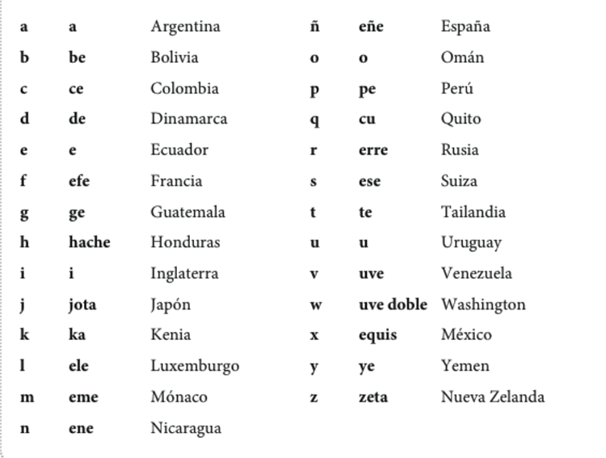
</div>

---

# ¿Qué es esto? ¿Cómo se escribe?

<div align="center">

</div>

---

# El ahorcado

<div align="center">

</div>

---

# Los números

<div align="center">

</div>

---

# Los números

<div align="center">

</div>

---

# ¿Cuántos objetos hay en la sala de clase?

<div align="center">

</div>

- ¿Cuántos libros? ¿Cuántas mochilas?
- ¿Cuántos pupitres? ¿Cuántos bolígrafos hay?
- ¿Cuántos estudiantes hay? ¿Cuántas sillas hay?

---
class: inverse, center, middle
<!-- contenido nuevo -->

# Capítulo 1

---

# El plan

<div style="float: right">
  
</div>

- Vocabulario
	- Saludos
	- Origen
	- Intercambiar información básica

</br>
  
- Gramática
	- los pronombres personales
	- los verbos **estar**, **ser**, **tener**, **ir**

---

# Los pronombres personales

</br>

|    |    |  Singular      |    | Plural              |
|:---| :- | :--------------| :- | :------------------ |
| 1a |    |  yo            |    | nosotros/as         |
| 2a |    |  tú            |    | vosotros/as         |
| 3a |    |  él/ella/usted |    | ellos/ellas/ustedes |
| | &nbsp; &nbsp; &nbsp; | | &nbsp; &nbsp; &nbsp; | |


<!-- imagen -->

---

# El verbo estar

</br>

|    |    |  Singular              |    | Plural                        |
|:---| :- | :--------------------- | :- | :---------------------------- |
| 1a |    | yo **estoy**           |    | nosotros/as **estamos**       |
| 2a |    | tú **estás**           |    | vosotros/as **estáis**        |
| 3a |    | él/ella/usted **está** |    | ellos/ellas/ustedes **están** |
| | &nbsp; &nbsp; &nbsp; | | &nbsp; &nbsp; &nbsp; | |


<!-- imagen -->

---

# Las presentaciones y los saludos formales (con los profesores)

<div style="float: left">
  
</div>

<div style="float: right">
  
</div>

---

# Las presentaciones y los saludos formales (con los profesores)

<div align="left">
  
</div>

---

# Las presentaciones y los saludos informales (con los amigos)

<div style="float: left">
  
</div>

<div style="float: right">
  
</div>

---

# Las presentaciones y los saludos informales (con los amigos)

<div style="float: left">
  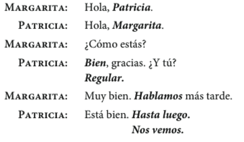
</div>

<div style="float: right">
  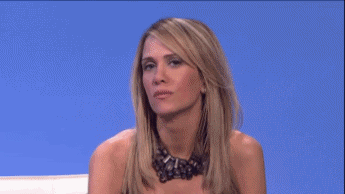
</div>

---

# ¿Cómo estás?: Los estados y el verbo estar

<div style="float:right">
  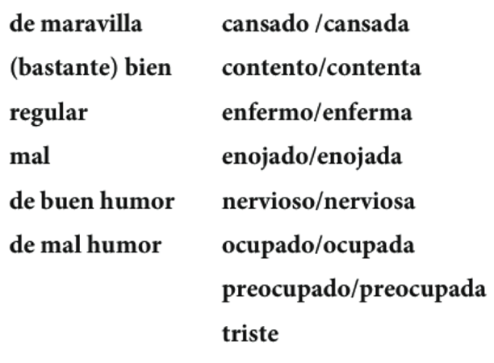
</div>

**Yo estoy \_\_\_\_**  

Ej. Yo estoy cansado(a)

---
class: inverse, center, middle

# Descanso (10 minutos)

<div style="float: right">
  
</div>

---

# ¿Cómo está(n)?

<div align="center">
  
</div>

---

# ¿Cómo está(n)?

<div align="center">
  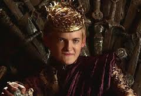
</div>

---

# ¿Cómo está(n)?

<div align="center">
  
</div>

---

# ¿Cómo está(n)?

<div align="center">
  
</div>

---

# ¿Cómo está(n)?

<div align="center">
  
</div>

---

# ¿Cómo está(n)?

<div align="center">
  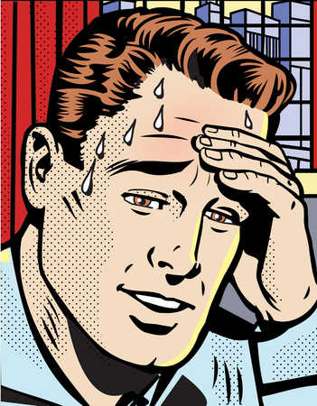
</div>

---

# ¿Cómo está(n)?

<div align="center">
  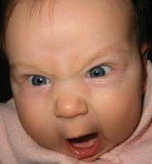
</div>

---

# ¿Cómo está(n)?

<div align="center">
  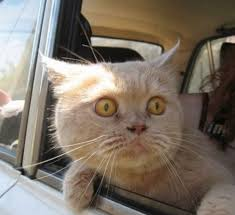
</div>

---

# ¿Cómo está(n)?

<div align="center">
  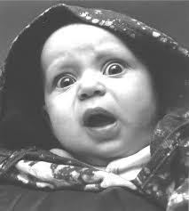
</div>

---

# ¿Cómo está(n)?

<div align="center">
  
</div>

---

# Intercambiar información básica

<div style="float: right">
  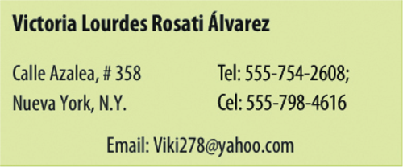
</div>

- ¿Cómo te llamas?
- ¿Dónde vives?
- ¿Cuál es tu número de teléfono?
- ¿Cuál es tu dirección de correo electrónico?

---

# El verbo tener

|    |    | Singular                |    | Plural                         |
|:-- | :- | :---------------------- | :- | :----------------------------- |
| 1a |    | yo **tengo**            |    | nosotros/as **tenemos**        |
| 2a |    | tú **tienes**           |    | vosotros/as **tenéis**         |
| 3a |    | él/ella/usted **tiene** |    | ellos/ellas/ustedes **tienen** |
| | &nbsp; &nbsp; &nbsp; | | &nbsp; &nbsp; &nbsp; | |

</br>

- ¿Cuántas clases tienes?
- ¿Cuántos años tienes?
- ¿Tienes hambre?

(clase, sueño, prisa, calor, frío, hambre)

---

# El verbo ser

|    |    | Singular             |    | Plural                      |
|:-- | :- | :------------------- | :- | :-------------------------- |
| 1a |    | yo **soy**           |    | nosotros/as **somos**       |
| 2a |    | tú **eres**          |    | vosotros/as **sois**        |
| 3a |    | él/ella/usted **es** |    | ellos/ellas/ustedes **son** |
| | &nbsp; &nbsp; &nbsp; | | &nbsp; &nbsp; &nbsp; | |

</br>

- ¿De dónde eres?
- ¿Cuál es tu dirección?

(profesor, estudiante, militar, hombre, mujer, padre, madre, simpático)

---

# El verbo ir

|     |    | Singular             |    | Plural                      |
| :-- | :- | :------------------- | :- | :-------------------------- |
| 1a  |    | yo **voy**           |    | nosotros/as **vamos**       |
| 2a  |    | tú **vas**           |    | vosotros/as **vais**        |
| 3a  |    | él/ella/usted **va** |    | ellos/ellas/ustedes **van** |
| | &nbsp; &nbsp; &nbsp; | | &nbsp; &nbsp; &nbsp; | |

</br>

- ¿Adónde vas?
- ¿Qué vas a hacer?

---

# Más detalles...

## tener

- posesión (tengo tres gatos)
- obligación (**tengo que** estudiar)
- frases especiales
    - tengo frío/calor/hambre/sed/sueño/etc.

## ir

- movimiento (**voy a** la biblioteca)
- futuro (**voy a** estudiar)

---

<div align="center">
  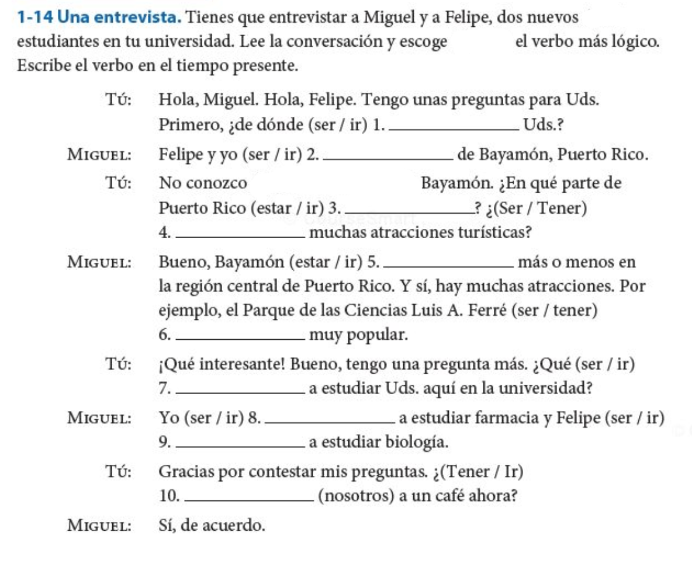
</div>

---
class: inverse, center, middle

# Repaso

---

# Hemos visto  
    
- Los pronombres personales
- Hay 4 verbos fundamentales en español (**estar**, **ser**, **tener**, **ir**)
- Tarea  
    - Usar **estar**, **ser**, **tener** e **ir** en conversaciones reales
    - Estudiar el vocabulario

---
class: inverse, center, middle


# La familia

---

# El plan

<div style="float: right">
  
</div>

- Vocabulario:
    - La familia
- Gramática:
    - Posesión
    - Verbos regulares
- Presentación del compañero
- Estrategias para la comunicación oral  

---

# La familia

<div style="float: left">
  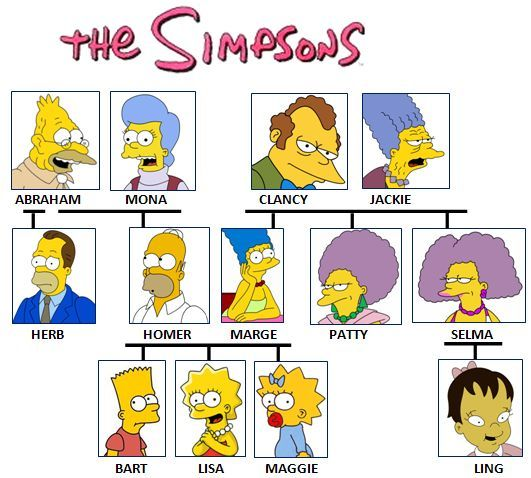
</div>

<div style="float: right">
  
</div>

---

# ¿Cómo es tu familia?

- Mi hermano mayor se llama...
- Mi padre tiene ... años.
- Mi tía vive en...

</br>

<div align="center">
  
</div>

---

# Los adjetivos posesivos

- Se utilizan para indicar **posesión**
- Tienen **número** y **género**

|    |    |       |    |                        |
|:---| :- | :---- | :- | :--------------------- |
| 1a |    | mi(s) |    | nuestro(s)/nuestra(s) |
| 2a |    | tu(s) |    | vuestro(s)/vuestra(s)  |
| 3a |    | su(s) |    | su(s)                  |
| | &nbsp; &nbsp; &nbsp; | | &nbsp; &nbsp; &nbsp; | |

</br>

- mi familia, mis abuelos

- su hija, sus hijos

- nuestr**a** herman**a**, nuestr**os** herman**os**

---

# La posesión con 'de'

<div style="float: right">
  
  
</div>

- Para evitar la confusión en la 3a persona, se puede usar la preposión 'de'

Enrique y Alicia viven en Cádiz.  

¿Dónde están sus casas?

- La casa **de** él está en San Fernando. 
- La casa **de** ella está en Sanlúcar.  

---

# La posesión con 'de'

<div style="float: right">
  
  
</div>

- Para evitar la confusión en la 3a persona, se puede usar la preposión 'de'

Enrique y Alicia tienen amigos que viven en Cádiz.

¿Dónde viven sus amigos?

- El amigo **de** Alicia vive en San Fernando.  
- El amigo **de** Enrique vive en Sanlúcar. 

---

# ¡Nunca usamos <BLUE>'s</BLUE> para indicar posesión!

</br>

<div align="center" class="big">
  <strike>
    <h1>
      Mi hermanas casa </br>  
      Tu amigos coche </br>  
      Su abuelos teléfono </br>  
      Nuestro perros correa </br> 
      Vuestras clases profesor </br>  
      Sus camas sábanas  
    </h1>
  </strike>
</div>

---

.pull-left[
  <strike>
    <h1>
      Mi hermanas casa  </br>
      Tu amigos coche  </br>
      Su abuelos teléfono  </br>
      Nuestro perros correa  </br>
      Vuestras clases profesor  </br>
      Sus camas sábanas  
    </h1>
  </strike>

]

.pull-right[

  <h1>
    La casa de mi hermana </br>  
    El coche de tu amigo </br>  
    El teléfono de su abuelo </br>  
    La correa de nuestro perro </br>  
    El profesor de vuestras clases </br>  
    Las sábanas de sus camas  
  </h1>
]

---
class: inverse, middle, center

# Descanso (10 minutos)

<div style="float: right">
  
</div>

---

# Los verbos regulares

Estamos muy ocupados entre semana.

<div align="center">
  
</div>

---

# Los verbos regulares

Paso la semana en la universidad.

<div align="center">
  
</div>

---

# ¿Cómo es tu rutina?

.pull-left[

</br>
</br>
</br>

- Normalmente yo...  

- A veces yo... 

]

.pull-right[

</br>

- paso mucho tiempo en el facebook.
- voy al gimnasio por la mañana/por la tarde.
- escucho música/mi iPod.
- limpio el cuarto/el apartamento.
- preparo la comida.
- tomo café con mis amigos.

]

---

<!-- act 1-26 -->
<div align="center">
  
</div>

---

# El tiempo presente expresa...

</br>

### ...una rutina

--

- Estudio en la biblioteca todos los días.

### ...una acción continua

--

- Mi amiga vive en una residencia este semestre.

### ...una acción en el futuro

--

- Mis compañeros van a una fiesta mañana.

---

# Los verbos regulares

Hay tres tipos de infinitivos: -ar, -er, -ir

|                     |    | -ar         |    | -er         |    | -ir           |
| :------------------ | :- | :---------- | :- | :---------- | :- | :------------ |
|                     |    | **tomar**   |    | **comer**   |    | **asistir**   |
| yo                  |    | tom**o**    |    | com**o**    |    | asist**o**    |
| tú                  |    | tom**as**   |    | com**es**   |    | asist**es**   |
| él/ella/usted       |    | tom**a**    |    | com**e**    |    | asist**e**    |
| nosotro(as)         |    | tom**amos** |    | com**emos** |    | asist**imos** |
| vosotros(as)        |    | tom**áis**  |    | com**éis**  |    | asist**ís**   |
| ellos/ellas/ustedes |    | tom**an**   |    | com**en**   |    | asist**en**   |
| | &nbsp; &nbsp; &nbsp; | | &nbsp; &nbsp; &nbsp; | | &nbsp; &nbsp; &nbsp; | |

---

# Algunos verbos regulares

.pull-left[

  **-ar**  
  Adivinar  
  Gastar  
  Amar  
  Apagar  
  Ayudar  
  Invitar  
  Bailar  
  Jugar  
  Besar  
  Lavar  
  Cambiar  
  Levantar  
  Despertar  
  Pasear  

]

.pull-right[

  Dibujar  
  Pensar  
  Disfrutar  
  Pintar  
  Durar  
  Practicar  
  Echar  
  Preguntar  
  Empezar  
  Prestar  

]

---

# Algunos verbos regulares

.pull-left[

  **-er**  
  Agradecer  
  Llover  
  Beber  
  Nacer  
  Caber  
  Ofrecer  
  Caer  
  Perder  
  Comer  
  Prometer  
  Comprender   

]

.pull-right[

  **-ir**  
  Abrir  
  Partir  
  Construir  
  Pedir  
  Corregir  
  Prohibir  
  Decidir  
  Recibir  
  Despedir  
  Seguir  
  Discutir  

]

---

# Presentación de un compañero

- Vais a hacer una presentación oral corta mañana

--

- Duración de 1.30

--

- El enfoque será en las construcciones que hemos visto en clase

--

- Podéis hablar de lo que queráis (sugiero que os centréis en lo que hemos visto)

---

# Gramática 

- los sustantivos/artículos
- los pronombres personales
- los verbos ser/estar/tener/ir
    - tener + sustantivo (posesión)
    - tener que + infinitivo (obligación)
    - ir a + sustantivo (movimiento)
    - ir a + infinitivo (futuro)
- los adjetivos posesivos

---

# Preparación

### Para preparar debéis:

- Escoger un compañero
- Quedar en una hora esta tarde para hablar
- Utilizar nuestras estrategias para obtener información
- Apuntar toda la información (verificar que es correcta)
- Ensayar
- <blue>NO PODÉIS LEER</blue>

---

# Estrategias para la comunicación oral  

- ¡Ensayar! ¡Ensayar! ¡Ensayar!

--

- Hablar lentamente

--

- Vocales puras

--

- Tensión bucal

--

- Practicad palabras largas por sílabas

---
class: inverse, middle, center

# Repaso

---

# Hemos visto

- Vocabulario: La familia
- Gramática:
    - Posesión
    - Verbos regulares (-ar, -er, -ir)

### La tarea

- Presentación de un compañero

---

# Actividad posesivos

<div align="center">
  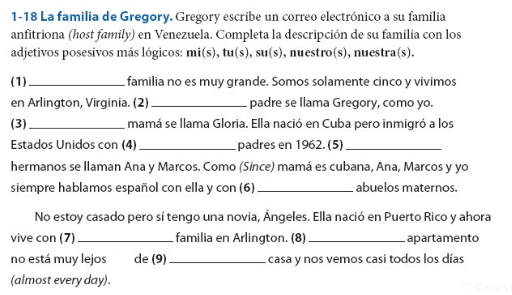
</div>

---

# Actividad verbos regulares

<div align="center">
  
</div>

---

# La relación sujeto/verbo

**SVO**

--

- **Juan** ***tiene*** tres clases este semestre.

--

- **Juan** *no* ***tiene*** un laboratorio este semestre.

--

- **Yo** *tengo* cuatro clases este semestre, pero **ella** *tiene* cinco.

---

<!-- dia 5 empieza aqui -->

# El plan

- Vocabulario:
    - El tiempo libre
- Gramática:
    - Gustar
    - Preguntas
    - El presente progresivo
 - Presentación del compañero (1:30 minutos)

---

# ¿Qué le gusta hacer en su tiempo libre?

<div align="center">
  
</div>

---

# ¿Qué le gusta hacer en su tiempo libre?

<div align="center">
  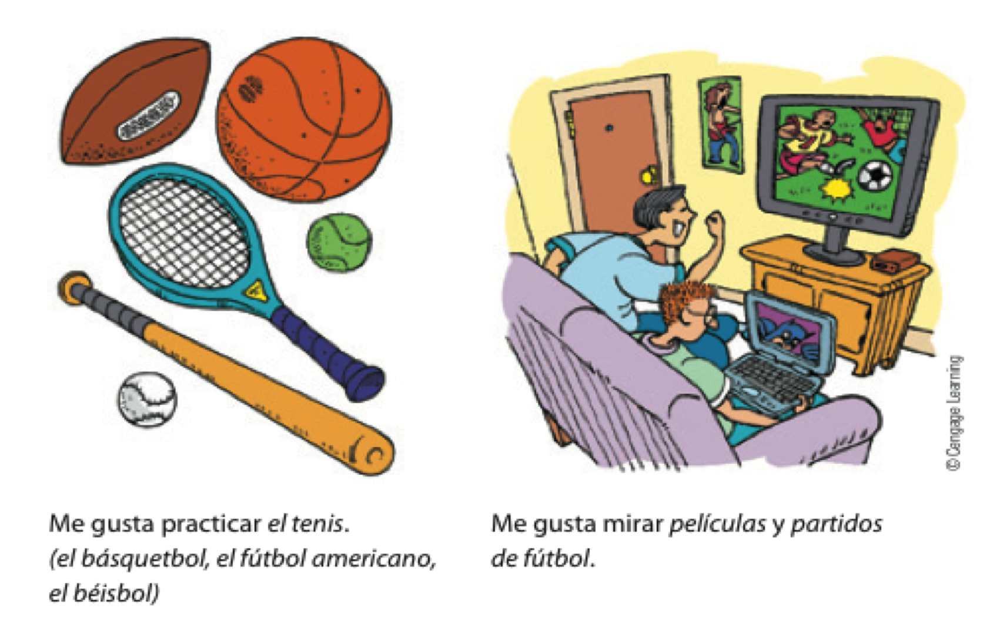
</div>

---

# El verbo gustar

- El verbo gustar tiene DOS formas: **gusta** y **gustan**

</br>

| Comp. Indirecto  &nbsp; &nbsp; &nbsp; | gusta/gustan &nbsp; &nbsp; &nbsp; | Sujeto |
|:----------------------|:-------------|:--------------|
| Me                    | gust**a**    | jugar al tenis|
| Te                    | gust**a**    | el tenis      |
| Le                    | gust**a**    | el deporte    |
| Nos                   | gust**a**    | la clase      |
| Os                    | gust**a**    | Middlebury    |
| Les                   | gust**a**    | la lluvia     |

---

# El verbo gustar

- El verbo gustar tiene DOS formas: **gusta** y **gustan**

</br>

| Comp. Indirecto &nbsp; &nbsp; &nbsp; | gusta/gustan &nbsp; &nbsp; &nbsp; | Sujeto |
|:----------------------|:-------------|:---------------------|
| Me                    | gust**an**   | los árboles          |
| Te                    | gust**an**   | el tenis y el fútbol |
| Le                    | gust**an**   | los deportes         |
| Nos                   | gust**an**   | las clases           |
| Os                    | gust**an**   | los edificios        |
| Les                   | gust**an**   | las nubes            |

---

# ¿A ti qué te gusta hacer en tu tiempo libre?

- montar en bicicleta 
- jugar videojuegos 
- practicar el tenis 
- mirar una película de terror 
- bailar en una fiesta 
- ir de compras 
- correr por el campus 
- leer el periódico 
- practicar el básquetbol

---

# ¿Con qué frecuencia...

.pull-left[

</br>
</br>
</br>
</br>

- vas de compras?
- vas al cine?

]

.pull-right[

</br>
</br>
</br>

- a menudo
- a veces
- casi todos los días
- casi nunca
- nunca

]

---

# El énfasis y aclaración con gustar y los nombres.


|Comp. Indirecto  &nbsp; &nbsp; &nbsp; | gusta/gustan  &nbsp; &nbsp; &nbsp; | Sujeto        |
|:---------------------|:-------------|:--------------|
| **A mí** me          | gust**a**    | jugar al tenis|
| **A ti** te          | gust**a**    | el tenis      |
| **A él** le          | gust**a**    | el deporte    |
| **A nosotros** nos   | gust**a**    | la clase      |
| **A vosotros** os    | gust**a**    | Middlebury    |
| **A ellas** les      | gust**a**    | la lluvia     |


</br>
**A Carlos** le gusta pasar su tiempo libre en la residencia, pero **a Juan** le gusta estudiar en su cuarto.

---

# El énfasis y aclaración con gustar y los nombres.

| Comp. Indirecto  &nbsp; &nbsp; &nbsp; | gusta/gustan  &nbsp; &nbsp; &nbsp; | Sujeto              |
|:----------------------|:-------------|:--------------------|
| **A mí** me           | gust**an**   | los árboles         |
| **A ti** te           | gust**an**   | el tenis y el fútbol|
| **A él** le           | gust**an**   | los deportes        |
| **A nosotros** nos    | gust**an**   | las clases          |
| **A vosotros** os     | gust**an**   | los edificios       |
| **A ellas** les       | gust**an**   | las nubes           |


</br>
**A Carlos** le gustan los plátanos, pero **a Juan** le gustan las manzanas.

---

# ¿A tus amigos y a ti les gusta...

.pull-left[

</br>
</br>
</br>

- jugar videojuegos?

- patinar sobre el hielo?

- nadar?

]

.pull-right[

</br>
</br>
</br>

- Sí, nos gusta mucho.

</br>

- No, no tanto.

]

---
class: inverse, center, middle

# Descanso (10 minutos)

<div style="float: right">
  
</div>

---

# Cuando NO usamos gustar

<div align="center">
  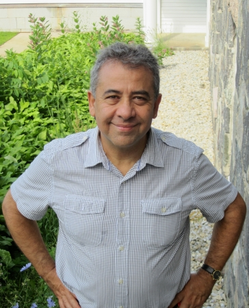  
  </br>
  ¿Me gusta el director?
</div>

- ¡NO! 

--

- Me cae bien el director.

--

- Me llevo bien con el director.

---

# Las preguntas

- de sí/no
- de información

---

# Preguntas de sí/no

- Inversión del sujeto/verbo

| Verbo   | Sujeto    | Otros elementos      |
|:--------|:----------|:---------------------|
| ¿Vive   | Martín    | en Madrid?           |
| ¿Comes  | (tú)      | fruta todos los días?|
| ¿Tenemos| (nosotros)| tarea?               |


</br>

- Sí, Martín vive en Madrid.

--

- No, no como fruta todos los días.

--

- No, no tenemos tarea.

---

# Preguntas de información

- Requieren una expressión interrogativa

| Expression interrogativa | Verbo    |  Sujeto     |
|:-------------------------|:---------|:------------|
| ¿Dónde                   | vive     | Martín?     |
| ¿Qué                     | comes    | (tú)?       |
| ¿Cuándo                  | es       | la reunión? |

---

# Con un compañero

<div align="center">
  
</div>

</br>

- Haced una lista de 4 preguntas (2 sí/no, 2 de información)
- Tened en cuenta la entonación

---

# El presente progresivo

- Sirve para hablar de acciones en progreso
- estar + gerundio
	- -ar = ando
	- -er/-ir = iendo

--

- com**er**

--

- com

--

- com + iendo

--

- comiendo


---

# Presentaciones

---
class: inverse, center, middle

# Repaso

---

# Hemos visto

- Vocabulario:
    - El tiempo libre
- Gramática:
    - Gustar
    - Preguntas
    - El presente progresivo
- Ejercicios opcionales
    - Vocabulario en contexto
        - TXT 0P-05, 0P-16
        - SAM 0P-21, 0P-22, 0P-23, 0P-26
    - Funciones y formas: 1
        - SAM 0P-36, 0P-37


