## Los sustantivos

> - Género
> - Número
> - Artículos

---

## Los sustantivos

>- Género
	- masculino
	- femenino
- Número
	- singular
	- plural
- Artículos
	- definidos
	- indefinidos

---

## El abecedario

  

---

## ¿Qué es esto? ¿Cómo se escribe?

---

## El ahorcado

---

## Los números

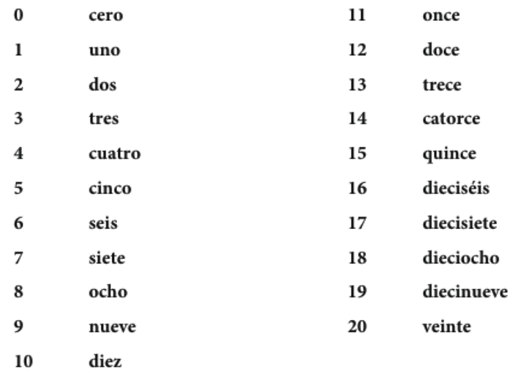

---

## Los números

---

## ¿Cuántos objetos hay en la sala de clase?

- ¿Cuántos libros? ¿Cuántas mochilas?
- ¿Cuántos pupitres? ¿Cuántos bolígrafos hay?
- ¿Cuántos estudiantes hay? ¿Cuántas sillas hay?

--- .segue bg:grey

<!-- contenido nuevo -->

# Capítulo 1.1 "Así somos"

---

## El plan

  

- Vocabulario
	- Saludos
	- Origen
	- Intercambiar información básica

 
  
- Gramática
	- los pronombres personales
	- los verbos **estar**, **ser**, **tener**, **ir**

---

## Los pronombres personales

 

|    | Singular      |  Plural            |
|:---|:--------------|:-------------------|
| 1a | yo            | nosotros/as        |
| 2a | tú            | vosotros/as        |
| 3a | él/ella/usted | ellos/ellas/ustedes|

<!-- imagen -->

---

## El verbo estar

 

|    | Singular                | Plural                         |
|:---|:------------------------|:-------------------------------|
| 1a | yo **estoy**            | nosotros/as **estamos**        |
| 2a | tú **estás**            | vosotros/as **estáis**         |
| 3a | él/ella/usted **está**  | ellos/ellas/ustedes **están**  |

<!-- imagen -->

---

## Las presentaciones y los saludos formales (con los profesores)

  

  

---

## Las presentaciones y los saludos formales (con los profesores)

  

---

## Las presentaciones y los saludos informales (con los amigos)

  

  

---

## Las presentaciones y los saludos informales (con los amigos)

  

  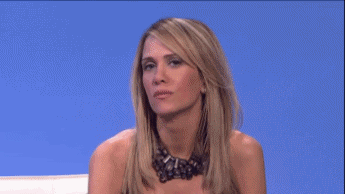

---

## ¿Cómo estás?: Los estados y el verbo estar

  

**Yo estoy \_\_\_\_**  

Ej. Yo estoy cansado(a)

--- .segue bg:grey

# Descanso (10 minutos)

  

---

## ¿Cómo está(n)?

  

---

## ¿Cómo está(n)?

  

---

## ¿Cómo está(n)?

  

---

## ¿Cómo está(n)?

  

---

## ¿Cómo está(n)?

  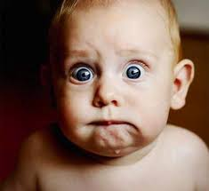

---

## ¿Cómo está(n)?

  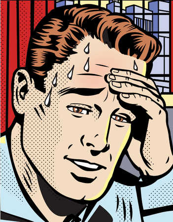

---

## ¿Cómo está(n)?

  

---

## ¿Cómo está(n)?

  

---

## ¿Cómo está(n)?

  

---

## ¿Cómo está(n)?

  

---

## Intercambiar información básica

  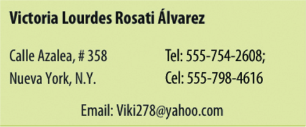

- ¿Cómo te llamas?
- ¿Dónde vives?
- ¿Cuál es tu número de teléfono?
- ¿Cuál es tu dirección de correo electrónico?

---

## El verbo tener

|    | Singular                | Plural                         |
|:---|:------------------------|:-------------------------------|
| 1a | yo **tengo**            | nosotros/as **tenemos**        |
| 2a | tú **tienes**           | vosotros/as **tenéis**         |
| 3a | él/ella/usted **tiene** | ellos/ellas/ustedes **tienen** |

 

- ¿Cuántas clases tienes?
- ¿Cuántos años tienes?
- ¿Tienes hambre?

(clase, sueño, prisa, calor, frío, hambre)

---

## El verbo ser

|    | Singular             | Plural                     |
|:---|:---------------------|:---------------------------|
| 1a | yo **soy**           | nosotros/as **somos**      |
| 2a | tú **eres**          | vosotros/as **sois**       |
| 3a | él/ella/usted **es** | ellos/ellas/ustedes **son**|

 

- ¿De dónde eres?
- ¿Cuál es tu dirección?

(profesor, estudiante, militar, hombre, mujer, padre, madre, simpático)

---

## El verbo ir

|    | Singular             | Plural                     |
|:---|:---------------------|:---------------------------|
| 1a | yo **voy**           | nosotros/as **vamos**      |
| 2a | tú **vas**           | vosotros/as **vais**       |
| 3a | él/ella/usted **va** | ellos/ellas/ustedes **van**|

 

- ¿Adónde vas?
- ¿Que vas a hacer?

---

## Más detalles...

- **tener**
    - posesión (tengo tres gatos)
    - obligación (**tengo que** estudiar)
    - frases especiales
        - tengo frío/calor/hambre/sed/sueño/etc.
- **ir**
    - movimiento (**voy a** la biblioteca)
    - futuro (**voy a** estudiar)

---

  

--- .segue bg:grey

# Repaso

---

## Hemos visto  
    
> - Los pronombres personales
> - Hay 4 verbos fundamentales en español (**estar**, **ser**, **tener**, **ir**)
> - Tarea  
    - Usar **estar**, **ser**, **tener** e **ir** en conversaciones reales
    - Estudiar el vocabulario
> - Tarea opcional  
    - CA1-7, CA1-8

--- .segue bg:grey

# Capítulo 1.2

---

## El plan

  

- Vocabulario:
    - La familia
- Gramática:
    - Posesión
    - Verbos regulares
- Presentación del compañero
- Estrategias para la comunicación oral  
- Cómo se graba un mp3 (actividad e-Portafolio)

---

## La familia

  

  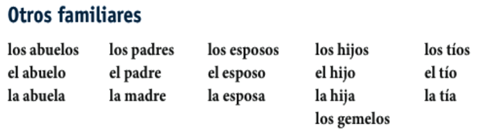

---

## ¿Cómo es tu familia?

- Mi hermano mayor se llama...
- Mi padre tiene ... años.
- Mi tía vive en...

 

  

---

## Los adjetivos posesivos

- Se utilizan para indicar **posesión**
- Tienen **número** y **género**

|    |       |                       |
|:---|:------|:----------------------|
| 1a | mi(s) | nuestros(s)/nuestra(s)|
| 2a | tu(s) | vuestro(s)/vuestra(s) |
| 3a | su(s) | su(s)                 |

 

- mi familia, mis abuelos

- su hija, sus hijos

- nuestr**a** herman**a**, nuestr**os** herman**os**

---

## La posesión con 'de'

  
  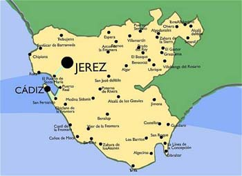

- Para evitar la confusión en la 3a persona, se puede usar la preposión 'de'

Enrique y Alicia viven en Cádiz.  

¿Dónde está sus casas?

> - La casa **de** él está en San Fernando. 
> - La casa **de** ella está en Sanlúcar.  

---

## La posesión con 'de'

  
  

- Para evitar la confusión en la 3a persona, se puede usar la preposión 'de'

Enrique y Alicia tienen amigos que viven en Cádiz.

¿Dónde viven sus amigos?

> - El amigo **de** Alicia vive en San Fernando.  
> - El amigo **de** Enrique vive en Sanlúcar. 

---

## ¡Nunca usamos -'s- para indicar posesión!

 

  <strike>
    <h1>
      Mi hermanas casa    
      Tu amigos coche    
      Su abuelos teléfono    
      Nuestro perros correa   
      Vuestras clases profesor    
      Sus camas sábanas  
    </h1>
  </strike>

---

  <strike>
    <h1>
      Mi hermanas casa   
      Tu amigos coche   
      Su abuelos teléfono   
      Nuestro perros correa   
      Vuestras clases profesor   
      Sus camas sábanas  
    </h1>
  </strike>

 

  <h1>
    La casa de mi hermana    
    El coche de tu amigo    
    El teléfono de su abuelo    
    La correa de nuestro perro    
    El profesor de vuestras clases    
    Las sábanas de sus camas  
  </h1>

--- .segue bg:grey

# Descanso (10 minutos)

  

---

## Los verbos regulares

Estamos muy ocupados entre semana.

  

---

## Los verbos regulares

Paso la semana en la universidad.

  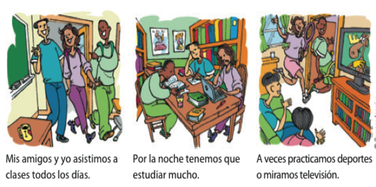

--- &twocol w1:40% w2:60%

## ¿Cómo es tu rutina?

*** {name: left}

 
 
 

- Normalmente yo...  

- A veces yo... 

*** {name: right}

 

- paso mucho tiempo en el facebook.
- voy al gimnasio por la mañana/por la tarde.
- escucho música/mi iPod.
- limpio el cuarto/el apartamento.
- preparo la comida.
- tomo café con mis amigos.

---

<!-- act 1-26 -->

  

---

## El tiempo presente expresa...

 

### ...una rutina

>- Estudio en la biblioteca todos los días.

### ...una acción continua

>- Mi amiga vive en una residencia este semestre.

### ...una acción en el futuro

>- Mis compañeros van a una fiesta mañana.

---

## Los verbos regulares

Hay tres tipos de infinitivos: -ar, -er, -ir

|                     | -ar        | -er         | -ir          |
|:--------------------|:-----------|:------------|:-------------|
|                     | **tomar**  | **comer**   | **asistir**  |
| yo                  | tom**o**   | com**o**    | asist**o**   |
| tú                  | tom**as**  | com**es**   | asist**es**  |
| él/ella/usted       | tom**a**   | com**e**    | asist**e**   |
| nosotros(as)        | tom**amos**| com**emos** | asist**imos**|
| vosotros(as)        | tom**áis** | com**éis**  | asist**ís**  |
| ellos/ellas/ustedes | tom**an**  | com**en**   | asist**en**  |

--- &twocol w1:40% w2:60%

## Algunos verbos regulares

*** {name: left}

  **-ar**  
  Adivinar  
  Gastar  
  Amar  
  Apagar  
  Ayudar  
  Invitar  
  Bailar  
  Jugar  
  Besar  
  Lavar  
  Cambiar  
  Levantar  
  Despertar  
  Pasear  

*** {name: right}

  Dibujar  
  Pensar  
  Disfrutar  
  Pintar  
  Durar  
  Practicar  
  Echar  
  Preguntar  
  Empezar  
  Prestar  

--- &twocol w1:40% w2:60%

## Algunos verbos regulares

*** {name: left}

  **-er**  
  Agradecer  
  Llover  
  Beber  
  Nacer  
  Caber  
  Ofrecer  
  Caer  
  Perder  
  Comer  
  Prometer  
  Comprender   

*** {name: right}

  **-ir**  
  Abrir  
  Partir  
  Construir  
  Pedir  
  Corregir  
  Prohibir  
  Decidir  
  Recibir  
  Despedir  
  Seguir  
  Discutir  

---

## Presentación de un compañero

> - Vais a hacer una presentación oral corta mañana

> - Duración de 1 a 2 minutos

> - El enfoque será en las construcciones que hemos visto en clase

> - Podéis hablar de lo que queráis (sugiero que os centréis en lo que hemos visto)

---

## Gramática 

> - los sustantivos/artículos
> - los pronombres personales
> - los verbos ser/estar/tener/ir
    - tener + sustantivo (posesión)
    - tener que + infinitivo (obligación)
    - ir a + sustantivo (movimiento)
    - ir a + infinitivo (futuro)
> - los adjetivos posesivos

---

## Preparación

Para preparar debéis:

> - Escoger un compañero
> - Quedar en una hora esta tarde para hablar
> - Utilizar nuestras estrategias para obtener información
> - Apuntar toda la información (verificar que es correcta)
> - Ensayar (podéis hacer un esquema básico en una tarjeta)
> - <blue>NO PODÉIS LEER</blue>

---

## Estrategias para la comunicación oral  

> - ¡Ensayar! ¡Ensayar! ¡Ensayar!

> - Hablar lentamente

> - Vocales puras

> - Tensión bucal

> - Practicad palabras largas por sílabas

---

## Cómo se graba un mp3 (actividad e-Portafolio)

- SansSpace

--- .segue bg:grey

# Repaso

---

## Hemos visto

- Vocabulario: La familia
- Gramática:
    - Posesión
    - Verbos regulares (-ar, -er, -ir)
- Estrategias para la comunicación oral  
- Cómo se graba un mp3 (actividad e-Portafolio)

**La tarea**

- Presentación de un compañero

---

## Actividad posesivos

  

---

## Actividad verbos regulares

  

---

## La relación sujeto/verbo

**SVO**

> - **Juan** ***tiene*** tres clases este semestre.

> - **Juan** *no* ***tiene*** un laboratorio este semestre.

> - **Yo** ***tengo*** cuatro clases este semestre, pero **ella** ***tiene*** cinco.

--- .segue bg:grey

# Puentes Capítulo 1.3

---

## El plan

- Vocabulario:
    - El tiempo libre
- Gramática:
    - Gustar
    - Preguntas
    - El presente progresivo
 - Presentación del compañero (1:30 minutos)

<!-- - La interculturalidad: Identificar aspectos de la interculturalidad -->

---

## ¿Qué le gusta hacer en su tiempo libre?

  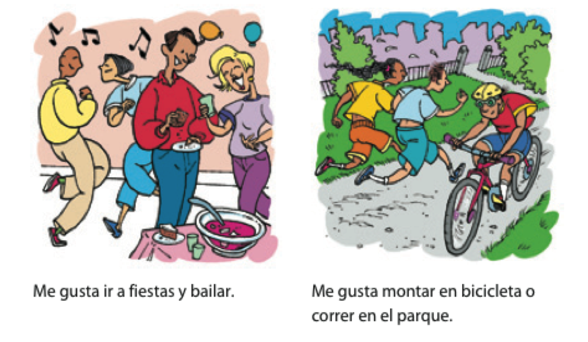

---

## ¿Qué le gusta hacer en su tiempo libre?

  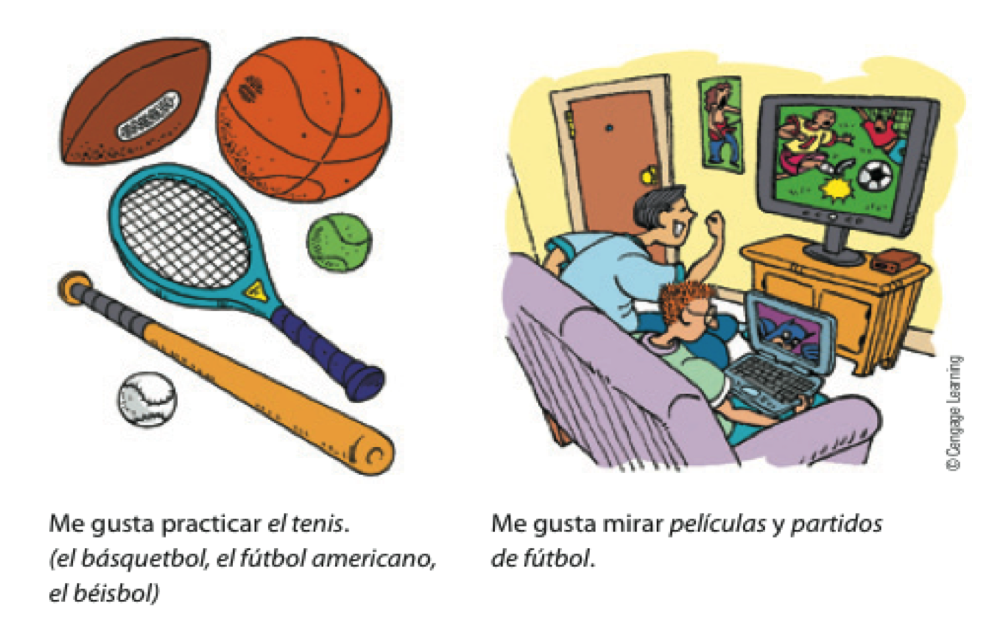

---

## El verbo gustar

- El verbo gustar tiene DOS formas: **gusta** y **gustan**

 

| Complemento Indirecto | gusta/gustan | Sujeto        |
|:----------------------|:-------------|:--------------|
| Me                    | gust**a**    | jugar al tenis|
| Te                    | gust**a**    | el tenis      |
| Le                    | gust**a**    | el deporte    |
| Nos                   | gust**a**    | la clase      |
| Os                    | gust**a**    | Middlebury    |
| Les                   | gust**a**    | la lluvia     |

---

## El verbo gustar

- El verbo gustar tiene DOS formas: **gusta** y **gustan**

 

| Complemento Indirecto | gusta/gustan | Sujeto               |
|:----------------------|:-------------|:---------------------|
| Me                    | gust**an**   | los árboles          |
| Te                    | gust**an**   | el tenis y el fútbol |
| Le                    | gust**an**   | los deportes         |
| Nos                   | gust**an**   | las clases           |
| Os                    | gust**an**   | los edificios        |
| Les                   | gust**an**   | las nubes            |

---

## ¿A ti qué te gusta hacer en tu tiempo libre?

- montar en bicicleta 
- jugar videojuegos 
- practicar el tenis 
- mirar una película de terror 
- bailar en una fiesta 
- ir de compras 
- correr por el campus 
- leer el periódico 
- practicar el básquetbol

--- &twocol w1:40% w2:60%

## ¿Con qué frecuencia...

*** {name: left}

 
 
 
 

- vas de compras?
- vas al cine?

*** {name: right}

 
 
 

- a menudo
- a veces
- casi todos los días
- casi nunca
- nunca

---

## El énfasis y aclaración con gustar y los nombres.

|Complemento Indirecto | gusta/gustan | Sujeto        |
|:---------------------|:-------------|:--------------|
| **A mí** me          | gust**a**    | jugar al tenis|
| **A ti** te          | gust**a**    | el tenis      |
| **A él** le          | gust**a**    | el deporte    |
| **A nosotros** nos   | gust**a**    | la clase      |
| **A vosotros** os    | gust**a**    | Middlebury    |
| **A ellas** les      | gust**a**    | la lluvia     |

 
**A Carlos** le gusta pasar su tiempo libre en la residencia, pero **a Juan** le gusta estudiar en su cuarto.

---

## El énfasis y aclaración con gustar y los nombres.

| Complemento Indirecto | gusta/gustan | Sujeto              |
|:----------------------|:-------------|:--------------------|
| **A mí** me           | gust**an**   | los árboles         |
| **A ti** te           | gust**an**   | el tenis y el fútbol|
| **A él** le           | gust**an**   | los deportes        |
| **A nosotros** nos    | gust**an**   | las clases          |
| **A vosotros** os     | gust**an**   | los edificios       |
| **A ellas** les       | gust**an**   | las nubes           |

 
**A Carlos** le gustan los plátanos, pero **a Juan** le gustan las manzanas.

--- &twocol w1:40% w2:60%

## ¿A tus amigos y a ti les gusta...

*** {name: left}

 
 
 

- jugar videojuegos?

- patinar sobre el hielo?

- nadar?

*** {name: right}

 
 
 

- Sí, nos gusta mucho.

 

- No, no tanto.

--- .segue bg:grey

# Descanso (10 minutos)

  

---

## Cuando NO usamos gustar

  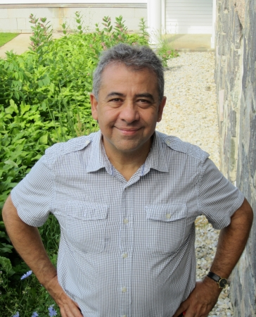  
  ¿Me gusta el director?

> - ¡NO! 
> - Me cae bien el director.
> - Me llevo bien con el director.

---

## Las preguntas

- de sí/no
- de información

---

## Preguntas de sí/no

- Inversión del sujeto/verbo

| Verbo   | Sujeto    | Otros elementos      |
|:--------|:----------|:---------------------|
| ¿Vive   | Martín    | en Madrid?           |
| ¿Comes  | (tú)      | fruta todos los días?|
| ¿Tenemos| (nosotros)| tarea?               |

 

> - Sí, Martín vive en Madrid.
> - No, no como fruta todos los días.
> - No, no tenemos tarea.

---

## Preguntas de información

- Requieren una expressión interrogativa

| Expression interrogativa | Verbo    |  Sujeto     |
|:-------------------------|:---------|:------------|
| ¿Dónde                   | vive     | Martín?     |
| ¿Qué                     | comes    | (tú)?       |
| ¿Cuándo                  | es       | la reunión? |

---

## Con un compañero

  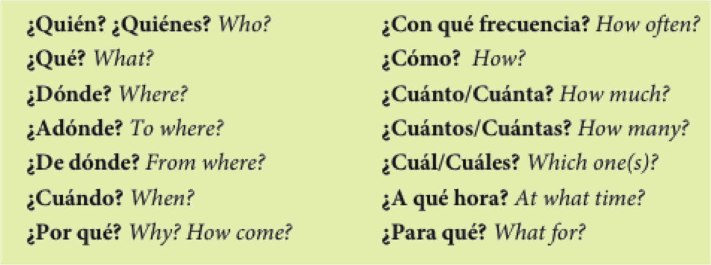

 

- Haced una lista de 4 preguntas (2 sí/no, 2 de información)
- Tened en cuenta la entonación

---

## El presente progresivo

- Sirve para hablar de acciones en progreso
- estar + gerundio
	- -ar = ando
	- -er/-ir = iendo

> - com**er**
> - com
> - com + iendo
> - comiendo

---

## Presentaciones

--- .segue bg:grey

# Repaso

---

## Hemos visto

- Vocabulario:
    - El tiempo libre
- Gramática:
    - Gustar
    - Preguntas
    - El presente progresivo
- Tarea (opcional)
	- CA1-15, CA1-16, CA1-17

