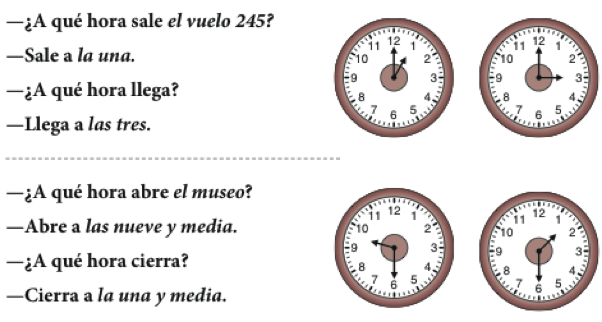
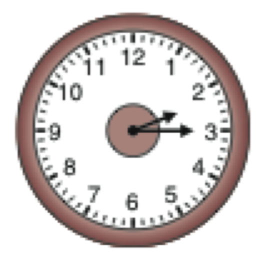
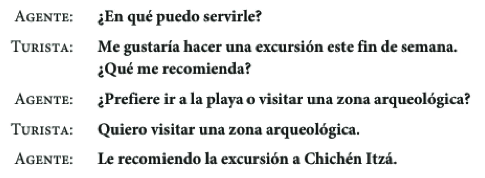
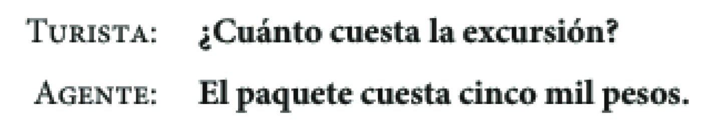
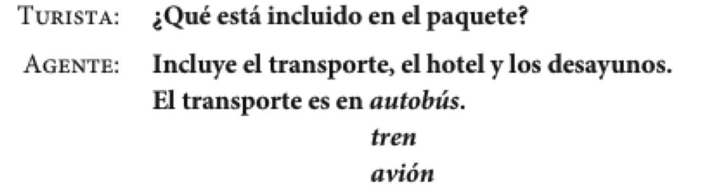
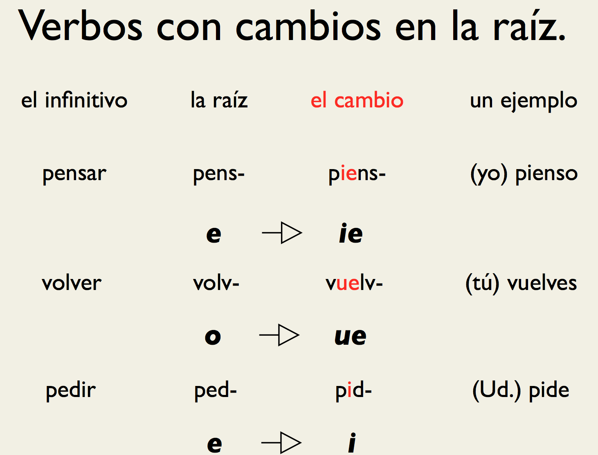
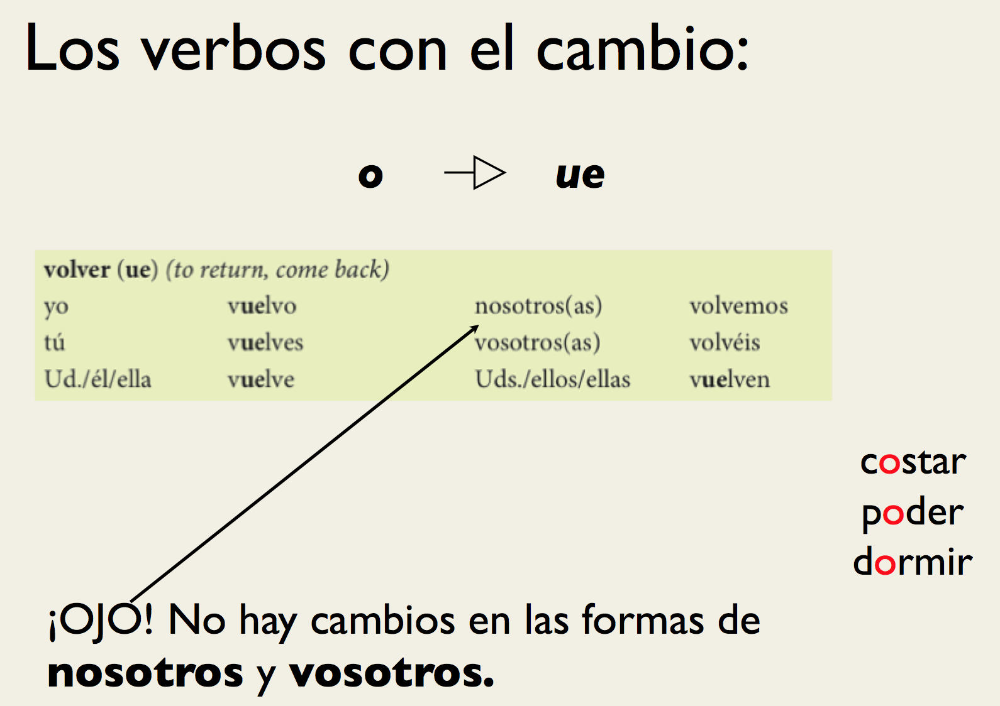
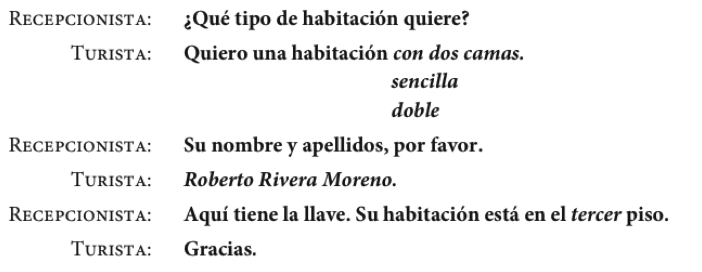
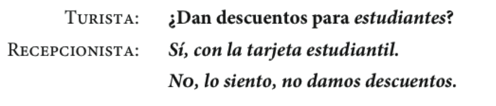

## Hemos visto

- Vocabulario:
    - El tiempo libre
- Gramática:
    - Gustar
    - Preguntas
    - El presente progresivo
- Tarea (opcional)
	- GS1-1, GS1-2, GS1-3

---

## ¿Qué están haciendo?

  

---

## ¿Qué están haciendo?

  

---

## ¿Qué están haciendo?

  

---

## ¿Qué están haciendo?

  

---

## ¿Qué están haciendo?

  

---

## ¿Qué están haciendo?

  

---

## ¿Qué están haciendo?

  

--- .segue bg:grey

# Puentes Capítulo 2

---

## El plan

  

- Vocabulario:
	- Horarios
	- fechas; de viaje
- Gramática:
	- Verbos de cambio radical
- Como hacer una grabación
- Estrategias para la comprensión auditiva

---

## Una pruebita

<!-- imprimir hojas -->

---

## ¿A qué hora... ?: cómo hablar de horarios

  

---

## Cómo decir la hora

 

¿Qué hora es?

 

    

de la mañana

---

## Cómo decir la hora

 

Perdón, ¿me puede decir la hora?  

 

 

    

 

de la tarde

 

---

## ¿Qué hora es?: dos formas de decir la hora

    

 

  Son las dos y cuarto.  

 

 

  Son las dos y quince.

 

---

## ¿Qué hora es?: dos formas de decir la hora

    

 

  Son las ocho menos veinte.

 

   

Son las siete y cuarenta.

 

---

## ¿Qué día es hoy?: los días de la semana

Hoy es...

|     |       |           |        |        |         |        |         |
| :-- | :---- | :-------- | :----- | :----- | :------ | :----- | :------ |
|     | Lunes | Martes | Miércoles | Jueves | Viernes | Sábado | Domingo |

 

  

- ¿Qué día es hoy?
- ¿En qué día estamos?
- ¿Cuándo está abierto el museo?
- ¿Cuándo está cerrado?

---

## ¿Cuál es la fecha de hoy?: los meses del año

  

- Hoy es...

---

## Para planificar un viaje: el tipo de viaje

  

---

## Información importante sobre la excursión

    
   
  

---

## Más datos y métodos de pago

    
   
  

---

## Las frases verbales para expresar los planes

- Cuando hablamos de nuestros planes, hay construcciones que son muy útiles...
	- ir + a + infinitivo
	- esperar + infinitivo
	- pensar + infinitivo

**Vamos a viajar a México.**  

**Espero visitar muchos museos.**

**¿Piensas visitar el museo de historia el domingo?**

---

## Las frases verbales para expresar las preferencias

- Cuando queremos hablar de nuestras preferencias, hay construcciones que son muy útiles...
	- querer + infinitivo
	- me gustaría + infinitivo
	- preferir + infinitivo

**Quiero viajar en junio.**  

**Me gustaría regresar el jueves, día 10 de julio.**  

**Prefiero salir el domingo 6 de junio.**

---

## Las frases verbales para expresar las obligaciones

- deber + infinitivo
- necesitar + infinitivo
- tener + que + infinitivo

**Debo planificar el viaje.**  

**Necesito hablar con el agente de viajes.**  

**Tengo que buscar un mapa de la ciudad.**

---

## Verbos irregulares

  

---

## Verbos irregulares

  

---

## Verbos irregulares

  

---

## Verbos irregulares

  

---

## Verbos irregulares

  

---

## Como hacer una grabación

---

## Estrategias para la comprensión auditiva

--- .segue bg:grey

# Repaso

---

## Hemos visto

- Horarios
- Fechas; de viaje
- Verbos de cambio radical
- Tarea
	- correcciones de la presentación oral
	- opcional: libro de ejercicios
		- CA2-6
		- CA2-7
		- CA2-9
  - Pruebita el lunes

--- .segue bg:grey

# Repaso - Semana 1

--- &twocol

## Gramática

*** {name: left}

- Los sustantivos
	- Número
	- Género
	- Artículos
		- definidos
		- indefinidos
- Pronombres personales
- Ser, estar, tener, ir

*** {name: right}

- Pronombres posesivos
- Verbos regulares
- Gustar
- Preguntas
	- de Sí/No
	- de información
- El presente progresivo (gerundio)
- Verbos irregulares (cambio radical)

---

## Vocabulario

- Para sobrevivir (presentarse, instrucciones, hablar con el profesor)
- La sala de clase
- El alfabeto
- Los números
- Saludos
- Origen
- La familia
- El tiempo libre
- Horarios/Fechas
- Los viajes

--- .segue bg:grey

# Puentes capítulo 2.2

---

## El plan

- Vocabulario:
	- El hotel
	- más números
- Gramática:
	- Verbos irregulares 
- Estrategias para la comprensión auditiva

---

## Actividad verbos irregulares

- 2-14 p. 68

---

## Pruebita

---  &multitext

## Pruebita

1. jugar (1a persona singular)
2. pensar (2a persona singular)
3. querer (1a persona plural)
4. empezar (3a persona plural)
5. poder (3a persona singular)
6. servir (1a persona singular)

*** .explanation

1. juego
2. piensas
3. queremos
4. empiezan
5. puede
3. sirvo

*** .hint

¡No hay pistas!

---

## En un hotel: para conseguir una habitación

  

---

## En un hotel: para conseguir una habitación

  

---

## En un hotel: unas preguntas para el recepcionista

  
 
 
  
 
 
  

---

## En un hotel: ¿En que piso está... ?

  
 
  

---

- Actividad 2-19 p. 71  
- Actividad 2-20 p. 71  

--- .segue bg:grey

# Descanso (10 minutos)

  

---

## Los números de 100 a 10,000,000

  

---

- Actividad 2-22 p. 72  
- Actividad 2-25 p. 73

---

## Los verbos irregulares con -go: la forma yo

 

| Infinitivo |   Yo   |            Otras personas           |
| :--------- | :----- | :---------------------------------- |
| hacer      | hago   | haces, hace, hacemos, hacéis, hacen |
| poner      | pongo  | pones, pone, ponemos, ponéis, ponen |
| salir      | salgo  | sales, sale, salimos, salís, salen  |
| traer      | traigo | traes, trae, traemos, traéis, traen |
| traer      | traigo | traes, trae, traemos, traéis, traen |

---

## Los verbos de -go con cambios en la raíz

 

|                     | tener      | venir      | decir     |
| :------------------ | :--------- | :--------- | :-------- |
| yo                  | **tengo**  | **vengo**  | **digo**  |
| tú                  | t**ie**nes | v**ie**nes | d**i**ces |
| Usted/él/ella       | t**ie**ne  | v**ie**ne  | d**i**ce  |
| Nosotros(as)        | tenemos    | venimos    | decimos   |
| Vosotros(as)        | tenéis     | venís      | decís     |
| Ustedes/ellos/ellas | t**ie**nen | v**ie**nen | d**i**cen |

---

## Otros verbos irregulares en la forma yo

 

| Infinitivo |    Yo    |                   Otras personas                   |
| :--------- | :------- | :------------------------------------------------- |
| conducir   | conduzco | conduces, conduce, conducimos, conducéis, conducen |
| conocer    | conozco  | conoces, conoce, conocemos, conocéis, conocen      |
| dar        | doy      | das, da, damos, dais, dan                          |
| saber      | sé       | sabes, sabe, sabemos, sabéis, saben                |
| ver        | veo      | ves, ve, vemos, veis, ven                          |

---

## Saber vs. conocer

- Saber: se utiliza para información
    - Sé la respuesta
    - Sé hacer reservaciones en línea.
    - ¿Sabes dónde está el banco?
- Conocer: se utiliza para las personas y los lugares
    - Conozco Nueva Orleans.
    - ¿Conoces al agente de viajes?

---

## Expresiones particulares

  

---

- Actividad 2-28 p. 77
- Actividad 2-29 p. 77
- Actividad 2-30 p. 77

<!-- no me dio tiempo -->

---

## Estrategias para la comprensión auditiva

- Con un compañero haz una lista de estrategias que puedes utilizar para ayudarte a comprender el español mejor. 

--- .segue bg:grey

# Repaso

---

- Vocabulario
    - el hotel
    - los números
- Verbos irregulares
    - e > ie
    - e > i
    - o > ue
    - u > ue
    - verbos -go

Recordad...

> - la bota
> - verbos -go cambian en forma de yo

---

- Actividad 2-28 p. 77
- Actividad 2-29 p. 77
- Actividad 2-30 p. 77

