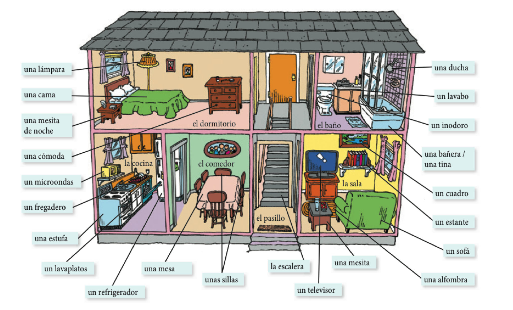
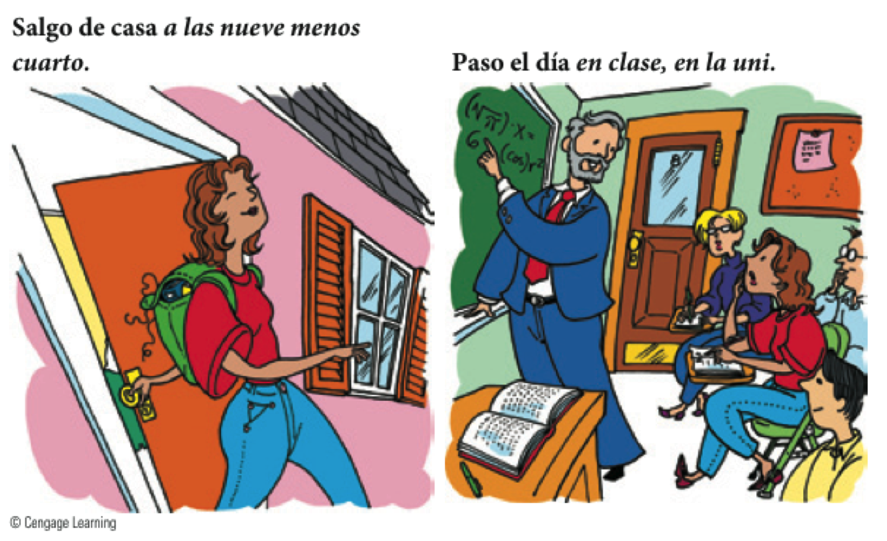
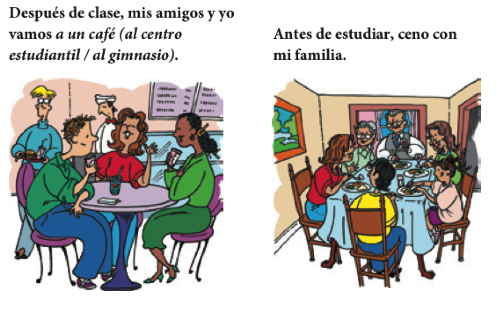

```{r setup, include=FALSE, cache=FALSE}
options(htmltools.dir.version = FALSE)
library(tidyverse)
```

```{r, eval=FALSE, echo=FALSE, cache=FALSE}
rmarkdown::render("./slides/semana3/index.Rmd")
xaringan::inf_mr('./slides/semana3/index.Rmd')
xaringan::inf_mr()
```

class: inverse, center, middle

# Precalentamiento

---

# Precalentamiento

<div style="float: left">
  
</div>

<div style="float: right">
  
</div>

---

# La familia

<div style="float: right">
  
</div>

<div align="center">
  
</div>

<!-- track 1-49 -->

---


# Mi árbol genealógico

- En una hoja de papel dibujad una imagen de ti mismo.

--

- Debajo de la imagen, pon tu nombre.

--

- Intercambiar hojas con un vecino.

--

- Descríbele tu familia para que él/ella pueda rellenar tu árbol.

--

- Devuelve la hoja y haz las correcciones necesarias.

--

- Comparte con la clase la descripción del árbol

---
class: inverse, center, middle

# Repaso

---

# La semana pasada vimos...

.pull-left[

## Gramática

- por vs. para
- saber vs. conocer
- verbos de cambio de raíz
- ser vs. estar
- verbos reflexivos

]

.pull-right[

## Vocabulario

- la comida
- los miembros de la familia
- las rutinas

]

---
class: inverse, center, middle

# Semana 3, día 1

---

# El plan

<div style="float: right">
  
</div>

## Vocabulario:

- Los muebles la casa

- La rutina

## Gramática:

- Reflexivos

- El participio pasado

- Más expresiones con tener

---

# ¿Cómo es la casa?: describir características de la casa

<div align="center">
  <div style="float: left">
  
  </div>
  <div align="right">
  
  </div>
</div>

</br>

--

- Mi casa es **nueva** (**vieja**).
- La sala es **grande** y **cómoda**.
- Los muebles son **elegantes**.

---

# ¿Cómo es la casa?: describir la casa, los cuartos y los muebles

<div align="center">
  <div style="float: left">
  
  </div>
  <div align="right">
  
  </div>
</div>

</br>

--

- Normalmente, mi cuarto está **ordenado** (**desordenado**).
- Por lo general, la cocina está **limpia**.
- Por desgracia, el **refrigerador** está **descompuesto** y la **ventana** está **rota**.

---

# ¿Dónde vive la familia?: la casa

<div align="center">
  
</div>

---

# Las relaciones espaciales - ¿Dónde está el gato?

<div align="center">
  
</div>

---

# Con un compañero nuevo...

- Saca una hoja de papel 

--

- Dibuja los planes de tu casa
  - Puede ser real
  - Puede ser la casa de tus sueños

--

- A la vez que dibujas, explícale a tu compañero lo que hay en la casa

--

- Describe con mucho detalle

--

- Intenta ser consciente de las pausas, la concordancia, etc. mientras hablas

---
background-image: url("../../site_libs/assets/img/huh.gif")
background-size: 250px
background-position: 90% 15%

# Comprensión auditiva

<audio controls>
  <source src="../../site_libs/assets/audio/disco1/61.ogg" type="audio/ogg">
  <source src="../../site_libs/assets/audio/disco1/61.wav" type="audio/wav">
Your browser does not support the audio element.
</audio>

--

1. ¿De qué color es el apartamento?

2. ¿Dónde está la cama?

3. ¿Dónde está el sillón?

4. ¿Qué hay delante del sillón?

5. ¿De quién es el apartamento?

6. ¿Quién habla?

---

# Un día ajetreado: la rutina diaria

- Por la mañana...

<div align="center">
  
</div>

---

# Un día ajetreado: la rutina diaria

- Por la mañana...

<div align="center">
  
</div>

---

# Un día ajetreado: la rutina diaria 

<div align="center">
  
</div>

---

# Un día ajetreado: la rutina diaria

- Por la tarde...

<div align="center">
  
</div>

---

# Un día ajetreado: la rutina diaria

- Por la noche...

<div align="center">
  
</div>

---
background-image: url("../../site_libs/assets/img/confundido.gif")
background-size: 450px
background-position: 90% 15%

# Comprensión auditiva

<audio controls>
  <source src="../../site_libs/assets/audio/disco1/64.ogg" type="audio/ogg">
  <source src="../../site_libs/assets/audio/disco1/64.wav" type="audio/wav">
Your browser does not support the audio element.
</audio>

--

1. ¿Quiénes hablan?

2. ¿De qué hablan?

3. ¿Qué hace después de ducharse?

4. ¿Tiene tiempo para almorzar?

5. ¿Qué hace los lunes y los miércoles?

6. ¿Qué hay que hacer para sacar buenas notas?

---
class: inverse, center, middle

# Descanso (10 minutos)

<div style="float: right">
  
</div>

---

# Los reflexivos

<div align="center">
  
</div>

---

# Los reflexivos

<div align="center">
  
</div>

---

# Los reflexivos

<div style="float:right">
  
</div>

--

- el sujeto == el objeto

--

- Hay concordancia entre el sujeto y el pronombre reflexivo  
Ej. y**o** <blue>me</blue> levant**o**

--

- El pronombre va al final si es un infinitivo. Aún hay concordancia  
Ej. Y**o** quier**o** <grey>levantar</grey><blue>me</blue>


</br>

--

```{r, results='asis', echo=FALSE}
dplyr::tribble(
~'Primera persona', ~'&#160;',  ~'Segunda persona', 
 'yo **me**',        '',         'nosotros **nos**', 
 'tú **te**',        '',         'vosotros **os**', 
 'ella **se**',      '',         'ellas **se**'
) %>% 
as.data.frame(.) %>%
pander::pandoc.table(., style = "rmarkdown", 
                        justify = c('left', 'left', 'left'))
```
---

# El señor Bean

<div align="center">
  <video width="420" height="315" allowfullscreen controls>
    <source src="./assets/videos/beanReflexive.mp4" type="video/mp4">
    <source src="./assets/videos/beanReflexive.ogg" type="video/ogg">
  </video>
</div>

---

# Con un compañero

- Explicad la rutina diaria del Señor Bean

- Escoged una persona famosa y describid su rutina cotidiana

---
class: inverse, center, middle

# Repaso

---

# Repaso

### Vocabulario:

- Los muebles la casa
- La rutina

### Gramática:

- Reflexivos
- El participio pasado


---
class: inverse, center, middle

# Semana 3, día 2

---

# Más expresiones con 'tener'

### Con 2 o 3 compañer@s...

1. Escoged 3 expresiones con 'tener'. 
2. Averiguad su significado.
3. Describid la expresión a otro grupo usando gestos. 

--

.pull-left[

- tener sed
- tener miedo (de algo)
- tener frío
- tener calor
- tener sueño
- tener dolor de (algo)
- tener prisa
- tener celos
- tener confianza

]

.pull-right[

- tener cuidado
- tener vergüenza
- tener razón
- tener éxito
- tener la culpa (de algo)
- tener suerte
- tener lugar
- tener ganas (de algo)
- tener (algo) en cuenta

]

---

# Con un@ compañer@

### Ejercicios

- 4-24 (p. 155)
- 4-25 (p. 156)

### Recordad

- el sujeto == el objeto
- Hay concordancia entre el sujeto y el pronombre reflexivo  
Ej. y**o** <blue>me</blue> levant**o**
- El pronombre va al final si es un infinitivo. Aún hay concordancia  
Ej. Y**o** quier**o** <grey>levantar</grey><blue>me</blue>


---
class: inverse, center, middle

# El participio pasado

---

# El participio pasado

- Podemos formar **adjetivos** a partir de cualquier verbo

--

- Hay una forma para los verbos -ar (-**ado**)

--

- Hay otra forma para los verbos -er/-ir (-**ido**)

---

# El participio pasado

1. quitar la terminación 
  - hablar > habl
  - comer > com 
  - dormir > dorm

--

2. añadir -ado/-ido 
  - habl + ado = habl**ado**
  - com + ido = com**ido**
  - dorm + ido = dorm**ido**

---

# El participio pasado

### El participio pasado funciona bien con los verbos **ser** y **estar** y también después de un sustantivo

- El trabajo *está* **terminado**

- El español *es* **hablado** por muchas personas

- El bicho **aplastado** en el piso *estaba* **muerto**

---

# El participio pasado

## **Ojo**

### ¡No te confundas con el gerundio!

--

### Hay formas irregulares

- <blue>hacer</blue> > **hecho**
- <blue>escribir</blue> > **escrito**
- <blue>abrir</blue> > **abierto**
- <blue>decir</blue> > **dicho**
- <blue>poner</blue> > **puesto**
- <blue>morir</blue> > **muerto**
- <blue>romper</blue> > **roto**
- <blue>ver</blue> > **visto**
- <blue>volver</blue> > **vuelto**

---
class: inverse, center, middle

# Descanso (10 minutos)

<div style="float: right">
  
</div>

---

# Ejercicios

### Con tu compañero, escribid 4 oraciones que describan Middlebury usando el participio pasado (2 con ser y 2 con estar).

---

# Ejercicios

### Poned la forma del participio pasado

.pull-left[

1. morir
2. decir
3. ir
4. salir
5. haber
6. poner
7. volver
8. cubrir
9. comer
10. abrir

]

--

.pull-right[

1. muerto
1. dicho
1. ido
1. salido
1. habido
1. puesto
1. vuelto
1. cubierto
1. comido
1. abierto

]

---

# Ejercicios

### Completad las siguientes oraciones

1. Todo el campo estaba (cubrir) de nieve. 
2. Estas dificultades son (resolver) muy rápidamente. 
3. Si ya no salen juntos, es porque está (romper) su compromiso. 
4. La jefa está (satisfacer) con el trabajo de su empleado. 
5. Los cuadros de este pintor son (exponer) durante seis meses. 
6. Estas personas están (morir). 
7. La puerta está (abrir) hasta las siete. 
8. (escribir) las direcciones en los sobres, los echamos al buzón. 
9. Cuando llegamos, encontramos las camas (deshacer). 
10. La biblioteca me sigue llamando, pero los libros ya están (devolver)

---

# Ejercicios

### Completad las siguientes oraciones

1. Todo el campo estaba **cubierto** de nieve. 
2. Estas dificultades son **resueltas** muy rápidamente. 
3. Si ya no salen juntos, es porque está **roto** su compromiso. 
4. La jefa está **satisfecha** con el trabajo de su empleado. 
5. Los cuadros de este pintor son **expuestos** durante seis meses. 
6. Estas personas están **muertas**. 
7. La puerta está **abierta** hasta las siete. 
8. **Escritas** las direcciones en los sobres, los echamos al buzón. 
9. Cuando llegamos, encontramos las camas **deshechas**. 
10. La biblioteca me sigue llamando, pero los libros ya están **devueltos**.

---

# Presentación 3

- Mi restaurante preferido

---


class: inverse, center, middle

<!-- semana 3, d'ia 4 = no class, presentations -->

# Semana 3, día 5

---

# Precalentamiento

### ¡Cálmate!

Tu amiga Sofía va a montar una fiesta para su novio. Ella está un poco preocupada con los preparativos y tú tienes que calmarla. Con un(a) compañero(a) de clase, seguid el modelo y completad los diálogos. ¡Ojo! Hay que usar participios pasados en las respuestas. 

- **Sofía**: ¿Quién va a **decorar** el pastel?
- **Tú**: ¡No te preocupes! El pastel ya *está* **decorado**. 

---

# Precalentamiento

### ¡Cálmate!

**Sofía**: ¿Quién va a **decorar** el pastel?  
**Tú**: ¡No te preocupes! El pastel ya *está* **decorado**. 

- ¿Por qué no **preparamos** los sándwiches ahora?
- ¿Quién va a **poner** la mesa?
- Ahora tenemos que **hacer** las camas.
- ¿Cuándo vamos a **envolver** los regalos?
- Debemos **abrir** las ventanas; hace calor hoy.
- ¿Hay más platos sucios? Tenemos que **lavar**los antes de que lleguen los invitados. 

---

# Precalentamiento

### ¿Qué habéis hecho...?

- Cuéntale 2 cosas a tu compañero/a que has hecho
  - hoy
  - esta semana 
  - este verano
  - este año

---

# El presente perfecto

### Sirve para indicar cosas que **han pasado** y siguen siendo relevantes en el presente. 

- ¿Has comprado el vino para la fiesta?
- Sí, y también he preparado las tapas.
- ¿Qué han hecho ustedes hoy?
- Hemos trabajado mucho 

--

### El verbo haber

.pull-left[

- **haber** + participio pasado = el presente perfecto
- **¡OJO!** ¡No se pronuncia la "h"!
- **¡Recordad!** Algunos verbos son irregulares.

]

.pull-right[

|     |    |          Singular          |    |              Plural               |
| :-- | :- | :------------------------- | :- | :-------------------------------- |
| 1a  |    | yo **he** trabajado        |    | nosotros **hemos** dormido        |
| 2a  |    | tú **has** comido          |    | vosotros **habéis** dormido       |
| 3a  |    | él/ella/usted **ha** visto |    | ellos/ellas/ustedes **han** hecho |
| | &nbsp; &nbsp; | | &nbsp; &nbsp; | |

]

---
class: inverse, center, middle

# Los complementos directos

---

# Los complementos directos...

### Reciben la acción del verbo

<div style="float: right">
   
 
</div>

--

- Voy a probar **el flan**.
- ¿Qué voy a probar? **El flan**.

</br>

--

- Veo a **nuestro camarero**.
- ¿A quién veo? A **nuestro camarero**.

---

# Los <blue>PRONOMBRES</blue> de complementos directos...

### Sirven para evitar la repitición

<div style="float: right">
   
 
</div>

--

- Voy a probar **el flan**.
- **Lo** como con frecuencia.

</br>

--

- Veo a **nuestro camarero**.
- **Lo** veo enfrente del restaurante.

---

# Los <blue>pronombres</blue> de complementos directos

Concuerdan en cuanto al número y género. 

```{r results = 'asis', echo = FALSE}
library(dplyr)
tribble(

 ~Persona,       ~'&#160;', ~Singular,     ~'&nbsp;',  ~Plural,
  '1a',           '',        '**me**',      '',        '**nos**', 
  '2a',           '',        '**te**',      '',        '**os**', 
  '3a',           '',        '**lo, la**',  '',        '**los, las**', 
  'sustantivos',  '',        '**lo, la**',  '',        '**los, las**') %>%

as.data.frame(.) %>% 
pander::pandoc.table(., style = "rmarkdown", 
                        justify = c('left', 'left', 'left', 'left', 'left'))
```

</br>

--

- ¿Cómo quieres **el café**?
- **Lo** tomo con azúcar.

--

<p></p>

- ¿Tienes **las galletas**?
- Sí, **las** tengo.

--

<p></p>

- ¿Tú **me** ves?
- Sí, yo **te** veo. 

---

# Los complementos directos

## La posición de los complementos directos pronominales depende de la forma verbal.

--

### Con un verbo conjugado

- ¿Necesitas **el menú**?
- No, no **lo** necesito.

--

### Con un verbo conjugado y un infinitivo 

- ¿Vas a servir **la torta** ahora?
- No, **la** voy a servir un poco más tarde.
- No, voy a servir**la** un poco más tarde.

---

# A practicar

### Forma una pregunta para tu compañer@ usando los ejemplos abajo  

Ej. **ayudar económicamente**  

<grey>Pregunta</grey>: ¿Quién <blue>te</blue> **ayuda** económicamente?  

--

<grey>Respuesta</grey>: Mis padres <blue>me</blue> **ayudan** económicamente. 

--

1. querer mucho
2. escuchar en todo momento
3. llamar por teléfono con frecuencia
4. ayudar con los problemas
5. aconsejar cuando estás indeciso/a

---

# ¿Qué ves?

<div align="center">
  
  
  
</div>

---

# ¿Qué comes?

<div align="center">
  
  
</div>

---

# ¿Qué ves?

<div align="center">
  
  
  
</div>

---

# ¿Qué ves?

<div align="center">
  
  
</div>

--

- 5-23 (p. 190)
- 5-24 (p. 191)

---

<div align="center">
<iframe src="https://play.kahoot.it/#/k/6cad70d6-9189-49ea-8999-da96b4cccfa3" width="1000" height="600" style="border:none;overflow:hidden" scrolling="no" frameborder="0" allowTransparency="true" allowFullScreen="true"></iframe>
</div>

---

# Esta semana hemos visto...

- El participio pasado
- El presente perfecto
- Los pronombres de objetos directos
