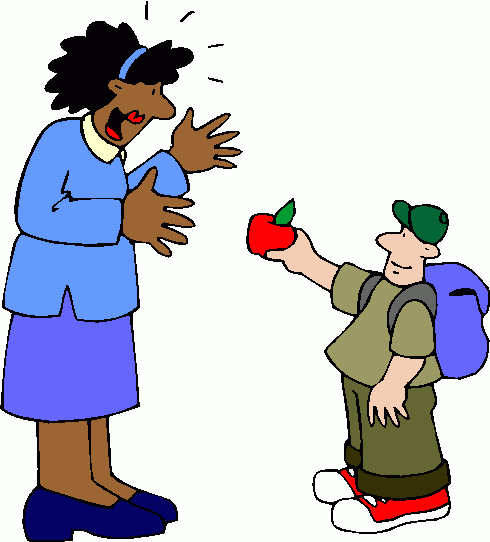
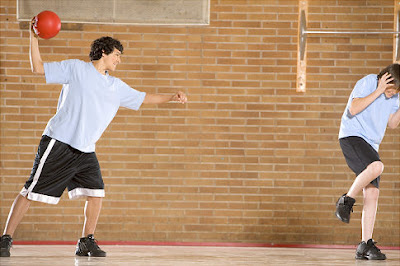
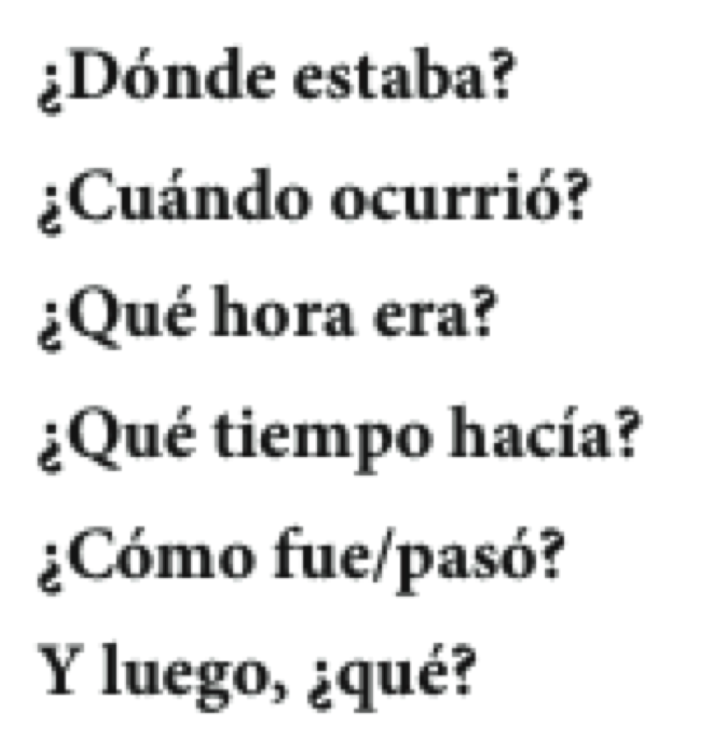

```{r setup, include=FALSE, cache=FALSE}
options(htmltools.dir.version = FALSE)
library(tidyverse)
```

```{r, eval=FALSE, echo=FALSE, cache=FALSE}
rmarkdown::render("./slides/semana5/index.Rmd")
xaringan::inf_mr('./slides/semana5/index.Rmd')
xaringan::inf_mr()
```


class: inverse, middle, center

# Semana 5, día 1

---

# El plan

<div style="float: right">
  
</div>


- El imperfecto
- El complemento indirecto
- Como preparar una presentación con elementos visuales

---

# Precalentamiento

### Batalla naval - verbos reflexivos

- Hoja 2 (sentarse, levantarse, etc.)

--

### Pruebita

---

# Prueba

Hola Javier,  

Ya llevo muchas semanas en la Escuela Española y creo que me estoy volviendo loco. La semana pasada yo **vi** que no siempre es divertido estar en Middlebury. Los profesores me **dieron** mucha tarea y yo **estuve** enfermo durante 2 días. Mis amigos y yo **quisimos** ir al lago Dunmore, pero no **hubo** manera con tanta tarea. Al final nosotros **fuimos** al grill cada noche para estudiar más. Por si te parece poco, mi mejor amigo **tuvo** que dejar el programa porque tenía demasiado estrés y se le **cayó** todo el pelo. 

---

# Prueba

Él **se puso** malo después de las pruebas del profesor Joseph. La semana pasada yo te **dije** que me encantaba Middlebury, pero yo **llegué** a la conclusión de que echo de menos a mi madre y no sé para qué yo **vine**. Le escribí una carta en español pero creo que ella ni la **leyó**. ¿Cómo **pudiste** aguantar todo esto durante 7 semanas? Yo **busqué** información en la oficina de los bilingües, pero ni modo. Espero sobrevivir hasta el final. Si no me ves dentro de dos semanas, es porque me mató la comida de Proctor.  

Con mucho miedo,  
Martín

---

# Estrategias para aprender vocabulario

- ¿Cómo sueles aprender vocabulario nuevo? ¿En qué situaciones? ¿Con quién sueles estar?

- ¿Qué haces para recordar el vocabulario nuevo que aprendes?

- ¿Qué sugerencias tienes para aprender y memorizar vocabulario nuevo (haz una lista)?

- ¿Cómo puedes mejorar tu estrategias?

---
class: inverse, middle

<div style="float:right">
  
</div>

### Era una noche fría de invierno. Yo estaba en casa, sola y 
### aburrida. Bueno, no estaba completamente sola, porque 
### allí a mi lado, tenía mi gato. Mi gato se llamaba Tigre y 
### era un gato de esos egoístas y fríos. Normalmente, Tigre 
### pasaba la noche en el dormitorio donde dormía debajo de mi cama. Pero esa noche parecía un 
### poco nervioso y se escondía detrás de los cojines del sofá. De repente, Tigre saltó del sofá 
### y corrió a la puerta. Yo lo seguí y abrí la puerta con cuidado...

---
class: inverse, middle

<div style="float:right">
  
</div>

### **Era** una noche fría de invierno. Yo **estaba** en casa, sola y 
### aburrida. Bueno, no **estaba** completamente sola, porque 
### allí a mi lado, **tenía** mi gato. Mi gato se **llamaba** Tigre y 
### **era** un gato de esos egoístas y fríos. Normalmente, Tigre 
### **pasaba** la noche en el dormitorio donde **dormía** debajo de mi cama. Pero esa noche **parecía** un 
### poco nervioso y se **escondía** detrás de los cojines del sofá. De repente, Tigre saltó del sofá 
### y corrió a la puerta. Yo lo seguí y abrí la puerta con cuidado...

---
class: inverse, middle, center

# El imperfecto

---

# El imperfecto 

## En un cuento, el imperfecto describe el trasfondo de la historia y crea una imagen. 

--

### **Era** una noche fría de invierno. Yo **estaba** en casa, sola y aburrida. Bueno, no **estaba** completamente sola, porque allí a mi lado, **tenía** mi gato. Mi gato se **llamaba** Tigre y **era** un gato de esos egoístas y fríos. Normalmente, Tigre **pasaba** la noche en el dormitorio donde **dormía** debajo de mi cama. Pero esa noche **parecía** un poco nervioso y **se escondía** detrás de los cojines del sofá.

--

.pull-left[

- la hora, la fecha, el lugar
- describir el lugar, a los personajes

]

.pull-right[

- describir las costumbres
- ¿Qué pasa en este momento?

]

---

# El pretérito

## En un cuento, el pretérito narra los eventos importantes del cuento.

--

### Era una noche fría de invierno. Yo estaba en casa, sola y aburrida. Bueno, no estaba completamente sola, porque allí a mi lado, tenía mi gato. Mi gato se llamaba Tigre y era un gato de esos egoístas y fríos. Normalmente, Tigre pasaba la noche en el dormitorio donde dormía debajo de mi cama. Pero esa noche parecía un poco nervioso y se escondía detrás de los cojines del sofá.  
###<black>*De repente*, Tigre **saltó** del sofá y **corrió** a la puerta. Yo lo **seguí** y **abrí** la puerta con cuidado.

---

# En combinación...

- Describimos más con **el imperfecto**. 
- Continuamos y resumimos con <blue>el pretérito</blue>.

<p></p>

--

### **El imperfecto**:

- Afuera, **nevaba** un poco.
- La luna **brillaba** como el sol, pero afuera no se **veía** a nadie.

<p></p>

--

### <blue>El pretérito</blue>:

- <blue>Cerré</blue> la puerta y <blue>volví</blue> a sentarme en el sofá. 
- <blue>Fue</blue> una experiencia un poco inquietante.

---
class: inverse, middle

<div style="float:right">
  
</div>

### **Era** una noche fría de invierno. Yo **estaba** en casa, sola y 
### aburrida. Bueno, no **estaba** completamente sola, porque 
### allí a mi lado, **tenía** mi gato. Mi gato se **llamaba** Tigre y 
### **era** un gato de esos egoístas y fríos. Normalmente, Tigre 
### **pasaba** la noche en el dormitorio donde **dormía** debajo de mi cama. Pero esa noche **parecía** un 
### poco nervioso y se **escondía** detrás de los cojines del sofá. De repente, Tigre saltó del sofá 
### y corrió a la puerta. Yo lo seguí y abrí la puerta con cuidado...

--

- Batalla naval, hoja 3 (pensar, querer, dormir)

---


class: inverse, center, middle

# Descanso (10 minutos)

<div style="float: right">
  
</div>

---

# Un repaso: el verbo gustar

- El verbo gustar usa dos formas: **gusta y gustan**
- Un complemento indirecto expresa **a quién** le gusta.  
(**me, te, le, nos, os, les**)

</br>

- Me gusta la blusa.
- A Sara le gustan las camisas. 

---

# Otros verbos como gustar: interesar y encantar

- A Sara le gusta la clase de inglés. 

- Me encanta la clase de biología. 

- Nos interesan las ciencias. 

</br>

--

|     |    |  **Singular** |    | <blue>Plural</blue> |
| :-- | :- | :------------ | :- | :------------- | 
| 1a  |    | <black>me</black> encanta(n) |    | <black>nos</black> encanta(n) |
| 2a  |    | <black>te</black> encanta(n) |    | <black>os</black> encanta(n)  |
| 3a  |    | <black>le</black> encanta(n) |    | <black>les</black> encanta(n) |
| | &nbsp; &nbsp; &nbsp; | | &nbsp; &nbsp; &nbsp; | |

|     |    |  **Singular**  |    | <blue>Plural</blue> |
| :-- | :- | :------------- | :- | :------------------ |
| 1a  |    | <black>me</black> interesa(n) |    | <black>nos</black> interesa(n)     |
| 2a  |    | <black>te</black> interesa(n) |    | <black>os</black> interesa(n)      |
| 3a  |    | <black>le</black> interesa(n) |    | <black>les</black> interesa(n)     |
| | &nbsp; &nbsp; &nbsp; | | &nbsp; &nbsp; &nbsp; | |

---

# Otros verbos como gustar: importar, faltar y quedar

### Importar > importa / importan

- A Marisa no le importa el precio.

<p></p>

--

### Faltar > falta / faltan

- Les falta un dólar.

<p></p>

--

### Quedar > queda / quedan

- No me quedan más suéteres azules

---

# Otros verbos como gustar: parecer 

### ¡**OJO**! Va acompañado de un adjetivo.

- **Nos** *parecen* ***caros*** *esos pantalones*. 
- Pantalones > masculino, plural

<p></p>

--

- Me pareció divertid**a** la película.
- la película > femenina, singular

<p></p>

--

### ¿Qué te parece(n)...

- el club de cocina?
- las fiestas en el grill?
- la comida de proctor?
- los partidos de fútbol?

---

# Otros verbos como gustar: quedar 

### Se puede utilizar para hablar de la ropa

- Se usa con bien / mal.
- Me quedan **bien** esos pantalones.

<p></p>

--

- Se usa con los adjetivos para describir más.
- Le quedan **un poco apretados** esos zapatos.

---

# Verbos como gustar

.pull-left[

### ¿Qué tienen en común?

]

.pull-right[

- gustar
- encantar
- interesar
- importar
- faltar
- parecer
- quedar

]

--

.footnote[el complemento indirecto]

---


class: inverse, middle, center

# Semana 5, día 2

---

# Los complementos indirectos

### Expresan ¿a quién? o ¿para quién?

Siempre **les** sirvo *vino* **a mis invitados**.

--

### ¿Qué sirvo? 

- *El vino*  
(el complemento directo)

--

### ¿A quién sirvo? 

- **A mis invitados**  
(el complemento indirecto)

---
background-image: url("https://www.wpclipart.com/signs_symbol/arrows/BW_arrows/arrow_BW_thin_left.png")
background-position: 47% 38%
background-size: 60px

# Los complementos indirectos

|  Singular         |    |        |    |  Plural               |    |         |
| :---------------- | :- | :----- | :- | :-------------------- | :- | :------ |
| yo                |    | **me** |    | nosotros              |    | **nos** |
| tú                |    | **te** |    | vosotros              |    | **os**  |
| usted, él, ella   |    | <blue>le</blue> |    | ustedes, ellos, ellas |    | <blue>les</blue> |
| | &nbsp; | | &nbsp; &nbsp; &nbsp; | | &nbsp; | |

</br>

- ¿**Me** puede traer una cuchara?

- Siempre **les** preparo las galletas.

---

# Los complementos indirectos

### La posición de los complementos indirectos pronominales depende de la forma verbal

--

#### Con un verbo conjugado

- ¿Cuánto **le** debo?

--

#### Con un verbo conjugado y un infinitivo

- ¿**Me** puede traer un tenedor?
- ¿Puede traer**me** un tenedor?

---

# Los complementos indirectos

### Muchas veces el complemento indirecto <blue>y</blue> el pronombre de complemento indirecto aparecen en la misma oración para evitar la confusión

- Siempre **le** sirvo platos vegetarianos **a María**.

- **Les** voy a servir una sopa **a mis invitados**.

---

# A practicar...

- Ej. 3, p. 222
- Ej. 6-18, p. 224

---

# Dos complementos: directo e indirecto

.pull-left[

### <blue>CD</blue>

|        |    | singular |    |  plural  |
| :----- | :- | :------- | :- | :------- |
| 1a     |    | me       |    | nos      |
| 2a     |    | te       |    | os       |
| 3a     |    | lo, la   |    | los, las |
| | &nbsp; &nbsp; | | &nbsp; &nbsp; |

]

.pull-right[

### **CI**

|        |   | singular |    | plural |
| :----- |:- | :------- | :- | :----- |
| 1a     |   | me       |    | nos    |
| 2a     |   | te       |    | os     |
| 3a     |   | le       |    | les    |
| | &nbsp; &nbsp; | | &nbsp; &nbsp; |

]

---

# Dos complementos: directo e indirecto

</br></br></br>

.center[

### Mami, ¿**me** haces <blue>unas galletas</blue>?

]

--

.center[

### Sí, **te** <blue>las</blue> hago esta tarde.

]

---

# Dos complementos: directo e indirecto

### Mami, ¿**me** haces <blue>unas galletas</blue>?

- ¿Qué haces?  
  - unas galletas (el complemento directo)
- ¿A quién o para quién?  
  - a mí (me) (el complemento indirecto)

--

### Sí, **te** <blue>las</blue> hago esta tarde.

- Te = para ti
- las = las galletas

---

# A veces "le" y "les" cambian a "se"

</br></br>

<div align="center">
  
</div>

</br>

--

- ¿Me puede traer un menú?
- Ahora **se** lo traigo. 

---

# ¿Qué pasa?

<div align="center">
  
</div>

--

.pull-left[

### El perro come *las pelotas de tenis*

]

--

.pull-right[

### *Las* come. 

]

---

# ¿Qué pasa?

<div align="center">
  
</div>

--

.pull-left[

### Joshua **le** da <blue>una manzana</blue> **a la maestra**.

]

--

.pull-right[

### **Se** <blue>la</blue> da.

]

---

# ¿Qué pasa?

<div align="center">
  
</div>

--

.pull-left[

### Jing **le** da <blue>uvas</blue> **a Kim**.

]

--

.pull-right[

### **Se** <blue>las</blue> da.

]

---

# ¿Qué pasa?

<div align="center">
  
</div>

--

.pull-left[

### El niño **le** va a regalar <blue>una sorpresa</blue> **a la niña**.

]

--

.pull-right[

### **Se** <blue>la</blue> va a regalar.  
### Va a regalár**se**<blue>la</blue>.

]

---

# ¿Qué pasa?

<div align="center">
  
</div>

---

# ¿Qué pasa?

<div align="center">
  
</div>

---
class: inverse, center, middle

# Descanso (10 minutos)

<div style="float: right">
  
</div>

---


# El pretérito y el imperfecto: 

.pull-left[

### **¿Cómo era?**

]

.pull-right[

### <blue>¿Qué pasó?</blue>

]

### **Había** una vez una princesa muy hermosa. Una tarde de primavera, la princesa **cantaba** y **paseaba** por el parque del palacio cuando <black>de repente</black> <blue>oyó</blue> una voz muy bajita. <blue>Miró</blue> a su alrededor y <blue>vio</blue> un sapo que le **sonreía** desde el suelo...

---

# El pretérito y el imperfecto: 

- **Dos acciones**: el imperfecto describe las acciones continuas y simultáneas.

<p></p>

- **Palabras importantes**: 
  - mientras
  - mientras tanto

<p></p>

- Ángel **miraba** el desfile en la televisión mientras yo **cocinaba**.

--

<div align="center">
  
</div>

---

# El pretérito y el imperfecto: 

- El pretérito **narra** una serie de acciones completadas.

- Después de mirar el desfile, Ángel <BLUE>llamó</BLUE> a su amiga y la <BLUE>invitó</BLUE> 
a salir. Primero <BLUE>fueron</BLUE> al cine y luego <BLUE>miraron</BLUE> los fuegos artificiales. 

--

<div align="center">
  
</div>

---

# El pretérito y el imperfecto: 

- **El imperfecto** expresa una acción continua. 
- <blue>El pretérito</blue> expresa su interrupción.

<p></p>

- Palabras importantes: 
  - mientras.... (el imperfecto)
  - cuando (el pretérito)

<p></p>

- <BLUE>Empezó</BLUE> a llover mientras **hacíamos** nuestro picnic.

--

<div align="center">
  
</div>

---

# Ejercicios

<div style="float: right">
  </br></br>
  </br></br>
    
</div>

- 2, p. 290
- 8-20, p. 291

---
background-image: url("./assets/img/resumen.png")
background-size: contain

---


class: inverse, middle, center

# Semana 5, día 3

---

# Presentación oral 3 - más información

### Podéis contar un cuento conocido

- Blancanieves
- Caperucita roja
- Cenicienta

--

### Podéis contar una historia personal

- Un día importante/divertido/gracioso en tu vida

--

### Podéis inventaros un cuento completamente falso

---

# Los elementos de un cuento

1. Anunciar el cuento (les voy a contar un cuento sobre XXX) (optativo)

--

2. Situación inicial (descripción de personajes y lugares, se suele usar el imperfecto)  
Ej. Érase una vez una princesa bellísima que vivía...

--

3. Nudo o acción (algo importante ocurre, se suele usar el pretérito)  
Ej. De repente/un día llegó la bestia asquerosa del lago

--

4. Intriga o reacción 

--

5. Desenlace

--

6. Situación final (tiene cierta simetría con la situación inicial)  
Ej. Vivieron felices y comieron perdices

--

7. Moraleja (optativa)  
Ej. No robes porque puedes conseguir un perro muerto.

---

# Expresiones de interés

<div style="float: right">
  
  
</div>

--

- Las expresiones de interés ayudan a que la conversación fluya naturalmente

- ¿Habéis escuchado otras expresiones en vuestras conversaciones en Middlebury?

---

# Algunas preguntas típicas

<div style="float: right">
  
  
</div>

--

- Estas preguntas sirven para avanzar el cuento.

- Notad que algunas están en el pretérito y otras en el imperfecto. ¿Por qué?

<audio controls>
  <source src="../../site_libs/assets/audio/disco3/20.wav" type="audio/wav">
Your browser does not support the audio element.
</audio>

---
background-image: url("./assets/img/maya1.JPG")
background-size: 750px
background-position: 130% 50%
class: inverse

# **Maya**

### Érase una vez una golden retriever que  
### **se llamaba** Maya. Maya **era** la perra más  
### bonita y mejor portada de toda la ciudad
### de Tucson. Le **brillaba** el pelo y **sonreía**  
### sin parar. Le **gustaba** mucho perseguir a los  
### otros animales y siempre **quería** jugar con  
### todo el mundo.

---
background-image: url("./assets/img/maya2.JPG")
background-size: 1220px
background-position: 50% -90%
background-color: #C0C0C0
class: middle

</br></br></br></br></br></br></br></br></br>
</br></br></br></br></br></br></br></br></br>
</br>

### El mejor amigo de Maya **se llamaba** Joseph. **Era** estudiante graduado y siempre **estaba** muy ocupado con sus clases. A Joseph **le encantaba** jugar con Maya, pero a veces no **podía** porque **tenía** mucho trabajo. 

---
background-image: url("./assets/img/maya3.gif")
background-size: 750px
background-position: 140% 50%
class: inverse, middle

### A Maya no **le importaban** las clases de Joseph.  
### Ella **creía** que Joseph **trabajaba** demasiado e  
### **intentaba** recordarle de vez en cuando que **era** 
### necesario tener tiempo para jugar también.

---
background-image: url("./assets/img/maya4.JPG")
background-size: 1300px
background-position: 60% 40%
class: bottom, inverse

### Un día Joseph y Maya <blue>fueron</blue> al parque. **Hacía** mucho sol y no **había** nadie más ahí. **Hacía** un día estupendo. Joseph <blue>decidió</blue> llevar su trabajo de clase para poder estudiar mientras Maya **jugaba**. 

---

# Maya

<div style="float:right">
  
  <video width="450" allowfullscreen controls>
    <source src="./assets/videos/maya.mp4" type="video/mp4">
    <source src="./assets/videos/maya.ogg" type="video/ogg">
  </video>
</div>

### Pero a Maya no **le importaban** las clases ni la tarea de Joseph. De repente Maya <blue>se dio</blue> cuenta de Joseph no le **prestaba** atención y <blue>empezó</blue> a correr hacia él lo más rápido que **podía**.

--

### Cuando Joseph <blue>se dio</blue> cuenta, ya **era** demasiado tarde. Maya <blue>chocó</blue> con él a toda velocidad y <blue>rompió</blue> su teléfono. Confundido y algo dolido, Joseph <blue>decidió</blue> que nunca más **iba** a llevar su trabajo al parque. 

---
background-image: url("./assets/img/mayaFinal1.jpg"), url("./assets/img/mayaFinal2.jpg")
background-size: 600px, 700px
background-position: 0% 50%, 100% 50%
class: bottom, center

# ¡Fueron felices y comieron perdices!

---
background-image: url("./assets/img/mayaFinal3.png")
background-size: contain
class: center, middle, inverse

# Fin

---


class: inverse, center, middle

# Descanso (10 minutos)

<div style="float: right">
  
</div>

---
class: inverse, middle, center

# Como preparar una presentación con elementos visuales

---

# Como preparar una presentación con elementos visuales

- Con un compañero, haz una lista de los elementos necesarios para hacer una buena presentación

--

- Haz otra lista de las cosas que no te gusten en una presentación

--

- ¿Qué sugerencias tenéis para mejorar las presentaciones orales?

--

- ¿Es necesario utilizar elementos visuales? ¿Por qué?

--

- ¿Cómo deben usarse?

---

# El imperfecto

1)     
- **Dos acciones**: el imperfecto describe las acciones continuas y simultáneas.

<div align="center">
    
</div>

2)    
- El pretérito **narra** una serie de acciones completadas.

<div align="center">
    
</div>

---

# El imperfecto

3)    
- El imperfecto expresa una **acción continua**.  
- El pretérito expresa su <blue>interrupción</blue>.

<div align="center">
    
</div>

---

# Más práctica

<div style="float: right">
  </br></br>
  </br></br>
    
</div>

- Escribe dos ejemplos de cada situación

--

- 8-22, p. 292

--

- 8-23, p. 292

---
class: inverse, middle, center

# Situación 1

---
background-image: url("./assets/img/sit1_1.png")
background-size: contain

---
background-image: url("./assets/img/sit1_2.png")
background-size: contain

---
background-image: url("./assets/img/sit1_3.png")
background-size: contain

---
background-image: url("./assets/img/sit1_4.png")
background-size: contain

---
background-image: url("./assets/img/sit1_5.png")
background-size: contain

---
background-image: url("./assets/img/sit1_6.png")
background-size: contain

---
background-image: url("./assets/img/sit1_7.png")
background-size: contain

---
class: inverse, middle, center

# Situación 2

---
background-image: url("./assets/img/sit2_1.png")
background-size: contain

---
background-image: url("./assets/img/sit2_2.png")
background-size: contain

---
background-image: url("./assets/img/sit2_3.png")
background-size: contain

---
background-image: url("./assets/img/sit2_4.png")
background-size: contain

---
background-image: url("./assets/img/sit2_5.png")
background-size: contain

---
background-image: url("./assets/img/sit2_6.png")
background-size: contain

---
background-image: url("./assets/img/sit2_7.png")
background-size: contain

---
class: inverse, middle, center

# Situación 3

---
background-image: url("./assets/img/sit3_1.png")
background-size: contain

---
background-image: url("./assets/img/sit3_2.png")
background-size: contain

---
background-image: url("./assets/img/sit3_3.png")
background-size: contain

---
background-image: url("./assets/img/sit3_4.png")
background-size: contain

---
background-image: url("./assets/img/sit3_5.png")
background-size: contain

---
background-image: url("./assets/img/sit3_6.png")
background-size: contain

---

# Simulacro - CD/CI

1. Voy a buscar a mi perro.

2. Te doy las respuestas. 

3. Nos cuentas muchos chistes.

4. Pedro le dice la verdad a su madre.

5. La madre le pone las chanclas a su hijo.

6. Juan me va a regalar dos gatos. 


---
class: inverse, middle, center

# Semana 5, Día 4

---

# Precalentamiento

1. Joseph quiere a Maya.

2. Nos dan la información. 

3. Os escribo una carta.

4. Les vamos a contar muchas mentiras.

5. ¿Me pasas la sal?

6. A ustedes les he dado la tarea. 

7. Le estamos escribiéndo una carta a Marta.

8. Nunca nos has dicho la verdad.

9. Siempre me ayudas con la tarea

10. No te trajo la comida.

---
class: inverse, middle, center

# Los comparativos y los superlativos

---

# Las comparaciones de superioridad:

### *más* + (**adjetivo**, **adverbio**, **sustantivo**) + *que*  

<div align="center">
  <div style="float: right">
     
  </div>
  <div style="float:right">
     
  </div>
</div>

</br>

--

- Sultán es *más* **grande** *que* Preciosa.

--

- Sultán come *más* **rápidamente** *que* Preciosa.

--

- Sultán tiene *más* **energía** *que* Preciosa.

---

# Las comparaciones de inferioridad:

### *menos* + (**adjetivo**, **adverbio**, **sustantivo**) + *que*  

<div align="center">
  <div style="float: right">
     
  </div>
  <div style="float:right">
     
  </div>
</div>

</br>

--

- Lobo es *menos* **grande** *que* Preciosa.

--

- Lobo duerme *menos* **tranquilamente** *que* Preciosa.

--

- Lobo tiene *menos* **juguetes** *que* Preciosa.

---

# Las comparaciones irregulares:

- Lobo es **menor** que Preciosa.

--

- Preciosa es **mayor** que Lobo.

--

- La personalidad de Preciosa es **mejor** que la personalidad de Lobo.

--

- La personalidad de Lobo es **peor** que la personalidad de Sultán.

---

# Las comparaciones de igualdad:

### *tan* + (**adjetivo**, **adverbio**) + *como*  

<div align="center">
  <div style="float: right">
     
  </div>
  <div style="float:right">
     
  </div>
</div>

</br>

--

- Lobo es *tan* **malo** *como* Sultán.

--

- Lobo corre *tan* **rápidamente** *como* Sultán.

---

# Las comparaciones de igualdad:

### *tanto(s), tanta(s)* + (**sustantivo**) + *como*  

<div align="center">
  <div style="float: right">
     
  </div>
  <div style="float:right">
     
  </div>
</div>

</br>

--

- Lobo tiene *tantos* **juguetes** *como* Sultán.

--

- Lobo tiene *tanta* **energía** *como* Sultán.

--

- ¡OJO! Lobo come **tanto como** Sultán.

---

# Los superlativos expresan los extremos

### *el, la, los, las* + (**sustantivo**) + *más/menos* +  (**adjetivo**) de un grupo

<div align="center">
  <div style="float: right">
     
  </div>
  <div style="float:right">
     
  </div>
</div>

</br>

--

- Sultán es *el* **perro** *más* **grande** de los tres.

--

- Lobo es *el* *menos* **grande** pero *el* *más* **feroz** del grupo.

---

# Ejercicios

- 8-24, p. 295
- 8-25, p. 295
- 5, p. 300
- 8-30, p. 302


---
class: inverse, center, middle

# Descanso (10 minutos)

<div style="float: right">
  
</div>

---

# Una luna de miel

### Día 1

(1. Ser) \_\_\_\_\_\_\_\_\_\_\_\_\_\_\_\_ las diez de la noche. Nosotros (2. tener) \_\_\_\_\_\_\_\_\_\_\_\_\_\_\_\_ hambre. A las diez y media, (3. decidir) \_\_\_\_\_\_\_\_\_\_\_\_\_\_\_\_ pedir comida del restaurante del hotel. Mientras nosotros (4. esperar) \_\_\_\_\_\_\_\_\_\_\_\_\_\_\_\_ la comida, René y yo (5. dormirse) \_\_\_\_\_\_\_\_\_\_\_\_\_\_\_\_. De repente, alguien (6. tocar) \_\_\_\_\_\_\_\_\_\_\_\_\_\_\_\_ la puerta. René (7. despertarse) \_\_\_\_\_\_\_\_\_\_\_\_\_\_\_\_ y (8. abrir) \_\_\_\_\_\_\_\_\_\_\_\_\_\_\_\_ la puerta. (10. llevar) \_\_\_\_\_\_\_\_\_\_\_\_\_\_\_\_ un uniforme de prisionero. El hombre (11. entrar) \_\_\_\_\_\_\_\_\_\_\_\_\_\_\_\_ en la habitación y (12. repetir) \_\_\_\_\_\_\_\_\_\_\_\_\_\_\_\_ dos veces "¡Silencio o los mato!" Segundos después el camarero (13. anunciar) \_\_\_\_\_\_\_\_\_\_\_\_\_\_\_\_ su llegada. Después de un minuto, el prisionero (14. decir) \_\_\_\_\_\_\_\_\_\_\_\_\_\_\_\_, "¡Váyase! No queremos nada". Luego la policía (15. llegar) \_\_\_\_\_\_\_\_\_\_\_\_\_\_\_\_. En cinco minutos, todo (16. terminar) \_\_\_\_\_\_\_\_\_\_\_\_\_\_\_\_. Entonces, nosotros (17. saber) \_\_\_\_\_\_\_\_\_\_\_\_\_\_\_\_ que el prisionero (18. ser) \_\_\_\_\_\_\_\_\_\_\_\_\_\_\_\_ un asesino muy conocido. 

### Día 2

Por la mañana, René y yo (19. despertarse) \_\_\_\_\_\_\_\_\_\_\_\_\_\_\_\_ y (20. irse) \_\_\_\_\_\_\_\_\_\_\_\_\_\_\_\_ a casa. ¡Qué luna de miel!

---

# Una luna de miel

### Día 1

(1. Ser) **Eran** las diez de la noche. Nosotros (2. tener) **teníamos** hambre. A las diez y media, (3. decidir) **decidimos** pedir comida del restaurante del hotel. Mientras nosotros (4. esperar) **esperábamos** la comida, René y yo (5. dormirse) **nos dormimos**. De repente, alguien (6. tocar) **tocó** la puerta. René (7. despertarse) **se despertó** y (8. abrir) **abrió** la puerta. (10. llevar) **Llevaba** un uniforme de prisionero. El hombre (11. entrar) **entró** en la habitación y (12. repetir) **repitió** dos veces "¡Silencio o los mato!" Segundos después el camarero (13. anunciar) **anunció** su llegada. Después de un minuto, el prisionero (14. decir) **dijo**, "¡Váyase! No queremos nada". Luego la policía (15. llegar) **llegó**. En cinco minutos, todo (16. terminar) **terminó**. Entonces, nosotros (17. saber) **supimos** que el prisionero (18. ser) **era** un asesino muy conocido. 

### Día 2

Por la mañana, René y yo (19. despertarse) **nos despertamos** y (20. irse) **nos fuimos** a casa. ¡Qué luna de miel!

---

# Las presentaciones

- Ejemplo
- Practicad con un compañero
  - Describid vuestros cuentos
  - Intercambiad retroalimentación
  - Discutid el uso de imágenes
  - Discudid el uso de pretérito/imperfecto

---


class: inverse, middle, center

# Semana 5, día 5

---

# Las palabras indefinidas y negativas

|     |    Indefinidas    |     Negativas      |
| :-- | :---------------- | :----------------- |
|     | algo              | nada               |
|     | alguien           | nadie              |
|     | alguno(a, os, as) | ninguno(a)         |


</br>

- En una misma frase pueden aparecer varias palabras negativas.
  - **No** conozco a **nadie** aquí.

---

# Alguno(a, os, as) y ninguno(a) son adjetivos.

### Delante de un sustantivo masculino y singular: 

- alguno > algún 
  - ninguno > ningún
  - ¿Hay **algún** mercadillo por aquí?
  - No, no hay **ningún** mercadillo.

### Ninguno(a) se usa solo en la forma singular.

- No veo ningún anillo de plata.
- No me queda ninguno.

<p></p>

--

- 6-20, p. 210
- Inventad 2/3 oraciones usando palabras indefinidas/negativas


