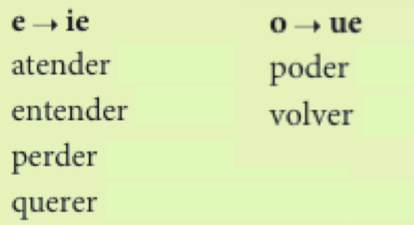
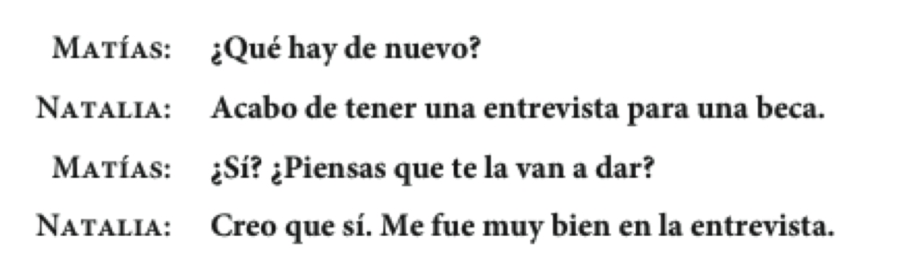

## Simón dice que...

> - En grupos de 3/4, jugad al "Simón dice" para practicar las partes del cuerpo. 
- ¡**OJO**! Cuando el verbo decir implica un mandato hay que utilizar el subjuntivo.
- EJ. 
	- Simón dice que toquen (tocar) el estómago.
	- Simón dice que salten (saltar). 
	- Etc.

--- .segue bg:grey

# CAPÍTULO 9 “¡Así es la vida!”

---

## Plan

  

### Vocabulario:
- Dar consejos

### Gramática:
- El subjuntivo

 

- Selección de los mp3 para e-Portafolio

---

## Las vicisitudes del estudiante

  

> - ¿Qué vicisitudes tienes como estudiante en Middlebury?
- ¿Son diferentes fuera de Middlebury? ¿Cómo?

---

## Algunas quejas comunes

  

 

> - ¿Qué quejas tienes? Cuéntaselas a tu compañero
- ¿Qué consejos tienes para que se queje menos?

---

## Para dar consejos

    

  

---

## El subjuntivo: 

- Cómo influir sobre los demás

  

---

## Para formar el subjuntivo:

 

<!-- 

  

 -->

| El presente del subjuntivo |      -ar      |    -er    |    -ir     |
| :------------------------- | :------------ | :-------- | :--------- |
|                            | **descansar** | **hacer** | **salir**  |
|                            | (yo descansø) | (yo hagø) | (yo salgø) |
| que yo                     | descanse      | haga      | salga      |
| que tú                     | descanses     | hagas     | salgas     |
| que el/ella/Ud.            | descanse      | haga      | salga      |
| que nosotros               | descansemos   | hagamos   | salgamos   |
| que vosotros               | descanséis    | hagáis    | salgáis    |
| que ellos/ellas/Uds.       | descansen     | hagan     | salgan     |

---

## Las expresiones de influencia

  

---

## Los verbos de comunicación

- aconsejar
- recomendar
- pedir
- sugerir
- prohibir

> - Inventad una oración usando cada uno de los verbos de comunicación
- 9-7, p. 301

---

## Los cambios ortográficos en el presente del subjuntivo

  

---

## Los verbos irregulares en el presente del subjuntivo

<!-- 

  

 -->

 

|                      |    ir   |  ser   |  estar  |  saber  |  dar  |
| :------------------- | :------ | :----- | :------ | :------ | :---- |
| que yo               | vaya    | sea    | esté    | sepa    | dé    |
| que tú               | vayas   | seas   | estés   | sepas   | des   |
| que él/ella/Ud.      | vaya    | sea    | esté    | sepa    | dé    |
| que nosotros(as)     | vayamos | seamos | estemos | sepamos | demos |
| que vosotros(as)     | vayáis  | seáis  | estéis  | sepáis  | deis  |
| que ellos/ellas/Uds. | vayan   | sean   | estén   | sepan   | den   |

---

## Ejerecicios

- 9-11, p. 304

---

## Selección de los mp3 para e-Portafolio

---

## Plan

  

- Los chistes
- Vocabulario
	- Los grandes momentos
- Gramática
	- El subjuntivo: las emociones

---

## Ejercicios

- La salud: 9-4, p. 298
- Las recomendaciones: 9-13, p. 305

---

## Los grandes momentos de la vida: Buenas noticias (43)

  

---

## Otros sentimientos y buenas noticias (44)

    
    

---

## Para reaccionar a las buenas noticias:

  

---

## Malas noticias y otros sentimientos (45, 46)

    
  

---

## Otras malas noticias y reacciones comunes a las malas noticias

    
  

---

## Ejercicios

- 9-14, p. 307 (47)

--- .segue bg:grey

# Descanso (10 minutos)

  

---

## El subjuntivo: Las expresiones de emoción

    

---

## Las expresiones de emoción

> - **esperar**
	- Esperamos que tu hermana **encuentre** empleo pronto.

> - **sentir**
	- Sentimos mucho que Uds. no **puedan** ir a la boda.

> - **estar + adjetivo de emoción + de**
	- Ramona está muy orgullosa de que su hijo **se gradúe**.

---

## Más expresiones de emoción

> - **tener miedo de**
	- Tengo miedo de que mi novia ya no me **quiera**.

> - **ojalá**
	- Ojalá (que) **sean** muy felices.

> - **Es + adjetivo o sustantivo de emoción**
	- Es ridículo que Sara no **piense** asistir a la boda.

---

## Los verbos como gustar en las expresiones de emoción

> - **gustar**
	- No nos gusta que no **se casen** por la iglesia.

> - **alegrar**
	- A mi padre le alegra que yo **siga** con mis estudios.

> - **preocupar**
	- Me preocupa que mis padres **se separen**.

---

## Los verbos como gustar en las expresiones de emoción

> - **sorprender**
	- ¿Te sorprende que **se comprometan**?

> - **molestar**
	- Les molesta que no **haya** una fiesta para celebrar la graduación.

> - **enfadar**
	- Me enfada que no **inviten** a mi novio a la fiesta.

---

## Ejercicios

- 9-19, p. 311
- 9-22, p. 312

---

## Los verbos con cambios en la raíz en el presente del subjuntivo

<!-- 

    

 -->

|         -ar          |    e > ie   |      o > ue     |
| :------------------- | :---------- | :-------------- |
|                      | **pensar**  | **acostarse**   |
| que yo               | p**ie**nse  | me ac**ue**ste  |
| que tú               | p**ie**nses | te ac**ue**stes |
| que Ud./él/ella      | p**ie**nse  | se ac**ue**ste  |
| que nosotros(as)     | pensemos    | nos acostemos   |
| que vosotros(as)     | penséis     | os acostéis     |
| que Uds./ellos/ellas | p**ie**nsen | se ac**ue**sten |

 

- **e** > **ie**: despertarse, empezar, pensar, merendar, recomendar
- **o** > **ue**: acostarse, almorzar, contar, encontrar, jugar (u > ue), probar

---

## Los verbos con cambios en la raíz en el presente del subjuntivo

<!-- 

    
  

 -->

|         -er          |     e > ie    |    o > ue   |
| :------------------- | :------------ | :---------- |
|                      | **entender**  | **volver**  |
| que yo               | ent**ie**nda  | v**ue**lva  |
| que tú               | ent**ie**ndas | v**ue**lvas |
| que Ud./él/ella      | ent**ie**nda  | v**ue**lva  |
| que nosotros(as)     | entendamos    | volvamos    |
| que vosotros(as)     | entendáis     | volváis     |
| que Uds./ellos/ellas | ent**ie**ndan | v**ue**lvan |

 

- **e** > **ie**: atender, entender, perder, querer
- **o** > **ue**: poder, volver

---

## Los verbos con cambios en la raíz en el presente del subjuntivo

<!-- 

    

 -->

|         -ir          |   e > ie/i   |   o > ue/u   |   e > i/i    |
| :------------------- | :----------- | :----------- | :----------- |
|                      | **sentir**   | **dormir**   | **servir**   |
| que yo               | s**ie**nta   | d**ue**rma   | s**i**rva    |
| que tú               | s**ie**ntas  | d**ue**rmas  | s**i**rvas   |
| que Ud./él/ella      | s**ie**nta   | d**ue**rma   | s**i**rva    |
| que nosotros(as)     | s**i**ntamos | d**u**rmamos | s**i**rvamos |
| que vosotros(as)     | s**i**ntáis  | d**u**rmáis  | s**i**rváis  |
| que Uds./ellos/ellas | s**ie**ntan  | d**ue**rman  | s**i**rvan   |

\* ¡OJO! Los verbos -ir tienen cambios en la forma **nosotros** y **vosotros**.

- **e** > **ie**/**i**: divertirse, preferir, sentir, sentirse
- **o** > **ue**/**u**: dormir, morir
- **o** > **i**/**i**: pedir, repetir, seguir, servir, vestirse

---

## Ejercicios

- 9-23, p. 314
- 9-26, p. 316

--- .segue bg:grey

# La semana pasada

---

## Gramática

- Usos de 'se' 
    - 'se' impersonal
    - 'se' pasivo
- Los mandatos formales
- El subjuntivo
    - las sugerencias
    - las emociones

---

## Vocabulario

- Por La ciudad
- Las partes del cuerpo
- Dar consejos

---

## Plan

  

- Instrucciones Examen Oral 3
- Vocabulario:
    - cuéntame de tu vida
- Gramática:
    - El indicativo y el subjuntivo
- Las evaluaciones

---

## Mandatos informales...

> 1. Conjuga el verbo en la 2a persona singular...
    - **comer** > **comes**
2. Quita la "s"
    - **comes** > <BLUE>come</BLUE>

 

> - ¡da! (dar, normalmente con complementos)
- ¡corre! (correr)
- ¡piensa! (pensar)
- ¡habla! (hablar)

---

## Mandatos informales... irregulares

  

 

> - Vin Disiel has ten weapons
- Ven di sal haz ten ve pon
- venir decir, salir, hacer, tener, ir, poner
- Tu compañero/a tiene malas notas, sale de marcha demasiado y no ayuda a recoger 
la casa. Poned orden dándole consejos (usad mandatos informales).

---

## Cuéntame de tu vida...

  

 

> - haber
- irle bien/mal

---

## Para expresar grados de certeza o duda, el optimismo, el pesimismo

    
  
  

 

> - 9-30, p. 318

---

## Cuando damos opiniones, expresamos la certeza y la duda.

    

---

## Las expresiones de certeza

    

> - Se usa el indicativo con estas expresiones.
    - Creo que me van a ofrecer el puesto. (el presente)
    - Creo que le dieron el puesto. (el pasado)
- 9-33, p. 321

---

## El subjuntivo con la duda y la negación

> - La duda:
    - Dudo que ella **esté** embarazada.

> - La negación:
    - No es verdad que ella **esté** embarazada.

---

## Las expresiones de duda

    

> - Se usa el subjuntivo con estas expresiones.
    - No creo que me **vayan** a ofrecer el puesto.

---

## Las expresiones de negación

    

 

> - Se usa el subjuntivo con estas expresiones.
    - No es posible que ella **esté** embarazada.

--- &twocol

## El subjuntivo vs. el indicativo

*** {name: left}

- <blue>El indicativo</blue>
    - la certeza
    - la afirmación  

*** {name: right}

- **El subjuntivo**
    - la duda
    - la negación

    

---

## Ejercicios

- 9-35, p. 323
- 9-36, p. 324

---

## Examen 3

---

## Evaluaciones

---

## ÚLTIMO DÍA

  

- **El Plan**
    - Subjuntivo

---

## Repaso

- Formamos el subjuntivo en 3 pasos...
    1. Vaya a la forma "yo"
    2. Quite la "o"
    3. Cambie la vocal

> - **hago** > **hag** > **haga**  

> - **como** > **com** > **comamos**  

> - **estudio** > **estudi** > **estudies**

---

## Las cláusulas

> - El subjuntivo suele aparecer en una cláusula subordinada
    - Recomiendo **que te vayas**
    - Es necesario **que me cuentes la verdad**
    - Dudan **que podamos lograrlo**

> - Suele haber un cambio de sujeto entre la cláusula principal y la subordinada
    - **El profesor** *quiere* que <blue>ellos</blue> *sepan* la respuesta.
    - **El profesor** *quiere* *saber* la respuesta.

---

## Repaso

  

---

## Qué opinas?

1. La universidad debe conceder becas según la necesidad económica, sin tomar en cuenta otros factores (talento atlético o artístico, mérito académico, etc.)

2. Todos los estudiantes universitarios deben pasar parte de su carrera académica estudiando en el extranjero.

3. La univesidad debe obligar a sus estudiantes a participar en actividades de servicio comunitario para graduarse. 

4. Una pasantía debe ser una parte integral de todas las carreras en la universidad.

---

## Ejercicios

- 9-38, p. 325

---

## Las cláusulas adjetivales

  

---

## Las cláusulas adjetivales

- La cláusula subordinada describe al antecedente de la cláusula principal.
- Funciona como un adjetivo. 

> - Ronaldo es un hombre **que vive intensamente**
> - Paco es un profesor **que toca el piano**
> - Tengo un perro **que ladra mucho**
> - ¿Conoces al profesor **que enseña el subjuntivo**?

---

## Las cláusulas adjetivales

- Se usa el indicativo si la subordinada se refiere a algo/alguien específico o conocido por el hablante

> - Tenemos una secretaria **que habla francés y alemán**
- Aquí hay dos anuncios para puestos **que ofrecen buenos beneficios**
- Tenéis una profesora **que nunca sonríe**
> - Escribid 3 oraciones que contengan cláusulas adjetivales

---

## Las cláusulas adjetivales

- Se usa el subjuntivo si la cláusula adjetival describe algo no existente o si se duda de su existencia

> - Claudia debe casarse con un hombre **que tenga menos obligaciones**
- Necesitamos una secretaria **que hable japonés**
- Quiero encontrar un puesto **que ofrezca oportunidades para viajar**
- No hay nadie **que trabaje tanto como Elisondo**
> - Escribid 3 oraciones que contengan cláusulas adjetivales en el subjuntivo

---

## Ejercicios

- GS9-1, p. 355
- GS9-2, p. 355
- GS9-3, p. 356

---

## El examen final

---

## Tarea

- Traed preguntas para el repaso
- Clase a las 9

