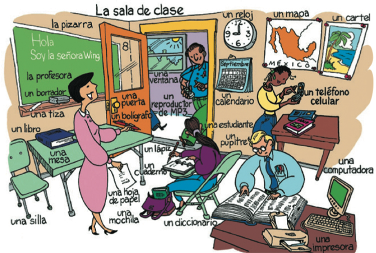

```{r setup, include=FALSE, cache=FALSE}
options(htmltools.dir.version = FALSE)
```

```{r, eval=FALSE, echo=FALSE, cache=FALSE}
rmarkdown::render("./slides/0_paso_prelim/index.Rmd")
xaringan::inf_mr()
```

class: inverse, center, middle

# Para sobrevivir

---

# Plan

- Para presentarnos
- Instrucciones básicas
- Para hablar con la gente

<!-- p5 -->

---

# Para presentarnos

|            |                                 |
|:-----------|:--------------------------------|
| SARA:      | “Hola. ***Me llamo*** Sara.”    |
| AMANDA:    | “Hola, Sara. ***Soy*** Amanda.” |
| SARA:      | “Mucho gusto.”                  |
| AMANDA:    | “Mucho gusto.”                  |


</br>

<div style="float: right">
  
</div>

- ¿Sabéis otras opciones?

--

- Mi nombre es Sara

--

- ~~Me llamo es Sara~~

---

# Instrucciones básicas

- **Abran/Cierren** el libro en la página...

- **Trabajad** con un compañero.

- **Escuchen** a la profesora.

- **Leed** la información.

- **Contesten** en español.

- **Escribid** vuestros nombres.

---

# Para hablar con la gente (1)

<div style="float: right">
  
</div>

- ¿Cómo se dice... ?

- Con permiso/Perdón.

- Gracias... De nada.

- Sí/No

---

# Para hablar con la gente (2)

<div style="float: right">
  
</div>

- Más despacio, por favor.

- ¿Puede repetir, por favor?

- ¿Qué quiere decir... ?

- ¿En qué página?

- Tengo una pregunta.

---

# ¿Qué se dice?

- Con un compañero, crea un diálogo corto usando este vocabuario 
útil. 

- Pensad en situaciones típicas que puedan pasar aquí en Middlebury.

---

# La clase

<div align="center">
  
</div>  

<!-- actividad ¿qué ves? ¿qué es? -->

---
class: inverse, middle, center

# Descanso (10 minutos)

<div style="float: right">
  
</div>

---
background-image: url(./assets/img/num_1_20.png)
background-size: 800px
background-position: 95%

# Los números

---
background-image: url(./assets/img/num_10_100.png)
background-size: 800px
background-position: 95%

# Los números

---
background-image: url(./assets/img/sala2.png)
background-size: 700px
background-position: 95% 80%

# ¿Cuántos objetos hay en la sala de clase?

.pull-left[

- ¿Cuántos libros hay? 

- ¿Cuántas mochilas hay?

- ¿Cuántos pupitres hay? 

- ¿Cuántos bolígrafos hay?

- ¿Cuántos estudiantes hay? 

- ¿Cuántas sillas hay?

]

---
background-image: url(./assets/img/abc.png)
background-size: contain
background-position: 120%
class: title-slide-section-blue

# El abecedario

---
background-image: url(./assets/img/sala1.png)
background-size: 750px
background-position: 50% 80%

# ¿Qué es esto? ¿Cómo se escribe?

---
background-image: url(./assets/img/ahorcado.gif)
background-size: contain
background-position: 120%
class: title-slide-section-blue

# El ahorcado

---
background-image: url(./assets/img/viki.png)
background-size: 550px
background-position: 90% 40%

# Intercambiar información básica

### Con un/a compañero/a

- ¿Cómo te llamas?

- ¿Dónde vives?

- ¿Cuál es tu número de teléfono?

- ¿Cuál es tu dirección de correo electrónico?

---
class: inverse, middle, center

# Repaso

---

# Lo que hemos visto...

- Vocabulario

- Repaso general

- El abecedario

- Los números

--

## Lo que hemos usado...

- El presente

---

# La tarea

- Comprar el libro
- Repasar el programa
- Explorar la página canvas (go/canvas/)
- Estudiar el vocabulario

