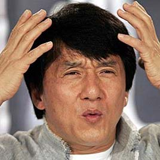

```{r setup, include=FALSE, cache=FALSE}
options(htmltools.dir.version = FALSE)
```

```{r, eval=FALSE, echo=FALSE, cache=FALSE}
rmarkdown::render("./slides/cap1/index.Rmd")
xaringan::inf_mr()
```

background-image: url(../../site_libs/assets/img/plan.gif)
background-size: 300px
background-position: 95% 50%

# El plan

### Vocabulario

- La universidad

### Gramática

- los artículos 
- los sustantivos

---

class: inverse, center, middle

# Repaso

---

background-image: url(./assets/img/abc.png)
background-size: contain
background-position: 120%
class: title-slide-section-blue

# El abecedario

---
background-image: url(./assets/img/sala1.png)
background-size: 750px
background-position: 50% 80%

# ¿Qué es esto? ¿Cómo se escribe?

---
background-image: url(./assets/img/ahorcado.gif)
background-size: contain
background-position: 120%
class: title-slide-section-blue

# El ahorcado

---

# Los sustantivos

- **Los sustantivos** son personas, lugares o cosas.

- En español tienen **género** y **número**

- ¿Puedes pensar en algunos sustantivos?

<div align="center">


</div>

---

# Género

<div style="float: right">
  
</div>

Normalmente...

- **el** libr**o**
- **la** mes**a**

--

Pero a veces...

- **el/la** estudiant**e**
- **el** pupitr**e**
- **la** clas**e**
- **el** relo**j**

---

# Número

<div style="float: right">
  
</div>

- el libro/los libros
- la mesa/las mesas

**¡Es FÁCIL!**

---

# Los artículos

<div style="float: right">
  
</div>

- Los sustantivos tienen **artículos**.
- Hay dos tipos:
  - Definidos
  - Indefinidos

---

# Los artículos definidos

<div style="float: right">
  
</div>

- **el** libro, **los** libros
- **la** página, **las** páginas
- **la** mochila, **las** mochilas
- **el** cuaderno, **los** cuadernos

---

# Los artículos indefinidos

<div style="float: right">
  
</div>

- **un** mapa, **unos** mapas
- **una** mesa, **unas** mesas
- **un** pupitre, **unos** pupitres
- **un**(a) estudiante **unos**(as) estudiantes

---

# Con un compañero...

<div style="float: right">
  
  
</div>

1. Hay (un/una) profesora. Es (el/la) señora Martínez.
2. (Los/Las) estudiantes están en (el/la) clase de español.
3. Hay (una/unas) ventana en (el/la) puerta.
4. Hay (un/una) mapa de España en (el/la) sala de clase.
5. (Un/Una) estudiante usa (el/la) teléfono celular.
6. Hay (unos/unas) borradores en (el/la) silla.
7. (Un/Una) estudiante escribe mensajes de texto en (el/la) teléfono celular.
8. Hay (un/una) libro en (el/la) mesa de la profesora.

<!-- > - Haced el ejercicio P-1 de la página 4 -->
<!-- > - Haced el ejercicio P-2 de la página 4 -->

---

# Con un compañero...

<div style="float: right">
  
  
</div>

1. Hay **una** profesora. Es **la** señora Martínez.
2. **Los**/**Las** estudiantes están en **la** clase de español.
3. Hay **una** ventana en **la** puerta.
4. Hay **un** mapa de España en **la** sala de clase.
5. **Un** estudiante usa **el** teléfono celular.
6. Hay **unos** borradores en **la** silla.
7. **Un** estudiante escribe mensajes de texto en **el** teléfono celular.
8. Hay **un** libro en **la** mesa de la profesora.

---

# Con un compañero...

Completa la tabla con el singular y plural de las palabras.


|     Singular     |       Plural       |
| :--------------- | :----------------- |
| **la profesora** |                    |
|                  | **los bolígrafos** |
|                  | **los pupitres**   |
| **el papel**     |                    |
|                  | **unas mochilas**  |
| **una ventana**  |                    |
| **un reloj**     |                    |
|                  | **unos carteles**  |

---

# Con un compañero...

Completa la tabla con el singular y plural de las palabras.


|          Singular         |            Plural           |
| :------------------------ | :-------------------------- |
| **la profesora**          | <blue>las profesoras</blue> |
| <blue>el bolígrafo</blue> | **los bolígrafos**          |
| <blue>el pupitre</blue>   | **los pupitres**            |
| **el papel**              | <blue>los papeles</blue>    |
| <blue>una mochila</blue>  | **unas mochilas**           |
| **una ventana**           | <blue>unas ventanas</blue>  |
| **un reloj**              | <blue>unos relojes</blue>   |
| <blue>un cartel</blue>    | **unos carteles**           |

---
background-image: url(./assets/img/presentarse1.png), url(./assets/img/formal.png)
background-size: 550px, 500px
background-position: 15% 50%, 95% 50%

# Las presentaciones y los saludos formales <br>(con los profesores)

---
background-image: url(./assets/img/presentarse2.png)
background-size: 850px
background-position: 50% 70%

# Las presentaciones y los saludos formales <br>(con los profesores)

---
background-image: url(./assets/img/presentarse3.png), url(./assets/img/informal2.gif)
background-size: 550px, 500px
background-position: 15% 50%, 95% 50%

# Las presentaciones y los saludos informales <br>(con los amigos)

---
background-image: url(./assets/img/presentarse4.png), url(./assets/img/informal1.gif)
background-size: 550px, 500px
background-position: 15% 60%, 95% 50%

# Las presentaciones y los saludos informales <br>(con los amigos)

---
background-image: url(./assets/img/estados.png)
background-size: 650px
background-position: 100% 70%

# ¿Cómo estás?: Los estados y el verbo estar

**Yo estoy \_\_\_\_**  

Ej. Yo estoy cansado(a)

---

# Los pronombres personales

</br>

|    |    |  Singular      |    | Plural              |
|:---| :- | :--------------| :- | :------------------ |
| 1a |    |  yo            |    | nosotros/as         |
| 2a |    |  tú            |    | vosotros/as         |
| 3a |    |  él/ella/usted |    | ellos/ellas/ustedes |
| | &nbsp; &nbsp; &nbsp; | | &nbsp; &nbsp; &nbsp; | |

---

# El verbo estar

</br>

|    |    |  Singular              |    | Plural                        |
|:---| :- | :--------------------- | :- | :---------------------------- |
| 1a |    | yo **estoy**           |    | nosotros/as **estamos**       |
| 2a |    | tú **estás**           |    | vosotros/as **estáis**        |
| 3a |    | él/ella/usted **está** |    | ellos/ellas/ustedes **están** |
| | &nbsp; &nbsp; &nbsp; | | &nbsp; &nbsp; &nbsp; | |

---
class: inverse, middle
background-image: url(../../site_libs/assets/img/descanso.png)
background-size: 450px
background-position: 100% 50%

# Descanso (10 minutos)

---
background-image: url(../../site_libs/assets/img/confundido.png)
background-size: contain
background-position: 110% 50%

# ¿Cómo está(n)?

---
background-image: url(./assets/img/esta1.png)
background-size: 600px
background-position: 50% 60%

# ¿Cómo está(n)?

---
background-image: url(../../site_libs/assets/img/frustracion.png)
background-size: contain
background-position: 100% 60%

# ¿Cómo está(n)?

---
background-image: url(./assets/img/esta2.png)
background-size: 600px
background-position: 50% 70%

# ¿Cómo está(n)?

---
background-image: url(./assets/img/esta3.png)
background-size: contain
background-position: 100%

# ¿Cómo está(n)?

---
background-image: url(./assets/img/esta4.png)
background-size: contain
background-position: 100%

# ¿Cómo está(n)?

---
background-image: url(./assets/img/esta5.png)
background-size: contain
background-position: 100%

# ¿Cómo está(n)?

---
background-image: url(./assets/img/esta6.png)
background-size: contain
background-position: 100%

# ¿Cómo está(n)?

---
background-image: url(./assets/img/esta7.png)
background-size: contain
background-position: 100%

# ¿Cómo está(n)?

---
background-image: url(./assets/img/esta8.png)
background-size: contain
background-position: 100%

# ¿Cómo está(n)?

---

# El verbo tener

- ¿Cuántas clases tienes?
- ¿Cuántos años tienes?
- ¿Tienes hambre?

(clase, sueño, prisa, calor, frío, hambre)

--

|    |    | Singular                |    | Plural                         |
|:-- | :- | :---------------------- | :- | :----------------------------- |
| 1a |    | yo **tengo**            |    | nosotros/as **tenemos**        |
| 2a |    | tú **tienes**           |    | vosotros/as **tenéis**         |
| 3a |    | él/ella/usted **tiene** |    | ellos/ellas/ustedes **tienen** |
| | &nbsp; &nbsp; &nbsp; | | &nbsp; &nbsp; &nbsp; | |

---

# El verbo ser

- ¿De dónde eres?
- ¿Cuál es tu dirección?

(profesor, estudiante, militar, hombre, mujer, padre, madre, simpático)

--

|    |    | Singular             |    | Plural                      |
|:-- | :- | :------------------- | :- | :-------------------------- |
| 1a |    | yo **soy**           |    | nosotros/as **somos**       |
| 2a |    | tú **eres**          |    | vosotros/as **sois**        |
| 3a |    | él/ella/usted **es** |    | ellos/ellas/ustedes **son** |
| | &nbsp; &nbsp; &nbsp; | | &nbsp; &nbsp; &nbsp; | |

---

# El verbo ir

- ¿Adónde vas?
- ¿Qué vas a hacer?

--

|     |    | Singular             |    | Plural                      |
| :-- | :- | :------------------- | :- | :-------------------------- |
| 1a  |    | yo **voy**           |    | nosotros/as **vamos**       |
| 2a  |    | tú **vas**           |    | vosotros/as **vais**        |
| 3a  |    | él/ella/usted **va** |    | ellos/ellas/ustedes **van** |
| | &nbsp; &nbsp; &nbsp; | | &nbsp; &nbsp; &nbsp; | |

---

# Más detalles...

## tener

- posesión (tengo tres gatos)
- obligación (**tengo que** estudiar)
- frases especiales
    - tengo frío/calor/hambre/sed/sueño/etc.

--

## ir

- movimiento (**voy a** la biblioteca)
- futuro (**voy a** estudiar)

---
background-image: url(./assets/img/tenerser.png)
background-size: 750px
background-position: 50% 50%

---

# Los verbos regulares

Estamos muy ocupados entre semana.

<div align="center">
  
</div>

---

# Los verbos regulares

Paso la semana en la universidad.

<div align="center">
  
</div>

---

# ¿Cómo es tu rutina?

.pull-left[

</br>
</br>
</br>

- Normalmente yo...  

- A veces yo... 

]

.pull-right[

</br>

- paso mucho tiempo en el facebook.
- voy al gimnasio por la mañana/por la tarde.
- escucho música/mi iPod.
- limpio el cuarto/el apartamento.
- preparo la comida.
- tomo café con mis amigos.

]

---

<!-- act 1-26 -->
<div align="center">
  
</div>

---

# El tiempo presente expresa...

</br>

### ...una rutina

--

- Estudio en la biblioteca todos los días.

--

### ...una acción continua

--

- Mi amiga vive en una residencia este semestre.

--

### ...una acción en el futuro

--

- Mis compañeros van a una fiesta mañana.

---

# Los verbos regulares

Hay tres tipos de infinitivos: -ar, -er, -ir

|                     |    | -ar         |    | -er         |    | -ir           |
| :------------------ | :- | :---------- | :- | :---------- | :- | :------------ |
|                     |    | **tomar**   |    | **comer**   |    | **asistir**   |
| yo                  |    | tom**o**    |    | com**o**    |    | asist**o**    |
| tú                  |    | tom**as**   |    | com**es**   |    | asist**es**   |
| él/ella/usted       |    | tom**a**    |    | com**e**    |    | asist**e**    |
| nosotro(as)         |    | tom**amos** |    | com**emos** |    | asist**imos** |
| vosotros(as)        |    | tom**áis**  |    | com**éis**  |    | asist**ís**   |
| ellos/ellas/ustedes |    | tom**an**   |    | com**en**   |    | asist**en**   |
| | &nbsp; &nbsp; &nbsp; | | &nbsp; &nbsp; &nbsp; | | &nbsp; &nbsp; &nbsp; | |

---

# Algunos verbos regulares

.pull-left[

  **-ar**  
  Adivinar  
  Gastar  
  Amar  
  Apagar  
  Ayudar  
  Invitar  
  Bailar  
  Jugar  
  Besar  
  Lavar  
  Cambiar  
  Levantar  
  Despertar  
  Pasear  

]

.pull-right[

  Dibujar  
  Pensar  
  Disfrutar  
  Pintar  
  Durar  
  Practicar  
  Echar  
  Preguntar  
  Empezar  
  Prestar  

]

---

# Algunos verbos regulares

.pull-left[

  **-er**  
  Agradecer  
  Llover  
  Beber  
  Nacer  
  Caber  
  Ofrecer  
  Caer  
  Perder  
  Comer  
  Prometer  
  Comprender   

]

.pull-right[

  **-ir**  
  Abrir  
  Partir  
  Construir  
  Pedir  
  Corregir  
  Prohibir  
  Decidir  
  Recibir  
  Despedir  
  Seguir  
  Discutir  

]

---


class: inverse, center, middle

# Los interrogativos

<!--
pon esta seccion en cap 1 despues de terminar hoy
-->

---

# Las preguntas

- de sí/no
- de información

---

# Preguntas de sí/no

- Inversión del sujeto/verbo

| Verbo   | Sujeto    | Otros elementos      |
|:--------|:----------|:---------------------|
| ¿Vive   | Martín    | en Madrid?           |
| ¿Comes  | (tú)      | fruta todos los días?|
| ¿Tenemos| (nosotros)| tarea?               |


</br>

- Sí, Martín vive en Madrid.

--

- No, no como fruta todos los días.

--

- No, no tenemos tarea.

---

# Preguntas de información

- Requieren una expressión interrogativa

| Expression interrogativa | Verbo    |  Sujeto     |
|:-------------------------|:---------|:------------|
| ¿Dónde                   | vive     | Martín?     |
| ¿Qué                     | comes    | (tú)?       |
| ¿Cuándo                  | es       | la reunión? |

---

# Con un compañero

<div align="center">
  
</div>

</br>

- Haced una lista de 4 preguntas (2 sí/no, 2 de información)
- Tened en cuenta la entonación

---

# Presentación de un compañero

- Vais a hacer una presentación oral corta el viernes

--

- Duración de 1.30

--

- El enfoque será en las construcciones que hemos visto en clase

--

- Podéis hablar de lo que queráis, pero sugiero que os centréis en lo que hemos 
visto en clase

---

# Preparación

### Para preparar debéis:

- Escoger un compañero
- Quedar en una hora esta tarde para hablar
- Utilizar nuestras estrategias para obtener información
- Apuntar toda la información (verificar que es correcta)
- Ensayar
- <blue>NO PODÉIS LEER</blue>

---

# Estrategias para la comunicación oral  

- ¡Ensayar! ¡Ensayar! ¡Ensayar!

--

- Hablar lentamente

--

- Vocales puras

--

- Tensión bucal

--

- Practicad palabras largas por sílabas

---
class: inverse, center, middle

# Repaso

---

# Hemos visto

- Los pronombres personales

- Hay 4 verbos fundamentales en español (**estar**, **ser**, **tener**, **ir**)

- Los interrogativos

<p></p>

- Tarea  
    - Usar **estar**, **ser**, **tener** e **ir** en conversaciones reales
    - Estudiar el vocabulario


