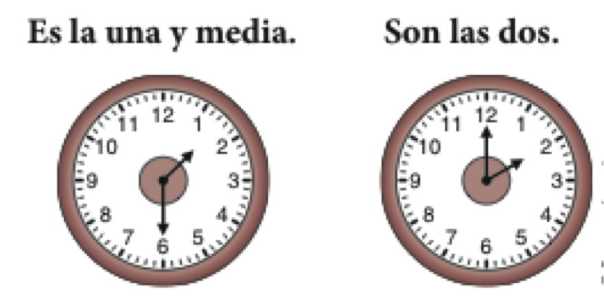

```{r setup, include=FALSE, cache=FALSE}
options(htmltools.dir.version = FALSE)
```

```{r, eval=FALSE, echo=FALSE, cache=FALSE}
rmarkdown::render("./slides/cap3/index.Rmd")
xaringan::inf_mr()
```

class: inverse, center, middle

# Repaso

---
class: title-slide-section-blue, bottom, center
background-image: url(./assets/img/hacer1.png)
background-size: contain
background-position: 50% 50%

# .Large[.blue[¿Qué están haciendo?]]

---
class: title-slide-section-blue, left
background-image: url(./assets/img/hacer2.png)
background-size: contain
background-position: 100% 50%

# .Large[.white[¿Qué está <br>haciendo?]]

---
class: title-slide-section-blue, right
background-image: url(./assets/img/hacer3.png)
background-size: contain
background-position: 0% 50%

# .Large[.black[¿Qué está] .white[haciendo?]]

---
class: title-slide-section-blue
background-image: url(./assets/img/hacer4.png)
background-size: contain
background-position: 100% 50%

# .Large[.white[¿Qué está haciendo?]]

---
class: title-slide-section-blue, bottom
background-image: url(./assets/img/hacer5.png)
background-size: 1250px
background-position: 50% 50%

# .Large[.white[¿Qué están haciendo?]]

---
class: title-slide-section-blue, center, bottom
background-image: url(./assets/img/hacer6.png)
background-size: contain
background-position: 50% 50%

# .Large[.white[¿Qué está haciendo?]]

---
class: title-slide-section-blue, center, bottom
background-image: url(./assets/img/hacer7.png)
background-size: contain
background-position: 50% 50%

# .Large[.white[¿Qué está haciendo?]]

---
background-image: url(../../site_libs/assets/img/plan.gif)
background-position: 95% 40%
background-size: 300px

<!-- semana 2, dia 1 --> 

# El plan

### Vocabulario:

- las diversiones
- los planes

### Recursos:

- Verbos irregulares

### Estrategias para la comprensión auditiva

---

# Cómo hacer una grabación

- Correcciones de la presentación 1

---


class: inverse, center, middle

# La hora (repaso)

---
background-image: url(./assets/img/hora1.png)
background-size: 750px
background-position: 50% 75%

# ¿A qué hora... ?: <br>cómo hablar de horarios

---

# Cómo decir la hora

.center[
### ¿Qué hora es?



### de la mañana
]

---

# Cómo decir la hora

.center[
### Perdón, ¿me puede decir la hora?  


### de la tarde
]

---

# ¿Qué hora es?: dos formas de decir la hora

.center[

]

--

.center[
### Son las dos y cuarto. 
### Son las dos y quince.
]

---

# ¿Qué hora es?: dos formas de decir la hora

.center[

]

--

.center[
### Son las ocho menos veinte.
### Son las siete y cuarenta.
] 


---
background-image: url(./assets/img/dia1.png)
background-size: 450px
background-position: 95% 55%

# ¿Qué día es hoy?: los días de la semana

Hoy es...

|     |       |        |           |        |         |        |         |
| :-- | :---- | :----- | :-------- | :----- | :------ | :----- | :------ |
|     | Lunes | Martes | Miércoles | Jueves | Viernes | Sábado | Domingo |

<br><br>

- ¿Qué día es hoy?
- ¿En qué día estamos?
- ¿Cuándo está abierto el museo?
- ¿Cuándo está cerrado?

---

# ¿Cuál es la fecha de hoy?: los meses del año

.center[

]

- Hoy es...

---


<!-- los planes --> 

# Para planificar un viaje: el tipo de viaje

.center[

]

---

# Información importante sobre la excursión

.left[


]

---

# Más datos y métodos de pago

.left[


]


---

# Las frases verbales para expresar los planes

## Cuando hablamos de nuestros .RUred[planes], hay construcciones que son muy útiles...

1. ir + a + infinitivo
1. esperar + infinitivo
1. pensar + infinitivo

--

### Con un/a compañero/a, usad estas construcciones en usa frase

--

**Vamos a viajar a México.**  

**Espero visitar muchos museos.**

**¿Piensas visitar el museo de historia el domingo?**

---

# Las frases verbales para expresar las preferencias

## Cuando queremos hablar de nuestras .RUred[preferencias], hay construcciones que son muy útiles...

1. querer + infinitivo
1. me gustaría + infinitivo
1. preferir + infinitivo

--

### Con un/a compañero/a, usad estas construcciones en usa frase

--

**Quiero viajar en junio.**  

**Me gustaría regresar el jueves, día 10 de julio.**  

**Prefiero salir el domingo 6 de junio.**

---

# Las frases verbales para expresar las obligaciones

## Cuando queremos hablar de nuestras .RUred[obligaciones], hay construcciones que son muy útiles...

1. deber + infinitivo
1. necesitar + infinitivo
1. tener + que + infinitivo

--

### Con un/a compañero/a, usad estas construcciones en usa frase

--

**Debo planificar el viaje.**  

**Necesito hablar con el agente de viajes.**  

**Tengo que buscar un mapa de la ciudad.**

---


class: inverse, center, middle

# Verbos irregulares

---

# Verbos irregulares

## Verbos con cambio en la raíz

.Large[

| El infinitivo | la raíz |     |   el cambio    |    Ej.    |
| :------------ | :-----: | :-: | :------------: | :-------- |
| &nbsp;        |         |     |                |           |
| pensar        | pens-   |     | p.RUred[ie]ns  | Yo pienso |
|               | **e**   |  →  | **ie**         |           |
| &nbsp;        |         |     |                |           |
| volver        | volv-   |     | v.RUred[ue]lv- | Yo vuelvo |
|               | **o**   |  →  | **ue**         |           |
| &nbsp;        |         |     |                |           |
| pedir         | ped-    |     | p.RUred[i]d-   | Yo pido   |
|               | **e**   |  →  | **i**          |           |

]

---

# Verbos irregulares

## Los verbos con el cambio **e** → **ie**

.center[
.large[
|     Pensar    |             | &nbsp; |                     |             |
| :------------ | :---------- | :----- | :------------------ | :---------- |
| yo            | p**ie**nso  |        | nosotros            | pensamos    |
| tú            | p**ie**nsas |        | vosotros            | pensáis     |
| él/ella/usted | p**ie**nsa  |        | ellos/ellas/ustedes | p**ie**nsan |
]
]

--

### Ejemplos

- emp.RUred[e]zar
- pref.RUred[e]rir
- qu.RUred[e]rer
- recom.RUred[e]ndar

.footnote[
.Large[¡.RUred[OJO]! No hay cambio en las formas de **nosotros**/**vosotros**]
]

---

# Verbos irregulares

## Los verbos con el cambio **o** → **ue**

.center[
.large[
|     Volver    |             | &nbsp; |                     |             |
| :------------ | :---------- | :----- | :------------------ | :---------- |
| yo            | v**ue**lvo  |        | nosotros            | volvemos    |
| tú            | v**ue**lves |        | vosotros            | volvéis     |
| él/ella/usted | v**ue**lve  |        | ellos/ellas/ustedes | v**ue**lven |
]
]

--

### Ejemplos

- c.RUred[o]star
- p.RUred[o]der
- d.RUred[o]rmir

.footnote[
.Large[¡.RUred[OJO]! No hay cambio en las formas de **nosotros**/**vosotros**]
]

---

# Verbos irregulares

## Los verbos con el cambio **e** → **i**

.center[
.large[
|     Pedir     |           | &nbsp; |                     |            |
| :------------ | :-------- | :----- | :------------------ | :--------- |
| yo            | p**i**do  |        | nosotros            | pedimos    |
| tú            | p**i**des |        | vosotros            | pedís      |
| él/ella/usted | p**i**de  |        | ellos/ellas/ustedes | p**i**den  |
]
]

--

### Ejemplos

- p.RUred[e]dir
- s.RUred[e]guir
- s.RUred[e]rvir

.footnote[
.Large[¡.RUred[OJO]! No hay cambio en las formas de **nosotros**/**vosotros**]
]

---


# Verbos irregulares

## Jugar: el cambio **u** → **ue**

.center[
.large[
|     Jugar     |            | &nbsp; |                     |            |
| :------------ | :--------- | :----- | :------------------ | :--------- |
| yo            | j**ue**go  |        | nosotros            | jugamos    |
| tú            | j**ue**gas |        | vosotros            | jugáis     |
| él/ella/usted | j**ue**ga  |        | ellos/ellas/ustedes | j**ue**gan |
]
]

--

### Ejemplo

- J.RUred[ue]go al golf todos los días.

.footnote[
.Large[¡.RUred[OJO]! No hay cambio en las formas de **nosotros**/**vosotros**]
]

---

# Actividad

.pull-left[

### Crowdsourcing un cuento

- Utilizando la lista de verbos que está a la derecha, escribe una frase 
corta en una hoja de papel. 
  - Puede ser una frase simple (SVO). 
  - Intenta usar vocabulario nuevo. 

<p></p>

- Cuando el profesor diga, pasa tu papel a otra persona.

<p></p>

- Lee lo que está escrito y añade una frase más. 
  - Tienes que usar uno de los verbos de la lista. 
  - Sólo puedes añadir **una** frase. 

<p></p>

- Repite.

]

--

.pull-right[

### Verbos

- jugar
- querer
- seguir
- servir
- pedir
- poder
- dormir
- empezar
- costar
- preferir
- recomendar

]

---


class: inverse, middle, center

<!-- dia 2 -->

# Semana 2 - día 2

---

# Precalentamiento

## Con un/a compañer@...

1. **Escoged** un sitio en el mundo al cual te gustaría viajar (no sé lo digas 
al compañero).
2. Formad 3-5 frases completas que **incluyan**:
  - una descripción de lo que te gusta o no te gusta del sitio
  - el verbo .RUred[gustar]
3. **Compartid** las frases con el compañero para que ***adivine*** el sitio

--

¡**PISTA**!

- Es mejor usar frases que dan mucha información acerca del sitio
- Ej. 
  - (A mí) me gusta tomar el sol. 
  - (A mí) me gusta la arena. 
  - (A mí) me gusta nadar. 

---

# El plan

### Vocabulario:

- La comida
- más números

### Recursos:

- por y para
- saber y conocer

### Estrategias para la comprensión auditiva

---

# La vida por Middlebury

<!-- Actividad verbos irregulares -->

\_\_\_\_\_ (ser/estar) con tu mejor amigo/a de middlebury. 
Ustedes \_\_\_\_\_ (empezar) a tener hambre y \_\_\_\_\_ (pensar) ir a Proctor. 
Al llegar a Proctor, ustedes ven que la comida no \_\_\_\_\_ \_\_\_\_\_ (gustar) 
y \_\_\_\_\_ (preferir) preparar un sandwich. Tu amiga dice que no \_\_\_\_\_ (poder) y te \_\_\_\_\_ (pedir/preguntar) que le hagas uno. Después de comer, 
ustedes \_\_\_\_\_ (volver) a la residencia porque esperan \_\_\_\_\_ (???) 
antes de dormir. 

--

### Respuestas

**Estás** con tu mejor amigo/a de middlebury. 
Ustedes **empiezan** a tener hambre y **piensan** ir a Proctor. 
Al llegar a Proctor, ustedes ven que la comida no **les gusta** 
y **prefieren** preparar un sandwich. Tu amiga dice que no **puede** y te **pide** que le hagas uno. Después de comer, 
ustedes **vuelven** a la residencia porque esperan \_\_\_\_\_ (???) 
antes de dormir. 

---

# Pruebita

- 3 verbos
  - 1 -ar
  - 1 -er
  - 1 -ir
  - 1 irregular
- Conjugad el verbo en el tiempo presente 

---


class: inverse, center, middle

# La fotografía de </br>Cristina García Rodero

---
background-image: url(./assets/img/cgr/cgr_1.png)
background-size: contain
class: title-slide-section-grey

---
background-image: url(./assets/img/cgr/cgr_2.png)
background-size: contain
class: title-slide-section-grey

---
background-image: url(./assets/img/cgr/cgr_3.png)
background-size: contain
class: title-slide-section-grey

---
background-image: url(./assets/img/cgr/cgr_4.png)
background-size: contain
class: title-slide-section-grey

---
background-image: url(./assets/img/cgr/cgr_5.png)
background-size: contain
class: title-slide-section-grey

---
background-image: url(./assets/img/cgr/cgr_6.png)
background-size: contain
class: title-slide-section-grey

---
background-image: url(./assets/img/cgr/cgr_7.png)
background-size: contain
class: title-slide-section-grey

---
background-image: url(./assets/img/cgr/cgr_8.png)
background-size: contain
class: title-slide-section-grey

---
background-image: url(./assets/img/cgr/cgr_9.png)
background-size: contain
class: title-slide-section-grey

---
background-image: url(./assets/img/cgr/cgr_10.png)
background-size: contain
class: title-slide-section-grey

---
class: inverse, center, middle

<iframe width="560" height="315" src="https://www.youtube.com/embed/EW3XBX6l2v8?rel=0" frameborder="0" allow="autoplay; encrypted-media" allowfullscreen></iframe>

---

# ¿Cómo se describe una foto/obra de arte?

.pull-left[

### Posibles temas

- Información histórica

- Contexto histórico

- Técnicas usadas para crear la obra

### Vocabulario útil

- Primer plano

- Segundo plano

]

--

.pull-right[

### Información personal

- ¿Por qué (no) te gusta?

- ¿Qué elementos específicos (no) te gustan?

### ¿Qué preguntas os gustaría hacerle a Cristina García Rodero?

]

.footnote[Fotos sacadas de [este](http://www.entreelcaosyelorden.com/2013/08/10-grandes-fotos-de-cristina-garcia.html) artículo]

---

class: inverse, center, middle

# Descanso (10 minutos)


---


# Los números de 100 a 10,000,000

.center[

]

---

# ¿Sabes mucha historia?

- Haz una lista de 3 acontecimientos históricos importantes

- Cuéntale a tu compañero/a el acontecimiento para que adivine el año

- Ej. 

  - En este año, Cristóbal Colón hace un viaje al nuevo mundo buscando especias. 

--

  - **1492** (mil cuatrocientos noventa y dos)

---

# Saber vs. conocer

## Saber: se utiliza para información

- Sé la respuesta

- Sé hacer reservaciones en línea.

- ¿Sabes dónde está el banco?

## Conocer: se utiliza para las personas y los lugares

- Conozco Nueva Orleans.

- ¿Conoces al agente de viajes?

---


class: inverse, middle
background-image: url(../../site_libs/assets/img/scared.gif)
background-position: 100% 50%
background-size: 400px

# Más verbos irregulares

---

# Los verbos irregulares con -go: la forma yo

.Large[
| Infinitivo |    |   Yo       |    |            Otras personas           |
| :--------- | :- | :--------- | :- | :---------------------------------- |
| hacer      |    | **hago**   |    | haces, hace, hacemos, hacéis, hacen |
| poner      |    | **pongo**  |    | pones, pone, ponemos, ponéis, ponen |
| salir      |    | **salgo**  |    | sales, sale, salimos, salís, salen  |
| traer      |    | **traigo** |    | traes, trae, traemos, traéis, traen |
| traer      |    | **traigo** |    | traes, trae, traemos, traéis, traen |
| | &nbsp; &nbsp; | | &nbsp; &nbsp; | |
]

---

# Los verbos de -go con cambios en la raíz

.Large[
|                     |    | tener      |    | venir      |    | decir     |
| :------------------ | :- | :--------- | :- | :--------- | :- | :-------- |
| yo                  |    | **tengo**  |    | **vengo**  |    | **digo**  |
| tú                  |    | t**ie**nes |    | v**ie**nes |    | d**i**ces |
| Usted/él/ella       |    | t**ie**ne  |    | v**ie**ne  |    | d**i**ce  |
| Nosotros(as)        |    | tenemos    |    | venimos    |    | decimos   |
| Vosotros(as)        |    | tenéis     |    | venís      |    | decís     |
| Ustedes/ellos/ellas |    | t**ie**nen |    | v**ie**nen |    | d**i**cen |
| | &nbsp; &nbsp; | | &nbsp; &nbsp; | | &nbsp; &nbsp; | |
]

---

# Otros verbos irregulares en la forma yo

.Large[
| Infinitivo |    |    Yo        |    |                   Otras personas                   |
| :--------- | :- | :----------- | :- | :------------------------------------------------- |
| conducir   |    | **conduzco** |    | conduces, conduce, conducimos, conducéis, conducen |
| conocer    |    | **conozco**  |    | conoces, conoce, conocemos, conocéis, conocen      |
| dar        |    | **doy**      |    | das, da, damos, dais, dan                          |
| saber      |    | **sé**       |    | sabes, sabe, sabemos, sabéis, saben                |
| ver        |    | **veo**      |    | ves, ve, vemos, veis, ven                          |
| | &nbsp; &nbsp; | | &nbsp; &nbsp; | |
]

---


# Expresiones particulares

.pull-left[

### dar: 

- dar un paseo

### hacer

- hacer la maleta
- hacer un viaje

### poner

- poner la tele (la radio)
- poner la mesa

]

--

.pull-right[

### ver

- no ver la hora

</br> </br> </br>

¿Sabéis más?

]

---
class: title-slide-section-blue, center, bottom
background-image: url("./assets/img/moana.gif")
background-size: contain
background-position: 50%, 50%

# ¿Cuáles son tus estrategias para la comprensión auditiva?

---


<!-- la comida --> 

# El desayuno: ¿Qué te gusta desayunar?

<div align="center">
  <iframe width="420" height="315" src="https://www.youtube.com/embed/SilOmnTK-z8" frameborder="0" allowfullscreen></iframe>
</div>

<!-- pregunta qué les gusta desayunar -->

---

# El desayuno: ¿Qué te gusta desayunar?

.center[

]

---

# El almuerzo: ¿Qué almuerzas?

.center[

]

<!-- preguntar al compa;ero lo que suele almorzar -->

---

# La merienda: ¿Qué meriendas?

.center[

]

<!-- que es una merienda? -->

---

# La cena: ¿Qué prefieres cenar?

.center[

]

---

# ¿A qué no puedes adivinar?

En grupos de tres...

- Cread (individualmente) una lista de 5 comidas (desayuno, almuerzo, 
merienda, cena)
- En turnos, describid una de las comidas de tu lista para que vuestros 
compañeros la adivinen

Ejemplo:

- **Tú**: Es un plato de huevos y queso
- .RUred[Compañero]: ¡Es una tortilla!

Ejemplo:

- .RUred[Compañero]: Es algo que comemos por la mañana con mermelada o mantequilla.
- **Tú**: Es el pan tostado.

---

# En el restaurante: antes de pedir

.center[

]

<!-- track 2-4 -->

---

# Para pedir en un restaurante...

.center[

]

<!-- track 2-5 --> 

---

# Después de comer: la cuenta

.center[

]

<!-- track 2-6 -->

---

# Los cubiertos

.center[

]

---


class: inverse, center, middle

# Por y para

---

# Por y para

## Con un/a compañer@...

- Comparad las frases en la pizarra

- ¿Qué tienen en común?

- ¿En qué se diferencian?

- ¿Podéis pensar en usos generales? (i.e. 'para' se usa para...)

--

.center[


]

---
background-image: url(./assets/img/por1.png)
background-position: 95% 50%
background-size: 450px

# Los usos de por

## La duración de un evento

--

- Estuvimos de compras .RUred[por] dos horas.

- Nos quedamos en la casa de mi suegra .RUred[por] 1 semana.

---
background-image: url(./assets/img/por2.png)
background-position: 120% 50%
background-size: contain

# Los usos de por 

## "**A cambio de**", </br>"**por el precio de**"

--

- Compramos esas mantillas .RUred[por] </br>100 euros.

- Le di dos gallinas .RUred[por] una vaca.

---
background-image: url(./assets/img/por3.png)
background-position: 100% 0%
background-size: contain

# Los usos de por

## "**cada persona paga**"

--

- La entrada a la exposición de </br>artesanías cuesta 6 euros </br>**por** 
persona.

---
background-image: url(./assets/img/por4.png), url(./assets/img/por5.png)
background-position: 40% 30%, 90% 30%
background-size: 400px, 400px

# Los usos de por 

## "**en**"  
## "**atravesando**"  

--

</br> </br> </br>

- El domingo di un paseo .RUred[por] el parque

- Llegamos a la casa de mi abuela pasando .RUred[por] el parque

---

# Expresiones fijas con "por"


- por ejemplo

- por eso

- por fin

- por supuesto

- por ciento

- por lo menos

--

.footnote[
.Large[¿Sabes más?]
]

---
class: title-slide-section-grey
background-image: url(./assets/img/para1.png)
background-position: 95% 50%

# Los usos de para

## .white[para + infinitivo]
## &nbsp; &nbsp; &nbsp; &nbsp; &nbsp; &nbsp; .RUred[=]
## ".white[con el propósito de]"

--

.white[
- Vamos al mercadillo .RUred[para] comprar algunos </br>recuerdos

- .RUred[Para] llegar a Proctor tienes que subir la cuesta

- Es necesario estudiar mucho .RUred[para] entender </br>bien el subjuntivo
]

---
background-image: url(./assets/img/para2.png)
background-size: contain
background-position: 150% 50%

# Los usos de para 

## **indicar límite temporal**

--

- Tienes que hacer la tarea .RUred[para] mañana.

- El proyecto final es .RUred[para] la semana que viene. 

- Es necesario comprar un disfraz .RUred[para] el sábado.

---
background-image: url(./assets/img/para2.png)
background-size: contain
background-position: 150% 50%

# Los usos de para 

## **indicar destinación**

--

- Estos recuerdos son .RUred[para] mi familia. 

- Ese regalo es .RUred[para] mi hermana. 

- He comprado dos libros .RUred[para] ti. 

---
class: title-slide-section-blue
background-image: url(./assets/img/para3.png)
background-size: contain
background-position: 100% 50%

# Los usos de para 

## .white[indicar propósito]

--

- Necesito un botón .RUred[para] mi camisa

- El disfraz es .RUred[para] la fiesta

- Estudias español .RUred[para] hablar con </br>más personas

---

# Actividad

- En parejas, haced el ejercicio 3-33 de la página 128

---

# Repaso

- Vocabulario
  - las diversiones, los planes
  - la comida
  - más números
- Saber/conocer
- Verbos irregulares
    - e > ie
    - e > i
    - o > ue
    - u > ue
    - verbos -go
- Por/para

Recordad...

- la bota
- verbos -go cambian en forma de yo
