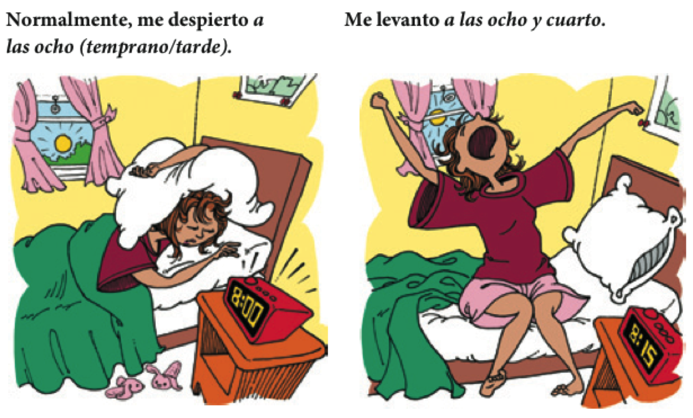

```{r setup, include=FALSE, cache=FALSE}
options(htmltools.dir.version = FALSE)
```

```{r, eval=FALSE, echo=FALSE, cache=FALSE}
rmarkdown::render("./slides/cap4/index.Rmd")
xaringan::inf_mr()
```

background-image: url(../../site_libs/assets/img/plan.gif)
background-position: 95% 50%

# El plan

### Recursos

- Verbos irregulares
- Verbos reflexivos

### Vocabulario

- Los miembros de la familia

---

# ¿Cómo se describe un cuadro?

- Haced una lista de tres cosas importantes que uno debe mencionar al 
describir un cuadro. 

- ¿Qué adjetivos son importantes/útiles?

- ¿Qué verbos son importantes/útiles?


---
background-image: url(https://oratory.ch/wp-content/uploads/2012/04/warmup.png)
background-size: 1000px
background-position: 190% 100%

# Precalentamiento

.pull-left[

- En grupos de 3, describid la situación más 
buena/mala/divertida/rara/graciosa que habéis tenido en un restaurante

- Después de contar vuestras historias, escoged una y haced un mini diálogo 
para compartir con la clase.

]

---
background-image: url(./assets/img/mascotas1.png)
background-size: 450px
background-position: 95% 50%

# Las mascotas

- ¿Cuántas mascotas tienes?

- ¿Qué tipos de mascotas hay en tu casa?

<!-- track 1-50 -->

---
background-image: url("./assets/img/mayaKinoXmas.png")
background-size: contain
class: inverse


---
class: inverse, middle, center

# Los verbos reflexivos

---

# Maya

<div align="center">
  <video width="600" height="450" allowfullscreen controls>
    <source src="./assets/videos/mayaShake.mov" type="video/mp4">
    <source src="./assets/videos/mayaShake.ogg" type="video/ogg">
  Your browser does not support the video tag.
  </video>
</div>

---

# Los verbos reflexivos: 

### el sujeto y el objeto son la misma persona

.center[

]

---

# Los pronombres reflexivos reflejan el sujeto de la frase

.center[

]

</br>

- Prefiero levantar**me** temprano.

- Me lavo **LOS** dientes todos los días.

---

# Los verbos regulares:

.center[

]

---

# Los verbos irregulares

.center[

]

---

# Ejercicios

- Echad un vistazo a algunos verbos comunes (p. 155)
- Haced el ejercicio 4-24 

---

# JT

<div align="center">
  <video width="600" height="450" allowfullscreen controls>
    <source src="./assets/videos/reflexivo.mp4" type="video/mp4">
    <source src="./assets/videos/reflexivo.ogg" type="video/ogg">
  </video>
</div>

---
class: inverse, center, middle

# Descanso (10 minutos)

.center[


]

---


class: inverse, middle, center

# Un paso para atrás...

---
background-image: url(./assets/img/arbolgenealogico.png), url(./assets/img/familia.png)
background-size: 450px, 450px
background-position: 15% 50%, 90% 50%

# Repasito

---
background-image: url(./assets/img/familia2.png), url(./assets/img/familia1.png)
background-size: 500px, 700px
background-position: 5% 60%, 100% 50%

# La familia

<!-- track 1-49 -->

---

# Mi árbol genealógico

- En una hoja de papel dibujad una imagen del profe

--

- Debajo de la imagen, pon "Joseph".

--

- Escuchad la descripción y rellenad el árbol.

--

- Cambiad con un compañero/a y haced las correcciones necesarias.

---

# Un día ajetreado: la rutina diaria

- Por la mañana...

<div align="center">
  
</div>

---

# Un día ajetreado: la rutina diaria

- Por la mañana...

<div align="center">
  
</div>

---

# Un día ajetreado: la rutina diaria 

<div align="center">
  
</div>

---

# Un día ajetreado: la rutina diaria

- Por la tarde...

<div align="center">
  
</div>

---

# Un día ajetreado: la rutina diaria

- Por la noche...

<div align="center">
  
</div>

---
background-image: url("../../site_libs/assets/img/confundido.gif")
background-size: 450px
background-position: 90% 15%

# Comprensión auditiva

<audio controls>
  <source src="../../site_libs/assets/audio/disco1/64.ogg" type="audio/ogg">
  <source src="../../site_libs/assets/audio/disco1/64.wav" type="audio/wav">
Your browser does not support the audio element.
</audio>

--

1. ¿Quiénes hablan?

2. ¿De qué hablan?

3. ¿Qué hace después de ducharse?

4. ¿Tiene tiempo para almorzar?

5. ¿Qué hace los lunes y los miércoles?

6. ¿Qué hay que hacer para sacar buenas notas?

---
class: inverse, center, middle

# Descanso (10 minutos)

<div style="float: right">
  
</div>

---

# Los reflexivos

<div align="center">
  
</div>

---

# Los reflexivos

<div align="center">
  
</div>

---

# Los reflexivos

<div style="float:right">
  
</div>

--

- el sujeto == el objeto

--

- Hay concordancia entre el sujeto y el pronombre reflexivo  
Ej. y**o** <blue>me</blue> levant**o**

--

- El pronombre va al final si es un infinitivo. Aún hay concordancia  
Ej. Y**o** quier**o** <grey>levantar</grey><blue>me</blue>


</br>

--

```{r, results='asis', echo=FALSE, message=FALSE, warning=FALSE}
library(tidyverse)
tribble(
~'Primera persona', ~'&#160;',  ~'Segunda persona', 
 'yo **me**',        '',         'nosotros **nos**', 
 'tú **te**',        '',         'vosotros **os**', 
 'ella **se**',      '',         'ellas **se**'
) %>% 
as.data.frame(.) %>%
pander::pandoc.table(., style = "rmarkdown", 
                        justify = c('left', 'left', 'left'))
```
---

# El señor Bean

<div align="center">
  <video width="420" height="315" allowfullscreen controls>
    <source src="./assets/videos/beanReflexive.mp4" type="video/mp4">
    <source src="./assets/videos/beanReflexive.ogg" type="video/ogg">
  </video>
</div>

---

# Con un compañero

- Explicad la rutina diaria del Señor Bean

- Escoged una persona famosa y describid su rutina cotidiana

---

# Más práctica

### Con un@ compañer@

#### Ejercicios

- 4-24 (p. 155)
- 4-25 (p. 156)

#### Recordad

- el sujeto == el objeto
- Hay concordancia entre el sujeto y el pronombre reflexivo  
Ej. y**o** <blue>me</blue> levant**o**
- El pronombre va al final si es un infinitivo. Aún hay concordancia  
Ej. Y**o** quier**o** <grey>levantar</grey><blue>me</blue>
