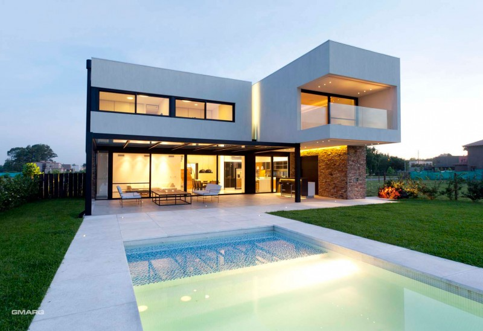
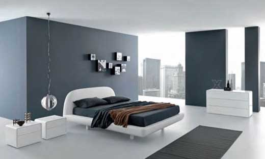
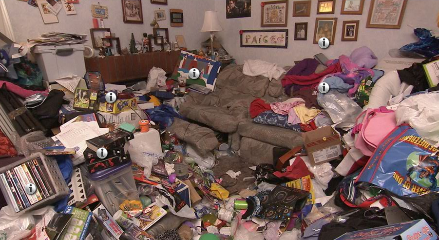
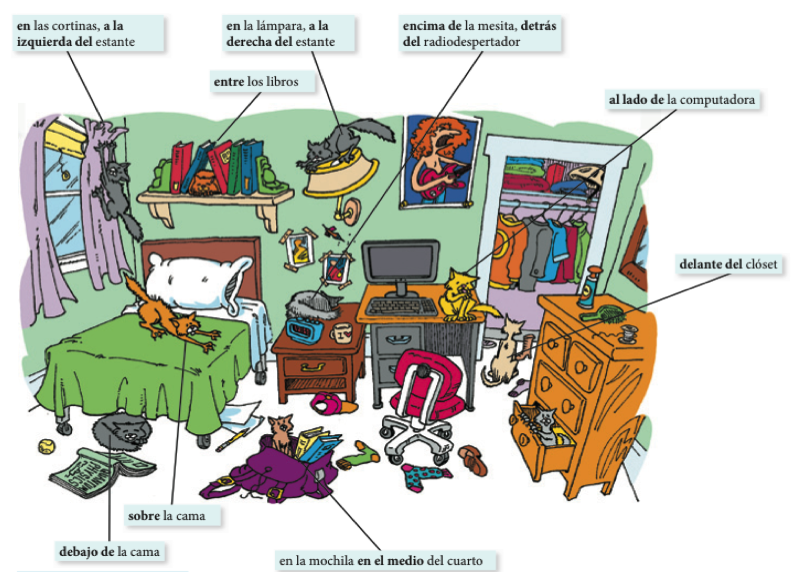
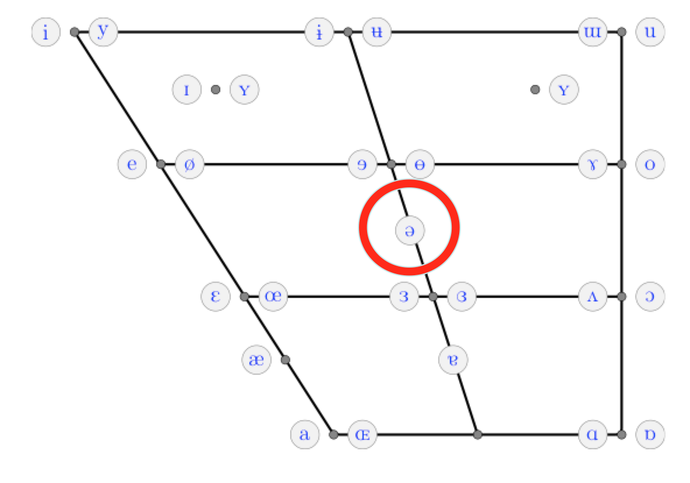
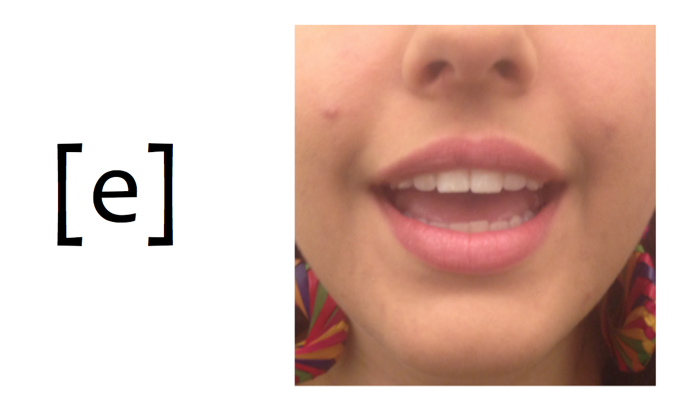
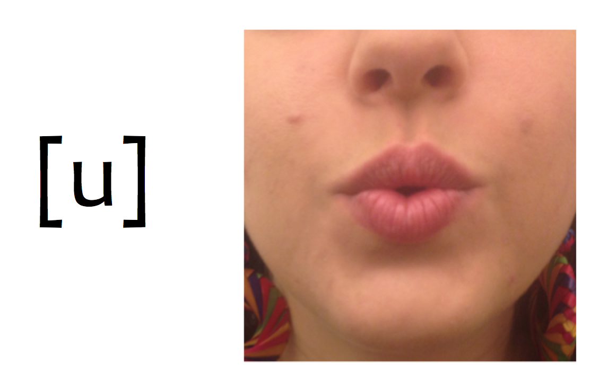

```{r setup, include=FALSE, cache=FALSE}
options(htmltools.dir.version = FALSE)
library(tidyverse)
```

```{r, eval=FALSE, echo=FALSE, cache=FALSE}
rmarkdown::render("./slides/cap5/index.Rmd")
xaringan::inf_mr()
```

# ¿Cómo es la casa?: describir características de la casa

<div align="center">
  <div style="float: left">
  
  </div>
  <div align="right">
  
  </div>
</div>

</br>

--

- Mi casa es **nueva** (**vieja**).
- La sala es **grande** y **cómoda**.
- Los muebles son **elegantes**.

---

# ¿Cómo es la casa?: describir la casa, los cuartos y los muebles

<div align="center">
  <div style="float: left">
  
  </div>
  <div align="right">
  
  </div>
</div>

</br>

--

- Normalmente, mi cuarto está **ordenado** (**desordenado**).
- Por lo general, la cocina está **limpia**.
- Por desgracia, el **refrigerador** está **descompuesto** y la **ventana** está **rota**.

---

# ¿Dónde vive la familia?: la casa

<div align="center">
  
</div>

---

# Las relaciones espaciales - ¿Dónde está el gato?

<div align="center">
  
</div>

---

# Con un compañero nuevo...

- Saca una hoja de papel 

--

- Dibuja los planes de tu casa
  - Puede ser real
  - Puede ser la casa de tus sueños

--

- A la vez que dibujas, explícale a tu compañero lo que hay en la casa

--

- Describe con mucho detalle

--

- Intenta ser consciente de las pausas, la concordancia, etc. mientras hablas

---
background-image: url("../../site_libs/assets/img/huh.gif")
background-size: 250px
background-position: 90% 15%

# Comprensión auditiva

<audio controls>
  <source src="../../site_libs/assets/audio/disco1/61.ogg" type="audio/ogg">
  <source src="../../site_libs/assets/audio/disco1/61.wav" type="audio/wav">
Your browser does not support the audio element.
</audio>

--

1. ¿De qué color es el apartamento?

2. ¿Dónde está la cama?

3. ¿Dónde está el sillón?

4. ¿Qué hay delante del sillón?

5. ¿De quién es el apartamento?

6. ¿Quién habla?


---
class: inverse, center, middle

# Los complementos directos

---

# Los complementos directos...

### Reciben la acción del verbo

<div style="float: right">
   
 
</div>

--

- Voy a probar **el flan**.
- ¿Qué voy a probar? **El flan**.

</br>

--

- Veo a **nuestro camarero**.
- ¿A quién veo? A **nuestro camarero**.

---

# Los <blue>PRONOMBRES</blue> de complementos directos...

### Sirven para evitar la repitición

<div style="float: right">
   
 
</div>

--

- Voy a probar **el flan**.
- **Lo** como con frecuencia.

</br>

--

- Veo a **nuestro camarero**.
- **Lo** veo enfrente del restaurante.

---

# Los <blue>pronombres</blue> de complementos directos

Concuerdan en cuanto al número y género. 

```{r results = 'asis', echo = FALSE}
library(dplyr)
tribble(

 ~Persona,       ~'&#160;', ~Singular,     ~'&nbsp;',  ~Plural,
  '1a',           '',        '**me**',      '',        '**nos**', 
  '2a',           '',        '**te**',      '',        '**os**', 
  '3a',           '',        '**lo, la**',  '',        '**los, las**', 
  'sustantivos',  '',        '**lo, la**',  '',        '**los, las**') %>%

as.data.frame(.) %>% 
pander::pandoc.table(., style = "rmarkdown", 
                        justify = c('left', 'left', 'left', 'left', 'left'))
```

</br>

--

- ¿Cómo quieres **el café**?
- **Lo** tomo con azúcar.

--

<p></p>

- ¿Tienes **las galletas**?
- Sí, **las** tengo.

--

<p></p>

- ¿Tú **me** ves?
- Sí, yo **te** veo. 

---

# Los complementos directos

## La posición de los complementos directos pronominales depende de la forma verbal.

--

### Con un verbo conjugado

- ¿Necesitas **el menú**?
- No, no **lo** necesito.

--

### Con un verbo conjugado y un infinitivo 

- ¿Vas a servir **la torta** ahora?
- No, **la** voy a servir un poco más tarde.
- No, voy a servir**la** un poco más tarde.

---

# A practicar

### Forma una pregunta para tu compañer@ usando los ejemplos abajo  

Ej. **ayudar económicamente**  

<grey>Pregunta</grey>: ¿Quién <blue>te</blue> **ayuda** económicamente?  

--

<grey>Respuesta</grey>: Mis padres <blue>me</blue> **ayudan** económicamente. 

--

1. querer mucho
2. escuchar en todo momento
3. llamar por teléfono con frecuencia
4. ayudar con los problemas
5. aconsejar cuando estás indeciso/a

---
class: inverse, center, middle

# Yo amo el español, pero el español no me ama. 

.pull-right[\- Grace Dunn, nivel 1.5]

---
class: inverse, center, middle

# Yo .RUred[amo] .lightgrey[el español]

--

## .grey[(Yo lo amo)]

---
class: inverse, center, middle

# Yo .RUred[amo] .lightgrey[el español], .grey[pero] el español .grey[no] .lightgrey[me] .RUred[ama]. 

---

# ¿Qué ves?

<div align="center">
  
  
  
</div>

---

# ¿Qué comes?

<div align="center">
  
  
</div>

---

# ¿Qué ves?

<div align="center">
  
  
  
</div>

---

# ¿Qué ves?

<div align="center">
  
  
</div>

--

- 5-23 (p. 190)
- 5-24 (p. 191)

---

<iframe src="https://play.kahoot.it/#/k/6cad70d6-9189-49ea-8999-da96b4cccfa3" width="1000" height="600" style="border:none;overflow:hidden" scrolling="no" frameborder="0" allowTransparency="true" allowFullScreen="true"></iframe>

---


class: inverse, center, middle

# Un poco de pronunciación

---

# Las vocales del inglés

<div align="center">
  
</div>

---

# Las vocales del español

<div align="center">
  
</div>

---

# Las vocales del español

<div style="float:right">
  
</div>

--

- **Son cortas**
- **Requieren MÁS tensión articulatoria**

---

<div align="center">
  
</div>

---

# Las vocales del español

<div align="center">
  
</div>

---

# Las vocales del español

<div align="center">
  
</div>

---

# Las vocales del español

<div align="center">
  
</div>

---

# Las vocales del español

<div align="center">
  
</div>

---

# Las vocales del español

<div align="center">
  
</div>

---

# Hay que evitar la schwa

<div align="center">
  
</div>

---


# Los complementos directos

--

### Los complementos directos requieren la concordancia de número y género. 


```{r results = 'asis', echo = FALSE}
library(dplyr)
tribble(

 ~Persona,       ~'&#160;', ~Singular,     ~'&nbsp;',  ~Plural,
  '1a',           '',        '**me**',      '',        '**nos**', 
  '2a',           '',        '**te**',      '',        '**os**', 
  '3a',           '',        '**lo, la**',  '',        '**los, las**', 
  'sustantivos',  '',        '**lo, la**',  '',        '**los, las**') %>%

as.data.frame(.) %>% 
pander::pandoc.table(., style = "rmarkdown", 
                        justify = c('left', 'left', 'left', 'left', 'left'))
```

---

# ¿Qué ves?

<div align="center">
  
</div>

---

# ¿Qué ves?

<div align="center">
  
</div>

---

# ¿Qué ves?

<div align="center">
  
</div>

---

# ¿Qué ves?

<div align="center">
  
</div>

---

# ¿Qué ves?

<div align="center">
  
</div>

---


class: inverse, center, middle

# Más expresiones con 'tener'

---

# Más expresiones con 'tener'

### Con 2 o 3 compañer@s...

1. Escoged 3 expresiones con 'tener'. 
2. Averiguad su significado.
3. Describid la expresión a otro grupo usando gestos. 

--

.pull-left[

- tener sed
- tener miedo (de algo)
- tener frío
- tener calor
- tener sueño
- tener dolor de (algo)
- tener prisa
- tener celos
- tener confianza

]

.pull-right[

- tener cuidado
- tener vergüenza
- tener razón
- tener éxito
- tener la culpa (de algo)
- tener suerte
- tener lugar
- tener ganas (de algo)
- tener (algo) en cuenta

]


---
class: inverse, center, middle

# El participio pasado

---
background-image: url(../../site_libs/assets/img/pensar2.png)
background-position: 95% 50%

# ¿Qué tienen en común las siguientes palabras?

.pull-left[
- hablar
- comer
- buscar
- tener
- pulir
- dormir
- abrir
]

.pull-right[
- hablado
- comidos
- buscada
- tenido
- pulidas
- dormida
- abierto
]

--

### Con un/a compañero/a intenta...

- buscar patrones (elementos que se repiten)

- desarrollar una regla para explicar los patrones

---

# El participio pasado

### Observaciones

#### Hay una forma para los verbos -ar (-**ado**)

--

#### Hay otra forma para los verbos -er/-ir (-**ido**)

--

#### Parece que hay concordancia de número y género (ej. "comid**os**", "dormid**a**")

---
background-image: url(../../site_libs/assets/img/happy.png)
background-position: 98% 50%

# El participio pasado

### ¿Cómo?

#### 1. quitar la terminación del infinitivo

- hablar > habl
- comer > com 
- dormir > dorm

--

#### 2. añadir -ado/-ido 

- habl + ado = habl**ado**
- com + ido = com**ido**
- dorm + ido = dorm**ido**

--

.footnote[### ¡.RUred[OJO]! Recuerda la concordancia (ej. "comid**os**", "dormid**a**")]

---

# El participio pasado

### ¿Para qué?

--

#### Podemos formar **adjetivos** a partir de cualquier verbo

--

### El participio pasado funciona bien con los verbos **ser** y **estar** y también después de un sustantivo

--

- El trabajo *está* **terminado**

- El español *es* **hablado** por muchas personas

- El bicho **aplastado** en el piso *está* **muerto**

- La niña **dormida** sueña con ser presidenta. 

---

# El participio pasado

## **Ojo**

### ¡No te confundas con el gerundio!: 
--
comido $\neq$ comiendo

--

### Hay formas irregulares ☹️

.pull-left[
- <blue>hacer</blue> > **hecho**
- <blue>escribir</blue> > **escrito**
- <blue>abrir</blue> > **abierto**
- <blue>decir</blue> > **dicho**
- <blue>poner</blue> > **puesto**
- <blue>morir</blue> > **muerto**
- <blue>romper</blue> > **roto**
- <blue>ver</blue> > **visto**
- <blue>volver</blue> > **vuelto**
]

--

.pull-right[
### Con un/a compañero/a escribe 3 frases usando el participio pasado. 
]

---

# Ejercicios

### Con tu compañero, escribid 4 oraciones que describan Middlebury usando el participio pasado (2 con ser y 2 con estar).

---

# Ejercicios

### Poned la forma del participio pasado

.pull-left[

1. morir
2. decir
3. ir
4. salir
5. haber
6. poner
7. volver
8. cubrir
9. comer
10. abrir

]

--

.pull-right[

1. muerto
1. dicho
1. ido
1. salido
1. habido
1. puesto
1. vuelto
1. cubierto
1. comido
1. abierto

]

---

# Ejercicios

### Completad las siguientes oraciones

1. Todo el campo estaba (cubrir) de nieve. 
2. Estas dificultades son (resolver) muy rápidamente. 
3. Si ya no salen juntos, es porque está (romper) su compromiso. 
4. La jefa está (satisfacer) con el trabajo de su empleado. 
5. Los cuadros de este pintor son (exponer) durante seis meses. 
6. Estas personas están (morir). 
7. La puerta está (abrir) hasta las siete. 
8. (escribir) las direcciones en los sobres, los echamos al buzón. 
9. Cuando llegamos, encontramos las camas (deshacer). 
10. La biblioteca me sigue llamando, pero los libros ya están (devolver)

---

# Ejercicios

### Completad las siguientes oraciones

1. Todo el campo estaba **cubierto** de nieve. 
2. Estas dificultades son **resueltas** muy rápidamente. 
3. Si ya no salen juntos, es porque está **roto** su compromiso. 
4. La jefa está **satisfecha** con el trabajo de su empleado. 
5. Los cuadros de este pintor son **expuestos** durante seis meses. 
6. Estas personas están **muertas**. 
7. La puerta está **abierta** hasta las siete. 
8. **Escritas** las direcciones en los sobres, los echamos al buzón. 
9. Cuando llegamos, encontramos las camas **deshechas**. 
10. La biblioteca me sigue llamando, pero los libros ya están **devueltos**.

---


class: inverse, middle, center

# Los demostrativos


---

# Esta semana hemos visto...

- El participio pasado
- Los pronombres de objetos directos
- Los demostrativos


