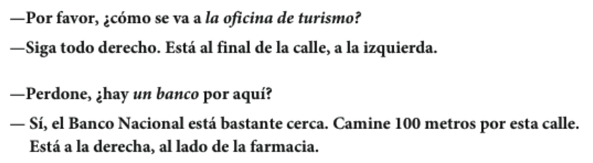

```{r setup, include=FALSE, cache=FALSE}
options(htmltools.dir.version = FALSE)
library(tidyverse)
```

```{r, eval=FALSE, echo=FALSE, cache=FALSE}
rmarkdown::render("./slides/cap9/index.Rmd")
xaringan::inf_mr()
```


class: inverse, middle, center

# Semana 6, día 1

---

<div align="center">
<iframe src="https://play.kahoot.it/#/k/683897f5-ed33-407e-ad9a-90f2fd7d45e3" width="1000" height="600" style="border:none;overflow:hidden" scrolling="no" frameborder="0" allowTransparency="true" allowFullScreen="true"></iframe>
</div>

---

# Con un compañero...

### Haced una lista de la ropa que se suele llevar en las siguientes situaciones:

- en una boda
- en clase
- en la misa
- en la playa
- en la primera cita
- para dormir
- en casa
- en una entrevista de trabajo

---

# Plan

<div style="float: right">
  
</div>

- Los mandatos informales
- El 'se' pasivo
- El pluscuamperfecto
- Los mandatos formales
- El futuro
- El subjuntivo

---

# 

<div>
  
</div>

---

# Para pedir y dar instrucciones

<div align="center">
    

  
</div>

---

# Mandatos formales

### Se pueden dar instrucciones con mandatos formales (Ud. y Uds.)

1. <blue>Se conjuga el verbo en la forma "yo"</blue>

--

2. <blue>Se elimina la "o"</blue>

--

3. <blue>Se pone la terminación apropiada</blue>

--

### Las terminaciones

- -**ar** > <BLUE>e</BLUE>(n)  
- -**er**/-**ir** > <BLUE>a</BLUE>(n)

--

|     |    |    -ar    |    |    -er     |    |    -ir    |
| :-- | :- | :-------- | :- | :--------- | :- | :-------- |
|     |    | **tomar** |    | **volver** |    | **salir** |
| 1.  |    | tomo      |    | vuelvo     |    | salgo     |
| 2.  |    | tomø      |    | vuelvø     |    | salgø     |
| 3.  |    | tome(n)   |    | vuelva(n)  |    | salga(n)  |
| | &nbsp; | | &nbsp; &nbsp; &nbsp; | | &nbsp; &nbsp; &nbsp; | |

---

# Los mandatos formales

### Se pone **no** delante de un mandato negativo.

- No vuelvan tarde.

--

### Hay mandatos irregulares:

- **ir**: Vaya(n) a la esquina.                                                    

- **saber**: Sepa(n) que aquí no se permite fumar.

- **dar**: Déle (Denle) el pasaporte al recepcionista.

- **ser**: Sea(n) puntual(es)

- **estar**: Por favor, esté(n) aquí antes de la seis.

---

# Los mandatos con cambios ortográficos

<!-- <div style="float: right">
  
</div> -->

- -car > que(n)
- -gar > gue(n)
- -zar > ce(n)

</br>

--

|     |    |   buscar   |    |   llegar   |    |   empezar   |
| :-- | :- | :--------- | :- | :--------- | :- | :---------- |
| 1.  |    | busco      |    | llego      |    | empiezo     |
| 2.  |    | buscø      |    | llegø      |    | empiezø     |
| !   |    | ~~busce~~  |    | ~~llege~~  |    | ~~empieze~~ |
| 3.  |    | bus**que** |    | lle**gue** |    | empie**ce** |
| | &nbsp; | | &nbsp; &nbsp; &nbsp; | | &nbsp; &nbsp; &nbsp; | |


---

# Los complementos y los mandatos

### Se pone el complemento:  

- Al final de un mandato afirmativo...  
¡Acuéstense ahora mismo!

<br>

- Delante de un mandato negativo...  
¡No se acuesten en el sofá!

---

# Ejercicios

- 335 (e)
- 9-25, p. 336
- 9-26, p. 336
- 9-27, p. 336
- hoja

---


class: inverse, middle, center

# Semana 6, día 2

---

# Para pensar

- ¿Existen comunidades hispanas en EE.UU.? ¿Dónde viven?

- ¿Cómo es el español de EE.UU.? ¿Difiere del de otros países? ¿Cómo? ¿Por qué?

- ¿Qué otras lenguas se hablan en EE.UU.? ¿Por qué no tenemos una lengua oficial? ¿Deberíamos?

- ¿Qué es un hablante de herencia? ¿Cómo/por qué son diferentes?

- ¿Cuál es el futuro del español en EE.UU.? ¿Cómo formas parte de ese futuro?

---

# A buscar trabajo

### En grupos de tres

- Dos personas del grupo son los jefes
- La tercera persona se presenta para un puesto de trabajo
- Hagan una entrevista al candidato para determinar si consigue el empleo

--

### Antes de empezar...

- Decidan cuál es el puesto
- Hagan una lista de vocabulario/verbos útiles
- Hablen entre ustedes de manera formal (usted, ustedes)

---

# Leed el siguiente párrafo...

En la escuela de español sólo se habla español. No se puede hablar en inglés. En general, se participa en muchas actividades, como el club de cocina, la clínica de pronunciación y el fútbol. 
Además, se llevan a cabo otras actividades como el teatro y el taller de salsa. Las clases son 
muy difíciles. Se tiene que trabajar mucho y las tareas se entregan todos los días. En fin, en Middlebury se aprenden muchas lenguas y se divierte mucho.

---

# El "se" pasivo

- El "se" pasivo pone énfasis en la acción de la frase.

--

- **se** + <blue>verbo conjugado</blue> + sustantivo

--

<p></p>

- Un verbo **singular** con un sustantivo **singular**
	- Se **produce** mucho **software** en Ecuador.

--

<p></p>

- Un verbo <blue>plural</blue> con un sustantivo <blue>plural</blue>
	- También se <blue>cultivan</blue> muchas <blue>flores</blue>.

---

# El "se" impersonal

- El "se" impersonal no pone énfasis en ninguna persona como sujeto.

--

- Podemos pensar que la(s) persona(s) que realiza(n) la acción son "ellos", "la gente", "las personas", "tú" o "uno".

--

- **se** + <blue>verbo singular</blue> + un infinitivo/un adverbio

--

- Ej. 
	- En Ecuador, se almuerza a la una.
	- ¿Se puede ir a pie?
	- ¿Dónde se puede comprar aspirina?

---

# "Se" impersonal vs. "se" pasivo

### Pasivo

- **se** + <blue>verbo conjugado</blue> + sustantivo  

</br>

### Impersonal

- **se** + <blue>verbo singular</blue> + un infinitivo/un adverbio

---

# Ejerecicios

- Mapa
- 10-14, p. 358
- 10-16, p. 358

---

# Releed el siguiente párrafo...

En la escuela de español sólo **se** habla español. No **se** puede hablar en inglés. En general, **se** participa en muchas actividades, como el club de cocina, la clínica de pronunciación y el fútbol. Además, **se** llevan a cabo otras actividades como el teatro y el taller de salsa. Las clases son muy difíciles. **Se** tiene que trabajar mucho y las tareas **se** entregan todos los días. En fin, en Middlebury **se** aprenden muchas lenguas y **se** divierte mucho.

---


class: inverse, middle, center

# Semana 6, día 3

---

# Presentación 5 
 
- Elige un tema como por ejemplo
	- dar direcciones para llegar a un lugar o a un edificio
	- dar instrucciones para elaborar una receta de cocina
	- dar consejos a un amigo para tener éxito en Midd
	- dar un explicación técnica de cómo se hace algo
	- dar información sobre cómo participar en un evento cultural de tu comunidad

--

<p></p>

- Debes explicar cuidadosamente las instrucciones, usando el vocabulario apropiado para la tarea.
- Es importante respetar el orden específico en el que presentas cada instrucción.
- Debes elegir una de las siguientes maneras que mejor funciona para darlas:
	- mandatos formales (directos o indirectos) (Ud o Uds)
	- mandatos informales (directos o indirectos) (tú o vosotros)
	- el infinitivo como mandato
	- una descripción en el presente
	- se impersonal

--

<p></p>

- Puedes variar la forma verbal hasta cierto punto, pero es importante ser 
consistente - no mezcles los mandatos de segunda y tercera persona.
- El uso de varios elementos visuales que pueden facilitar la comprensión 
de las instrucciones y es apropiado para este tipo de actividad. 

---

# "Se" impersonal vs. "se" pasivo

### Pasivo

- **se** + <blue>verbo conjugado</blue> + sustantivo  

</br>

### Impersonal

- **se** + <blue>verbo singular</blue> + un infinitivo/un adverbio

---

# Tu comida preferida

<div style="float: right">
  
    
</div>

- ¿Cuál es tu comida preferida? Escribe una receta explicando cómo se cocina.
- Utiliza el se pasivo y el se impersonal  

--

**Verbos útiles**  

- poner
- agarrar/coger
- batir/revolver
- hervir
- echar
- untar
- juntar
- medir
- cocinar
- hornear
- sazonar
- probar

--

<p></p>
- Reescribe tu lista usando mandatos formales

---

# Mandatos informales...

1. Conjuga el verbo en la 2a persona singular...
    - **comer** > **comes**
2. Quita la "s"
    - **comes** > <BLUE>come</BLUE>

</br>

--

- ¡da! (dar, normalmente con complementos)
- ¡corre! (correr)
- ¡piensa! (pensar)
- ¡habla! (hablar)

---

# Mandatos informales... irregulares

<div align="center">
  
</div>

</br>

- Vin Disiel has ten weapons
- Ven di sal haz ten ve pon
- venir decir, salir, hacer, tener, ir, poner
- Tu compañero/a tiene malas notas, sale de marcha demasiado y no ayuda a recoger 
la casa. Poned orden dándole consejos (usad mandatos informales).

---

# Simón dice...

---

# Las partes del cuerpo:

<div align="center">
  
</div>

<!-- ejercicio partes del cuerpo 
Si tengo X, qué me duele?
-->

---

# Resumen

### ¿Qué recursos tenemos para dar instrucciones/indicaciones?

Aportad un ejemplo de cada estrategia...

- Mandato formal

- Se pasivo

- Se impersonal

- Mandato informal

---


class: inverse, middle, center

# Semana 6, día 4

---

REPASO mandatos informales

actividad IMG vin diesel

---

# Querida Abby

.pull-left[
Tengo un problema con mi vida personal. Tengo mucho trabajo este semestre. Tengo cuatro clases los lunes, miércoles y viernes y dos clases en martes y jueves. Tengo mucha tarea y nunca hay tiempo para completarla. Quiero recibir buenas notas en mis clases pero también quiero mantener mi vida social. Estoy muy triste y cansada. ¡Ayudame!  

--Trabajadora

- ¿Qué consejos tienes para "Trabajadora"?
- Usad mandatos informales

]

---

<div align="center">
<iframe src="https://play.kahoot.it/#/k/1e2ea1a4-3579-4a39-95e8-157f882463bd" width="1000" height="600" style="border:none;overflow:hidden" scrolling="no" frameborder="0" allowTransparency="true" allowFullScreen="true"></iframe>
</div>

---

# El verbo doler sigue el modelo de gustar

<div style="float: right">
  
  
</div>

- Me duel**e** <blue>la espalda</blue>.
- Me duel**en** <blue>los pies</blue>.
- ¿Cuál es la situación más dolerosa que has experimentado en tu vida?

<!-- <div align="center">
  
</div> -->

|   Singular  |    plural    |
| :---------- | :----------- |
| me duele(n) | nos duele(n) |
| te duele(n) | os duele(n)  |
| le duele(n) | les duele(n) |

---

# Romperse es un verbo reflexivo

<div style="float: right">
  
  
</div>

- Paco <blue>se rompió</blue> el brazo. 

- <blue>Me rompí</blue> la pierna.

- ¿Alguna vez **te has roto** un hueso? ¿Qué pasó?

---
class: inverse, middle, center

# El pluscuamperfecto

---

# El pluscuamperfecto

### Se utiliza para hablar de una acción terminada que ocurre **antes** de otra acción en el pasado.

--

- Cuando Jaime llegó, Susana ya **había abierto** sus regalos. 

---
background-image: url("./assets/img/pluscuamperfecto1a.png")
background-size: contain

---
background-image: url("./assets/img/pluscuamperfecto1b.png")
background-size: contain

---
background-image: url("./assets/img/pluscuamperfecto1c.png")
background-size: contain

---

# El pluscuamperfecto

### Se utiliza para hablar de una acción terminada que ocurre **antes** de otra acción en el pasado.

- Cuando Jaime llegó, Susana ya **había abierto** sus regalos. 

- Marisol ya **había salido** cuando llamaste.

---
background-image: url("./assets/img/pluscuamperfecto2a.png")
background-size: contain

---
background-image: url("./assets/img/pluscuamperfecto2b.png")
background-size: contain

---
background-image: url("./assets/img/pluscuamperfecto2c.png")
background-size: contain

---

# El pluscuamperfecto

<div style="float: right">
  
  
</div>

- Se forma exactamente como el presente perfecto

- La excepción es que el verbo **haber** se conjuga en el imperfecto

--

### haber (presente) + participio pasado = presente perfecto

- Ya he hecho la tarea.

--

### haber (imperfecto) + participio pasado = pluscuamperfecto

- Ya había hecho la tarea cuando llegaste.

---

# El pluscuamperfecto

### **¡OJO!**

- Sigue habiendo formas irregulares del participio pasado.

<div align="center">
  
</div>

---

# Ejercicios

- 3, p. 496
- 14-18, p. 497
- 14-19, p. 498

---

# Yo nunca había...

- En grupos de 3-5, jugad una ronda completa de "Yo nunca he..."
- Para poder usar el pluscuamperfecto, utiliza el siguiente contexto:  

</br>

### Antes de venir a Middlebury, yo nunca había...

---


class: inverse, middle, center

# Semana 6, día 5

---

# ¿Cómo damos consejos?

<div align="center">
    
</div>

---

# ¿Cómo damos consejos?

<div style="float: right">
    
</div>


### Con un mandato formal:

- **Use** esta crema cada seis horas.

--

### Con un consejo indirecto:

- Es importante que Ud. **use** un protector solar.

---

# El subjuntivo

- Con un consejo indirecto, se usa la forma de un mandato para formar **el subjuntivo**.

<!-- <div align="center">
    
</div> -->

|          Mandato          |    |           Presente del subjuntivo           |
| :------------------------ | :- | :------------------------------------------ |
| **Guarde** cama           |    | Es necesario que Ud. **guarde** cama        |
| **Beban** muchos líquidos |    | Es mejor que Uds. **beban** muchos líquidos |
| | &nbsp; &nbsp; &nbsp; &nbsp; | |

</br>

### Con la forma tú:

- Es necesario que (tú) **guardes** cama.


---

# El subjuntivo

- El uso del subjuntivo requiere una frase con dos cláusulas.

<div align="center">
    
</div>

---

# El subjuntivo

### Algunas cláusulas que requieren el subjuntivo:

- Le/te recomiendo que...
- Quiero que...
- Es necesario que...
- Es aconsejable que...
- Es preferible que...
- Es mejor que...
- Es recomendable que...
- Es importante que...

<!-- <div align="center">
    
</div> -->

---

# Querida Abby

Tengo un problema con mi vida personal. Tengo mucho trabajo este semestre. Tengo cuatro clases los lunes, miércoles y viernes y dos clases en martes y jueves. Tengo mucha tarea y nunca hay tiempo para completarla. Quiero recibir buenas notas en mis clases pero también quiero mantener mi vida social. Estoy muy triste y cansada. ¡Ayudame!  

--Trabajadora

--

- ¿Qué consejos tienes para "Trabajadora"?

---

# Querida Abby

- Con un compañero, escribidle a Abby un párrafo corto explicando un problema que has tenido en Middlebury. Pedidle consejos para que os ayude. 
- Utilizad el pretérito/imperfecto para contar el problema
- Intercambiad consejos con otro grupo y haced el papel de Abby

<!-- ejercicios subj del libro -->
