```{r setup, include=FALSE, cache=FALSE}
options(htmltools.dir.version = FALSE)
```

```{r, eval=FALSE, echo=FALSE, cache=FALSE}
rmarkdown::render("./slides/semana2/index.Rmd")
xaringan::inf_mr('./slides/semana2/index.Rmd')
xaringan::inf_mr()
```

class: inverse, center, middle

# Repaso

---

# Hemos visto

- Vocabulario:
    - El tiempo libre
- Gramática:
    - Gustar
    - Preguntas
    - El presente progresivo
- Ejercicios opcionales
    - Vocabulario en contexto
        - TXT 0P-05, 0P-16
        - SAM 0P-21, 0P-22, 0P-23, 0P-26
    - Funciones y formas: 1
        - SAM 0P-36, 0P-37

---

# ¿Qué están haciendo?

<div align="center">
  
</div>

---

# ¿Qué están haciendo?

<div align="center">
  
</div>

---

# ¿Qué están haciendo?

<div align="center">
  
</div>

---

# ¿Qué están haciendo?

<div align="center">
  
</div>

---

# ¿Qué están haciendo?

<div align="center">
  
</div>

---

# ¿Qué están haciendo?

<div align="center">
  
</div>

---

# ¿Qué están haciendo?

<div align="center">
  
</div>

---

# El plan

<div style="float: right">
  
</div>

- Vocabulario:
	- Horarios
	- fechas; de viaje
- Gramática:
	- Verbos de cambio radical
- Estrategias para la comprensión auditiva

---

# Una pruebita

<!-- imprimir hojas -->

---

# ¿A qué hora... ?: cómo hablar de horarios

<div align="center">
  
</div>

---

# Cómo decir la hora

</br>

<div align="center">
¿Qué hora es?
</div>

</br>

<div align="center">
    
</div>

<div align="center">
de la mañana
</div>

---

# Cómo decir la hora

</br>

<div align="center">
Perdón, ¿me puede decir la hora?  
</div> 

</br>

<div align="center">
    
</div> 

<div align="center">
de la tarde
</div> 

---

# ¿Qué hora es?: dos formas de decir la hora

<div align="center">
    
</div> 

<div align="center">
  Son las dos y cuarto.  
</div> 

</br>

<div align="center">
  Son las dos y quince.
</div> 

---

# ¿Qué hora es?: dos formas de decir la hora

<div align="center">
    
</div> 

<div align="center">
  Son las ocho menos veinte.
</div> 

  </br>

<div align="center">
Son las siete y cuarenta.
</div> 


---

# ¿Qué día es hoy?: los días de la semana

Hoy es...


|     |       |           |        |        |         |        |         |
| :-- | :---- | :-------- | :----- | :----- | :------ | :----- | :------ |
|     | Lunes | Martes | Miércoles | Jueves | Viernes | Sábado | Domingo |


</br>

<div style="float: right">
  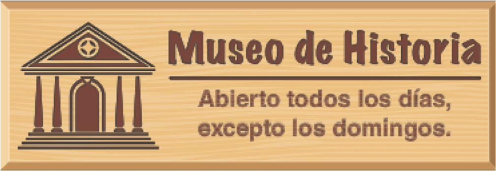
</div>

- ¿Qué día es hoy?
- ¿En qué día estamos?
- ¿Cuándo está abierto el museo?
- ¿Cuándo está cerrado?

---

# ¿Cuál es la fecha de hoy?: los meses del año

<div align="center">
  
</div>

- Hoy es...

---

# Para planificar un viaje: el tipo de viaje

<div align="center">
  
</div>

---

# Información importante sobre la excursión

<div align="left">
    
  </br>
  
</div>

---

# Más datos y métodos de pago

<div align="left">
    
  </br>
  
</div>

---

# Las frases verbales para expresar los planes

- Cuando hablamos de nuestros planes, hay construcciones que son muy útiles...
	- ir + a + infinitivo
	- esperar + infinitivo
	- pensar + infinitivo

**Vamos a viajar a México.**  

**Espero visitar muchos museos.**

**¿Piensas visitar el museo de historia el domingo?**

---

# Las frases verbales para expresar las preferencias

- Cuando queremos hablar de nuestras preferencias, hay construcciones que son muy útiles...
	- querer + infinitivo
	- me gustaría + infinitivo
	- preferir + infinitivo

**Quiero viajar en junio.**  

**Me gustaría regresar el jueves, día 10 de julio.**  

**Prefiero salir el domingo 6 de junio.**

---

# Las frases verbales para expresar las obligaciones

- deber + infinitivo
- necesitar + infinitivo
- tener + que + infinitivo

**Debo planificar el viaje.**  

**Necesito hablar con el agente de viajes.**  

**Tengo que buscar un mapa de la ciudad.**

---

# Verbos irregulares

<div align="center">
  
</div>

---

# Verbos irregulares

<div align="center">
  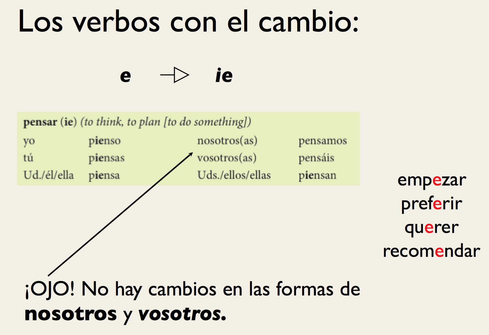
</div>

---

# Verbos irregulares

<div align="center">
  
</div>

---

# Verbos irregulares

<div align="center">
  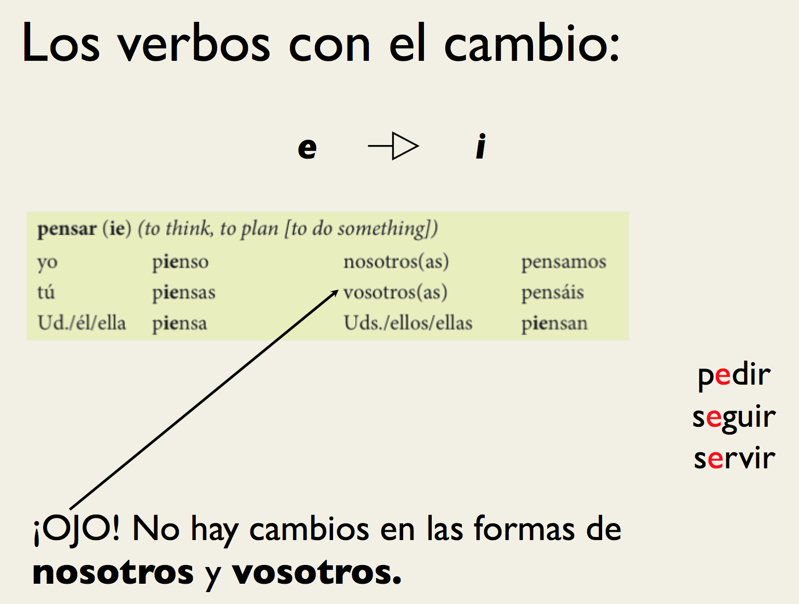
</div>

---

# Verbos irregulares

<div align="center">
  
</div>

---

# Cómo hacer una grabación

- Correcciones de la presentación 1

---
class: inverse, center, middle

# Repaso

---

# Hemos visto

- Horarios
- Fechas; de viaje
- Verbos de cambio radical
- Tarea
	- correcciones de la presentación oral
  - Pruebita el lunes

---
class: inverse, center, middle


# Repaso - Semana 1

---

# Gramática

.pull-left[

- Los sustantivos
	- Número
	- Género
	- Artículos
		- definidos
		- indefinidos
- Pronombres personales
- Ser, estar, tener, ir

]

.pull-right[

- Pronombres posesivos
- Verbos regulares
- Gustar
- Preguntas
	- de Sí/No
	- de información
- El presente progresivo (gerundio)
- Verbos irregulares (cambio radical)

]

---

# Vocabulario

- Para sobrevivir (presentarse, instrucciones, hablar con el profesor)
- La sala de clase
- El alfabeto
- Los números
- Saludos
- Origen
- La familia
- El tiempo libre
- Horarios/Fechas
- Los viajes

---
class: inverse, center, middle


# Semana 2 - día 2

---

# Precalentamiento

## Con un/a compañer@...

1. <BLUE>Escoged</BLUE> un sitio en el mundo al cual te gustaría viajar (no sé lo digas al compañero).
2. Formad 3-5 frases completas que <BLUE>incluyan</BLUE>:
  - una descripción de lo que te gusta o no te gusta del sitio
  - el verbo **gustar**
3. <BLUE>Compartid</BLUE> las frases con el compañero para que ***adivine*** el sitio

--

¡**PISTA**!

- Es mejor usar frases que dan mucha información acerca del sitio
- Ej. 
  - (A mí) me gusta tomar el sol. 
  - (A mí) me gusta la arena. 
  - (A mí) me gusta nadar. 

---

# El plan

- Vocabulario:
	- El hotel
	- más números
- Gramática:
  - por y para
  - Verbos irregulares 
  - saber y conocer
- Estrategias para la comprensión auditiva

---

# La vida por Middlebury

<!-- Actividad verbos irregulares -->

\_\_\_\_\_ (ser/estar) con tu mejor amigo/a de middlebury. 
Ustedes \_\_\_\_\_ (empezar) a tener hambre y \_\_\_\_\_ (pensar) ir a Proctor. 
Al llegar a Proctor, ustedes ven que la comida no \_\_\_\_\_ \_\_\_\_\_ (gustar) 
y \_\_\_\_\_ (preferir) preparar un sandwich. Tu amiga dice que no \_\_\_\_\_ (poder) y te \_\_\_\_\_ (pedir/preguntar) que le hagas uno. Después de comer, 
ustedes \_\_\_\_\_ (volver) a la residencia porque esperan \_\_\_\_\_ (???) 
antes de dormir. 

--

### Respuestas

**Estás** con tu mejor amigo/a de middlebury. 
Ustedes **empiezan** a tener hambre y **piensan** ir a Proctor. 
Al llegar a Proctor, ustedes ven que la comida no **les gusta** 
y **prefieren** preparar un sandwich. Tu amiga dice que no **puede** y te **pide** que le hagas uno. Después de comer, 
ustedes **vuelven** a la residencia porque esperan \_\_\_\_\_ (???) 
antes de dormir. 

---

# Pruebita

- 3 verbos
  - 1 -ar
  - 1 -er
  - 1 -ir
  - 1 irregular
- Conjugad el verbo en el tiempo presente 

---

# En un hotel: para conseguir una habitación

<div align="left">
  
</div>

---

# En un hotel: para conseguir una habitación

<div align="left">
  
</div>

---

# En un hotel: unas preguntas para el recepcionista

<div align="left">
  
</br>
</br>
  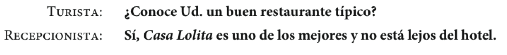
</br>
</br>
  
</div>

---

# En un hotel: ¿En que piso está... ?

<div align="left">
  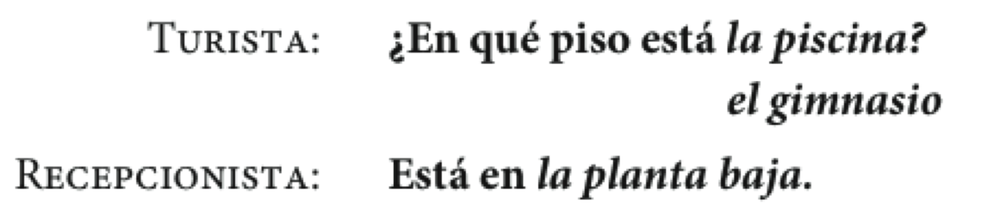
</br>
  
</div>

---
class: inverse, center, middle

# Descanso (10 minutos)

<div style="float: right">
  
</div>

---

# Los números de 100 a 10,000,000

<div align="center">
  
</div>

---

# ¿Sabes mucha historia?

- Haz una lista de 3 acontecimientos históricos importantes

- Cuéntale a tu compañero/a el acontecimiento para que adivine el año

- Ej. 

  - En este año, Cristóbal Colón hace un viaje al nuevo mundo buscando especias. 

--

  - **1492** (mil cuatrocientos noventa y dos)
---

# Los verbos irregulares con -go: la forma yo

</br>

| Infinitivo |    |   Yo       |    |            Otras personas           |
| :--------- | :- | :--------- | :- | :---------------------------------- |
| hacer      |    | **hago**   |    | haces, hace, hacemos, hacéis, hacen |
| poner      |    | **pongo**  |    | pones, pone, ponemos, ponéis, ponen |
| salir      |    | **salgo**  |    | sales, sale, salimos, salís, salen  |
| traer      |    | **traigo** |    | traes, trae, traemos, traéis, traen |
| traer      |    | **traigo** |    | traes, trae, traemos, traéis, traen |
| | &nbsp; &nbsp; | | &nbsp; &nbsp; | |

---

# Los verbos de -go con cambios en la raíz

</br>

|                     |    | tener      |    | venir      |    | decir     |
| :------------------ | :- | :--------- | :- | :--------- | :- | :-------- |
| yo                  |    | **tengo**  |    | **vengo**  |    | **digo**  |
| tú                  |    | t**ie**nes |    | v**ie**nes |    | d**i**ces |
| Usted/él/ella       |    | t**ie**ne  |    | v**ie**ne  |    | d**i**ce  |
| Nosotros(as)        |    | tenemos    |    | venimos    |    | decimos   |
| Vosotros(as)        |    | tenéis     |    | venís      |    | decís     |
| Ustedes/ellos/ellas |    | t**ie**nen |    | v**ie**nen |    | d**i**cen |
| | &nbsp; &nbsp; | | &nbsp; &nbsp; | | &nbsp; &nbsp; | |

---

# Otros verbos irregulares en la forma yo

</br>

| Infinitivo |    |    Yo        |    |                   Otras personas                   |
| :--------- | :- | :----------- | :- | :------------------------------------------------- |
| conducir   |    | **conduzco** |    | conduces, conduce, conducimos, conducéis, conducen |
| conocer    |    | **conozco**  |    | conoces, conoce, conocemos, conocéis, conocen      |
| dar        |    | **doy**      |    | das, da, damos, dais, dan                          |
| saber      |    | **sé**       |    | sabes, sabe, sabemos, sabéis, saben                |
| ver        |    | **veo**      |    | ves, ve, vemos, veis, ven                          |
| | &nbsp; &nbsp; | | &nbsp; &nbsp; | |

---

# Saber vs. conocer

## Saber: se utiliza para información

- Sé la respuesta

- Sé hacer reservaciones en línea.

- ¿Sabes dónde está el banco?

## Conocer: se utiliza para las personas y los lugares

- Conozco Nueva Orleans.

- ¿Conoces al agente de viajes?

---

# Expresiones particulares

<div align="center">
  
</div>

- ¿Sabéis más?

---
class: center
background-image: url("./assets/img/moana.gif")
background-size: 400
background-position: 50%, 50%

# ¿Cuáles son tus estrategias para la comprensión auditiva?

---

# Repaso

- Vocabulario
    - el hotel
    - más números
- Saber/conocer
- Verbos irregulares
    - e > ie
    - e > i
    - o > ue
    - u > ue
    - verbos -go
- Por/para

Recordad...

- la bota
- verbos -go cambian en forma de yo

---


class: inverse, center, middle

# Semana 2, día 3

---

# El plan

<div style="float: right">
  
</div>

- Recursos
  - La descripción 
  - Por y para
- Vocabulario
  - La comida

---

# ¿Cómo se describe un cuadro?

- Haced una lista de tres cosas importantes que uno debe mencionar al describir un cuadro. 

- ¿Qué adjetivos son importantes/útiles?

- ¿Qué verbos son importantes/útiles?

---

# Por y para

--

## Con un/a compañer@...

- Comparad las frases en la pizarra

- ¿Qué tienen en común?

- ¿En qué se diferencian?

- ¿Podéis pensar en usos generales? (i.e. 'para' se usar para...)

--

<div align="center">
  
</div>

---

# Los usos de por

<div style="float: right">
  
</div>

**La duración de un evento**

--

- Estuvimos de compras **por** dos horas.
- Nos quedamos en la casa de mi suegra **por** 1 semana.

---

# Los usos de por 

<div style="float: right">
  
</div>

"**A cambio de**", "**por el precio de**"

--

- Compramos esas mantillas **por** 100 euros.
- Le di dos gallinas **por** una vaca.

---

# Los usos de por

<div style="float: right">
  
</div>

"**cada persona paga**"

--

- La entrada a la exposición de artesanías cuesta 6 euros **por** persona.

---

# Los usos de por 

<div style="float: right">
    
  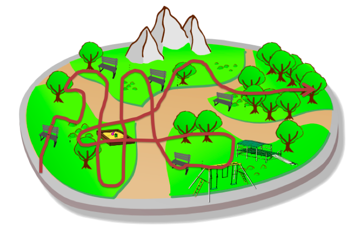
</div>

"**en**"  
"**alrededor de**"  
"**atravesando**"  

</br>
</br>
</br>

--

- El domingo di un paseo **por** el parque

---

# Expresiones fijas con "por"


- por ejemplo

- por eso

- por fin

- por supuesto

- por ciento

- por lo menos


---

# Los usos de para

<div style="float: right">
  
  
</div>

**para + infinitivo** "con el propósito de"

--

- Vamos al mercadillo **para** comprar algunos recuerdos
- **Para** llegar a Proctor tienes que subir la cuesta
- Es necesario estudiar mucho **para** entender bien el subjuntivo

---

# Los usos de para 

<div style="float: right">
  
  
</div>

**indicar límite temporal**

--

- Tienes que hacer la tarea **para** mañana.
- El proyecto final es **para** la semana que viene. 
- Es necesario comprar un disfraz **para** el sábado.

---

# Los usos de para 

<div style="float: right">
  
</div>

**indicar destinación**

--

- Estos recuerdos son **para** mi familia. 
- Ese regalo es **para** mi hermana. 

---

# Los usos de para 

<div style="float: right">
  
</div>

**indicar propósito**

--

- Necesito un botón **para** mi camisa
- El disfraz es **para** la fiesta

---

# Actividad

- En parejas, haced el ejercicio 3-33 de la página 128

---


class: inverse, center, middle

# Descanso (10 minutos)

<div style="float: right">
  
</div>

---

# El desayuno: ¿Qué te gusta desayunar?


<div align="center">
  <iframe width="420" height="315" src="https://www.youtube.com/embed/SilOmnTK-z8" frameborder="0" allowfullscreen></iframe>
</div>

<!-- pregunta qué les gusta desayunar -->

---

# El desayuno: ¿Qué te gusta desayunar?

<div align="center">
  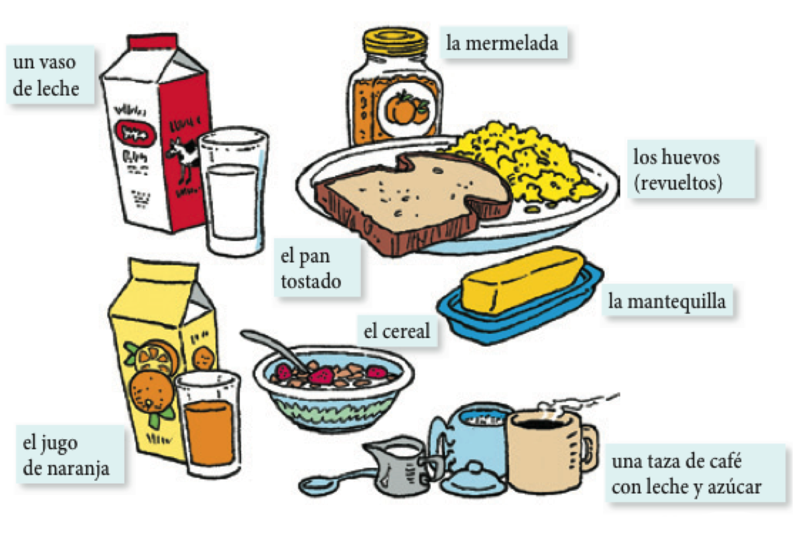
</div>

---

# El almuerzo: ¿Qué almuerzas?

<div align="center">
  
</div>

<!-- preguntar al compa;ero lo que suele almorzar -->

---

# La merienda: ¿Qué meriendas?

<div align="center">
  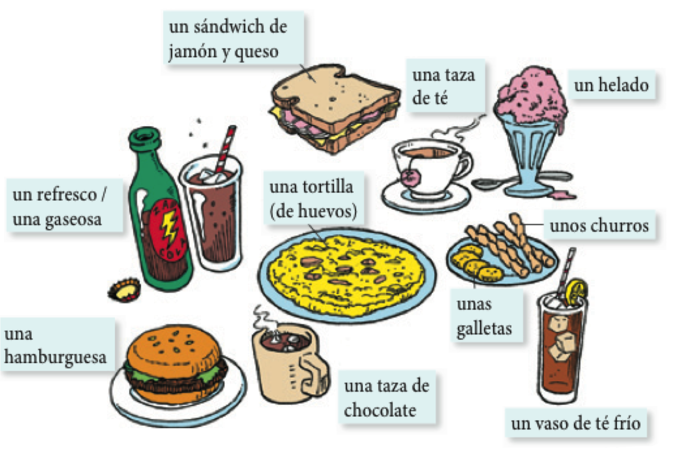
</div>

<!-- que es una merienda? -->

---

# La cena: ¿Qué prefieres cenar?

<div align="center">
  
</div>

---

# ¿A qué no puedes adivinar?

En grupos de tres...

- Cread (individualmente) una lista de 5 comidas (desayuno, almuerzo, merienda, cena)
- En turnos, describid una de las comidas de tu lista para que vuestros compañeros la adivinen

Ejemplo:

- **Tú**: Es un plato de huevos y queso
- <BLUE>Compañero</BLUE>: ¡Es una tortilla!

Ejemplo:

- <BLUE>Compañero</BLUE>: Es algo que comemos por la mañana con mermelada o mantequilla.
- **Tú**: Es el pan tostado.

---

# En el restaurante: antes de pedir

<div align="center">
  
</div>

<!-- track 2-4 -->

---

# Para pedir en un restaurante...

<div align="center">
  
</div>

<!-- track 2-5 -->

---

# Después de comer: la cuenta

<div align="center">
  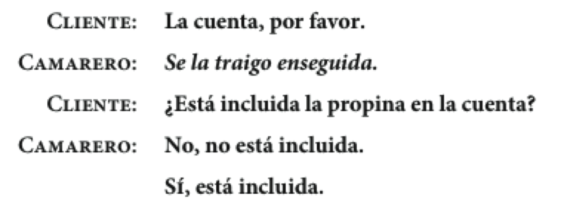
</div>

<!-- track 2-6 -->

---

# Los cubiertos

<div align="center">
  
</div>

---
class: inverse, center, middle

<!-- semana 2, dia 3 empieza aqui -->

# Semana 2, día 4

---

# El plan

<div style="float: right">
  
</div>

- Recursos
  - Ser y estar
  - Los verbos reflexivos
- Vocabulario
  - La descripción
  - El museo
  - Más familia

---

# Precalentamiento

- En grupos de 3, describid la situación más buena/mala/divertida/rara/graciosa que habéis tenido en un restaurante

- Después de contar vuestras historias, escoged una y haced un mini diálogo para compartir con la clase.

---

# Las mascotas

<div style="float: right">
  
</div>

</br>

- ¿Cuántas mascotas tienes?

- ¿Qué tipos de mascotas hay en tu casa?

<!-- track 1-50 -->

---
background-image: url("./assets/img/mayaKinoXmas.png")
background-size: contain
class: inverse

---
class: inverse, center, middle

# Ser y estar

---

# El verbo ser: para identificar y clasificar

<div style="float: right">
  
</div>

- Maya **es** mi perra.

--

- Mi hermana **es** enfermera.

--

- Yo **soy** lingüista.

--

- Tú **eres** estudiante.

--

- Joshua **es** de Iowa.

--

- Nosotros **somos** divertidos.

---

# El verbo ser: para describir características con los adjetivos

<div align="center">
  <div style="float: right">
     
  </div>
  <div style="float:right">
       
  </div>
</div>

</br>

--

- Sultán **es** grande y feroz.

- Sultán y Lobo **son** buenos perros.

---

# Maya es muy...

<div align="center">
  
</div>

---

# Los usos del verbo ser: con la preposición "de"

<div style="float: right">
  
</div>

--

- **Posesión**
  - ¿De quién **es** el cuarto? **Es** de Alicia.

</br>

--

- **Origen**
  - ¿De dónde **es** Fany? **Es** de Perú.

---

# Los usos del verbo ser: con la HORA y el LUGAR de los eventos

<div style="float: right">
  
</div>

</br>

--

- ¿Cuándo **es** la fiesta?

--

- **Es** el sábado a las siete de la noche.

--

- La fiesta **es** en la casa del profesor.

---

# Los usos del verbo estar: la ubicación de las cosas

<div style="float: right">
  
</div>

</br>

--

- ¿Dónde **está** el profe?

- **Está** en el gran cañón.

---

# Los usos del verbo estar: para describir una condición

<div style="float: right">
  
</div>

</br>

--

- ¿Cómo **está** Jackie Chan?

- **Está**...

---

# Ser y estar: las características versus las condiciones

<div align="center">
  
</div>

--

.pull-left[

### ¿Cómo **es** Jackie Chan?

- **Es** bajo con pelo negro.
- **Es** simpático.

]

.pull-right[

### ¿Cómo **está** Jackie Chan? 

- **Está** confundido.
- **Está** frustrado.

]

---

# Ejercicios

- 2-21, p. 84 (1 y 2)

---
class: inverse, center, middle

# Descanso (10 minutos)

<div style="float: right">
  
</div>


---
class: inverse, middle, center

# Los verbos reflexivos

---

# Maya

<div align="center">
  <video width="420" height="315" allowfullscreen controls>
    <source src="./assets/videos/mayaShake.mov" type="video/mp4">
    <source src="./assets/videos/mayaShake.ogg" type="video/ogg">
  Your browser does not support the video tag.
  </video>
</div>

---

# Los verbos reflexivos: el sujeto y el objeto son la misma persona

<div align="center">
  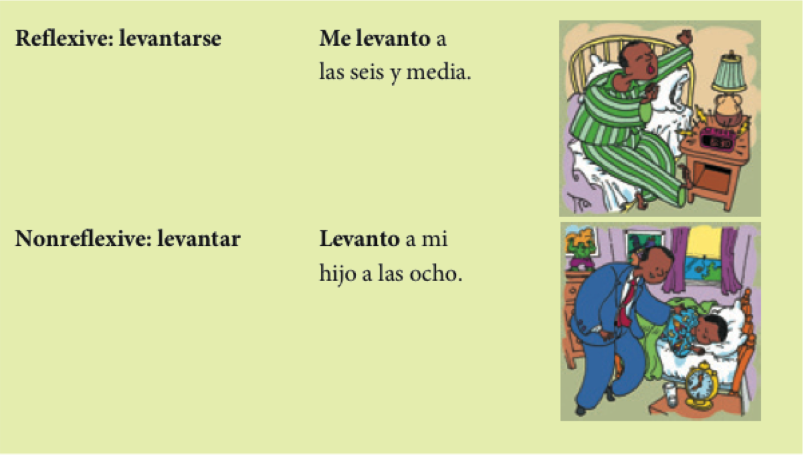
</div>

---

# Los pronombres reflexivos reflejan el sujeto de la frase

<div align="center">
  
</div>

</br>

> - Prefiero levantar**me** temprano.
> - Me lavo **LOS** dientes todos los días.

---

# Los verbos regulares:

<div align="center">
  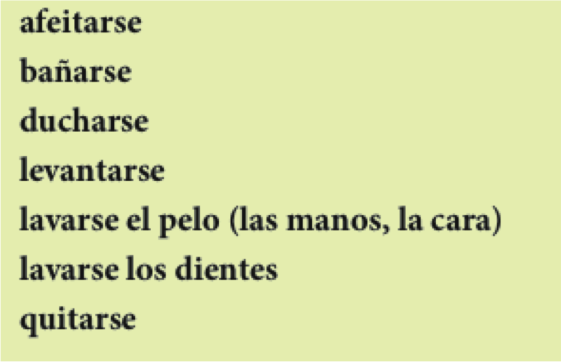
</div>

---

# Los verbos irregulares

<div align="center">
  
</div>

---

# Ejercicios

- Echad un vistazo a algunos verbos comunes (p. 155)
- Haced el ejercicio 4-24 

---

# JT

<div align="center">
  <video width="420" height="315" allowfullscreen controls>
    <source src="./assets/videos/reflexivo.mp4" type="video/mp4">
    <source src="./assets/videos/reflexivo.ogg" type="video/ogg">
  </video>
</div>

---
class: inverse, middle, center

# Un paso para atrás...

---

# Repasito

<div style="float: left">
  
</div>

<div style="float: right">
  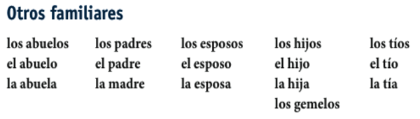
</div>

---

# La familia

<div style="float: right">
  
</div>

<div align="center">
  
</div>

<!-- track 1-49 -->

---

# Mi árbol genealógico

- En una hoja de papel dibujad una imagen de ti mismo.

--

- Debajo de la imagen, pon tu nombre.

--

- Intercambiar hojas con un vecino.

--

- Descríbele tu familia para que él/ella pueda rellenar tu árbol.

--

- Devuelve la hoja y haz las correcciones necesarias.

--

- Comparte con la clase la descripción del árbol
