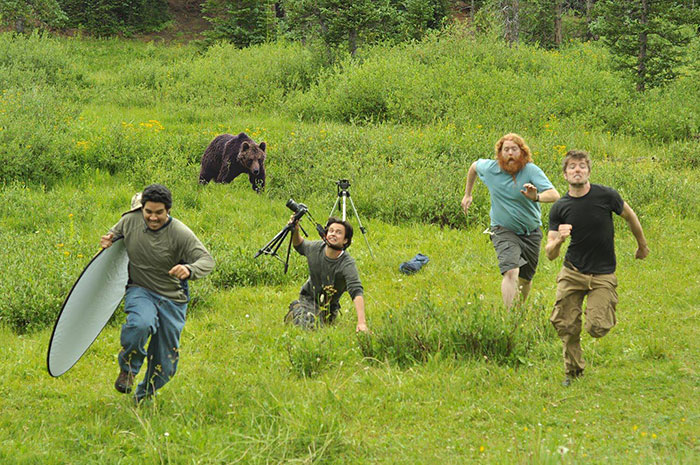
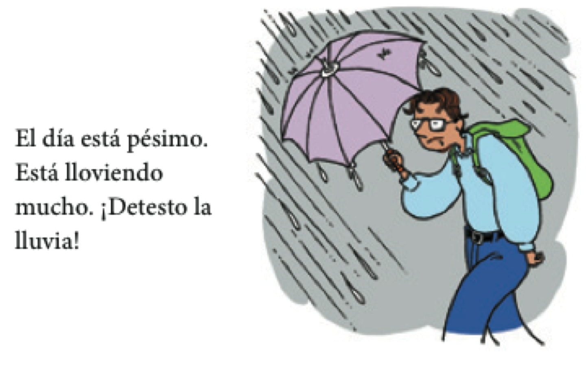
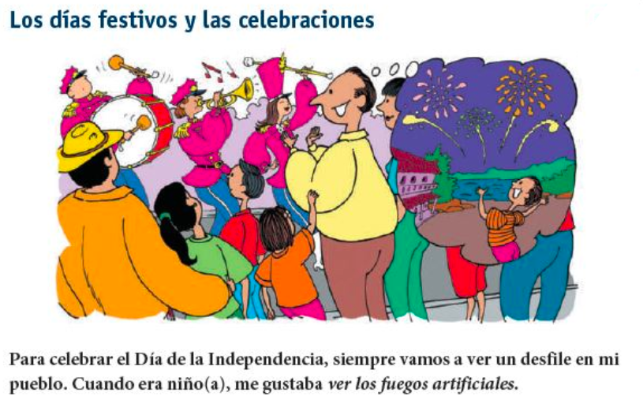

```{r setup, include=FALSE, cache=FALSE}
options(htmltools.dir.version = FALSE)
library(tidyverse)
```

```{r, eval=FALSE, echo=FALSE, cache=FALSE}
rmarkdown::render("./slides/semana4/index.Rmd")
xaringan::inf_mr('./slides/semana4/index.Rmd')
xaringan::inf_mr()
```


class: inverse, middle, center


<!-- 
imprimir 
- evaluaciones
- temarios
- entregar notas del examen oral
 -->


# Un poco de pronunciación

---

# Las vocales del inglés

<div align="center">
  
</div>

---

# Las vocales del español

<div align="center">
  
</div>

---

# Las vocales del español

<div style="float:right">
  
</div>

--

- **Son cortas**
- **Requieren MÁS tensión articulatoria**

---

<div align="center">
  
</div>

---

# Las vocales del español

<div align="center">
  
</div>

---

# Las vocales del español

<div align="center">
  
</div>

---

# Las vocales del español

<div align="center">
  
</div>

---

# Las vocales del español

<div align="center">
  
</div>

---

# Las vocales del español

<div align="center">
  
</div>

---

# Hay que evitar la schwa

<div align="center">
  
</div>

---


# Los complementos directos

Los complementos directos requieren la concordancia de número y género. 


```{r results = 'asis', echo = FALSE}
library(dplyr)
tribble(

 ~Persona,       ~'&#160;', ~Singular,     ~'&nbsp;',  ~Plural,
  '1a',           '',        '**me**',      '',        '**nos**', 
  '2a',           '',        '**te**',      '',        '**os**', 
  '3a',           '',        '**lo, la**',  '',        '**los, las**', 
  'sustantivos',  '',        '**lo, la**',  '',        '**los, las**') %>%

as.data.frame(.) %>% 
pander::pandoc.table(., style = "rmarkdown", 
                        justify = c('left', 'left', 'left', 'left', 'left'))
```

--

- ¿Cómo quieres **el café**?
- **Lo** tomo con azúcar.
- ¿Tienes **las galletas**?
- Sí, **las** tengo.
- ¿Tú **me** ves?
- Sí, yo **te** veo. 

---

# Los complementos directos

**La posición de los complementos directos pronominales depende de la forma verbal.**

--

- Con un verbo conjugado
- ¿Necesitas **el menú**?
- No, no **lo** necesito.

<p></p>

--

- Con un verbo conjugado y un infinitivo 
- ¿Vas a servir **la torta** ahora?
- No, **la** voy a servir un poco más tarde.
- No, voy a servir**la** un poco más tarde.

---

# ¿Qué ves?

<div align="center">
  
</div>

---

# ¿Qué ves?

<div align="center">
  
</div>

---

# ¿Qué ves?

<div align="center">
  
</div>

---

# ¿Qué ves?

<div align="center">
  
</div>

---

# ¿Qué ves?

<div align="center">
  
</div>

---


class: inverse, middle, center

# El pretérito

---

# ¿Qué hiciste ayer?: el pasado

<div align="center">
  
</div>

---

# ¿Qué hiciste ayer?: el pasado

<div align="center">
  
</div>

---

# ¿Qué hiciste ayer?: el pasado

<div align="center">
  
</div>

---

# El pretérito expresa el pasado con una referencia a un tiempo particular

- Salí con unos compañeros de clase **anoche**.

--

- **Ayer** fuimos a Dos Hermanos.

--

- **La semana pasada** corrimos dos millas.

--

- Me bañé en el mar **el año pasado**. 

---

# El pretérito

|                  |    |     tomar     |    |     volver     |    |     salir     |
| :--------------- | :- | :------------ | :- | :------------- | :- | :------------ |
| yo               |    | tom**é**      |    | volv**í**      |    | sal**í**      |
| tú               |    | tom**aste**   |    | volv**iste**   |    | sal**iste**   |
| Ud./él/ella      |    | tom**ó**      |    | volv**ió**     |    | sal**ió**     |
| nosotros(as)     |    | tom**amos**   |    | volv**imos**   |    | sal**imos**   |
| vosotros(as)     |    | tom**asteis** |    | volv**isteis** |    | sal**isteis** |
| Uds./ellos/ellas |    | tom**aron**   |    | volv**ieron**  |    | sal**ieron**  |
| | &#160; &#160; | | &#160; &#160; | | &#160; &#160; | |

--

**¡OJO!**

-  Los verbos reflexivos requieren el pronombre reflexivo.
- **Me desperté** a las ocho ayer.

--

<p></p>

-  El verbo gustar solo usa dos formas en el pretérito.
- **Me gustó** el concierto. No **me gustaron** esas dos películas.

---

# ¿Qué hiciste la semana pasada?

### Encuentra a alguien que...

.pull-left[

1. nadó en el lago.

2. cenó en el pueblo. 

3. rompió la palabra de honor.

4. miró juego de tronos.

5. bebió demasiado.

6. estudió todo el fin de semana. 

7. salió de Middlebury.

8. tomó comida de Proctor.

]

--

.pull-right[

|                  |    |     tomar     |    |     volver     |    |     salir     |
| :--------------- | :- | :------------ | :- | :------------- | :- | :------------ |
| yo               |    | tom**é**      |    | volv**í**      |    | sal**í**      |
| tú               |    | tom**aste**   |    | volv**iste**   |    | sal**iste**   |
| Ud./él/ella      |    | tom**ó**      |    | volv**ió**     |    | sal**ió**     |
| nosotros(as)     |    | tom**amos**   |    | volv**imos**   |    | sal**imos**   |
| vosotros(as)     |    | tom**asteis** |    | volv**isteis** |    | sal**isteis** |
| Uds./ellos/ellas |    | tom**aron**   |    | volv**ieron**  |    | sal**ieron**  |
| | &#160; &#160; | | &#160; &#160; | | &#160; &#160; | |

]

---


class: inverse, middle, center

# Semana 4, día 2

---

# ¿Qué viste?

### Ayer en clase viste algunas imágenes raras...

<div align="center">
  
</div>

---

# ¿Qué viste?

<div align="center">
  
</div>

---

# ¿Qué viste?

<div align="center">
  
</div>

---

# ¿Qué viste?

<div align="center">
  
</div>

--

- Actividad 5-21, p. 190

--

- [kahoot](https://create.kahoot.it/#quiz/eedc4d3b-69bf-4970-bae9-2b44c2b0fbdd)

---

# El pretérito 

### Expresa un momento particular en el pasado.

**Palabras importantes: ayer, anoche, la semana pasada**  

</br>

- Anoche miramos la televisión.
- Mi abuela me visitó hace dos semanas.

---

# El pretérito 

### Expresa un evento que ocurrió varias veces

**Palabras importantes: una vez, dos veces, varias veces**

</br>

- Fuimos a la piscina dos veces la semana pasada.

---

# El pretérito 

### Expresa cuánto tiempo duró un evento.

**Palabras importantes: por veinte minutos, por dos días**

</br>

- Arturo habló por teléfono por quince minutos.

---

# El pretérito

### Resume una experiencia (al principio o al final de una historia)

</br>

- Ayer fue un día fantástico en la uni. Primero...

---
class: inverse, center, middle

# Descanso (10 minutos)

<div style="float: right">
  
</div>

---

# El examen oral

- Con un@ compañer@ practicad entrevistas para el examen oral
- Turnaos (una persona hace las preguntas, la otra contesta)
- 3 minutos por entrevista
- Luego cambia de compañero 
- Pistas
  - Usad una mezcla de preguntas
  - No paréis durante los 3 minutos 
  - Si no sabéis decir algo, buscad otra forma
  - Usad lo que sabéis bien

---

# Algunos verbos irregulares en el pretérito:

|                  |    |    ir    |    |   ser    |    |   dar   |    |   ver   |
| :--------------- | :- | :------- | :- | :------- | :- | :------ | :- | :------ |
| yo               |    | fui      |    | fui      |    | di      |    | vi      |
| tú               |    | fuiste   |    | fuiste   |    | diste   |    | viste   |
| Ud./él/ella      |    | fue      |    | fue      |    | dio     |    | vio     |
| nosotros(as)     |    | fuimos   |    | fuimos   |    | dimos   |    | vimos   |
| vosotros(as)     |    | fuisteis |    | fuisteis |    | disteis |    | visteis |
| Uds./ellos/ellas |    | fueron   |    | fueron   |    | dieron  |    | vieron  |
| | &#160; &#160; | | &#160; &#160; | | &#160; &#160; | | &#160; &#160; | |

---

# Algunos verbos irregulares en el pretérito: 

### Los verbos con u en la raíz


|      estar      |    |     poder     |    |     poner     |    |     saber     |    |     tener     |
| :-------------- | :- | :------------ | :- | :------------ | :- | :------------ | :- | :------------ |
| estuv**e**      |    | pud**e**      |    | pus**e**      |    | sup**e**      |    | tuv**e**      |
| estuv**iste**   |    | pud**iste**   |    | pus**iste**   |    | sup**iste**   |    | tuv**iste**   |
| estuv**o**      |    | pud**o**      |    | pus**o**      |    | sup**o**      |    | tuv**o**      |
| estuv**imos**   |    | pud**imos**   |    | pus**imos**   |    | sup**imos**   |    | tuv**imos**   |
| estuv**isteis** |    | pud**isteis** |    | pus**isteis** |    | sup**isteis** |    | tuv**isteis** |
| estuv**ieron**  |    | pud**ieron**  |    | pus**ieron**  |    | sup**ieron**  |    | tuv**ieron**  |
| | &#160; &#160; | | &#160; &#160; | | &#160; &#160; | | &#160; &#160; | |

---

# Algunos verbos irregulares en el pretérito: 

### Los verbos con i en la raíz

|     hacer     |    |     querer     |    |     venir     |
| :------------ | :- | :------------- | :- | :------------ |
| hic**e**      |    | quis**e**      |    | vin**e**      |
| hic**iste**   |    | quis**iste**   |    | vin**iste**   |
| hiz**o**      |    | quis**o**      |    | vin**o**      |
| hic**imos**   |    | quis**imos**   |    | vin**imos**   |
| hic**isteis** |    | quis**isteis** |    | vin**isteis** |
| hic**ieron**  |    | quis**ieron**  |    | vin**ieron**  |
| | &#160; &#160; | | &#160; &#160; | |
---

# Algunos verbos irregulares en el pretérito: 

### Los verbos con j en la raíz

|     conducir     |    |     decir     |    |     traer      |
| :--------------- | :- | :------------ | :- | :------------- |
| conduj**e**      |    | dij**e**      |    | traj**e**      |
| condu**jiste**   |    | di**jiste**   |    | tra**jiste**   |
| condu**jo**      |    | di**jo**      |    | tra**jo**      |
| condu**jimos**   |    | di**jimos**   |    | tra**jimos**   |
| condu**jisteis** |    | di**jisteis** |    | tra**jisteis** |
| condu**jeron**   |    | di**jeron**   |    | tra**jeron**   |
| | &#160; &#160; | | &#160; &#160; | |
---

# ¿Qué pasó?

<div align="center">
  <video width="450" allowfullscreen controls>
    <source src="./assets/videos/maya.mp4" type="video/mp4">
    <source src="./assets/videos/maya.ogg" type="video/ogg">
  </video>
</div>

---

# El pretérito (irregulares)

.pull-left[

- tener
- estar
- ir
- ser
- poner
- poder
- traer
- hacer

]

.pull-right[

- haber
- saber
- querer
- decir
- venir
- ver
- dar

]

---

# El pretérito (irregulares)

<iframe width="560" height="315" src="https://www.youtube.com/embed/iFUAWMMdE7c" frameborder="0" allowfullscreen></iframe>

---

# El pretérito (irregulares)

<div style="float: right">
  
</div>

**tener** es tuve,  
**estar** es estuve  
**ir** es fui, y tambien **ser**  
**poner** es puse, **poder** es pude  
traje es para **traer**  


**hacer** hice, **haber** hube  
**saber** supe, **querer** quise  
**decir** dije, **venir** vine  
**ver** vi, **dar** di  
sin acentos

<audio controls>
  <source src="../../site_libs/assets/audio/pretIrreg.ogg" type="audio/ogg">
  <source src="../../site_libs/assets/audio/pretIrreg.m4a" type="audio/mpeg">
Your browser does not support the audio element.
</audio>

---

# Hay verbos con significados particulares en el pretérito.

<div align="center">
  
</div>


---
class: inverse, middle, center

# Semana 4, día 4

---

# Las estaciones

<div align="center">
  
</div>

<!-- pregunta en que meses cae cada estsacion -->

---

# ¿Qué tiempo hace hoy?

</br>

<div align="center">
  
  
</div>

---

# ¿Qué tiempo hace hoy?

</br>

<div align="center">
  
  
</div>

---

# Otras expresiones de tiempo

<div style="float: right">
  
  
</div>

--
- ¿Qué tiempo hace hoy?

--

- ¿Cuál es tu estación favorita?

--

- ¿Cómo es el clima en esa estación donde tú vives?

--

- ¿Cuáles son tus actividades favoritas  en esa estación?

--

- ¿Qué clima no te gusta? ¿Por qué?

---

# Los días festivos y las celebraciones

- ¿Qué haces tú durante el Día de la independencia?

<div align="center">
  
</div>

---

# Los días festivos y las celebraciones

- ¿Qué sueles hacer para celebrar el Día de Acción de Gracias?

<div align="center">
  
</div>

---

# Los días festivos y las celebraciones

- ¿Qué te gusta hacer para celebrar tu compleaños?

<div align="center">
  
</div>

---

# Las celebraciones y las costumbres

<!-- > - ¿Qué se celebran en cada estación? -->

<div align="center">
  
</div>

</br>

- ¿Qué costumbres tienes en tu familia? ¿Y tu compañero/a?

---

class: inverse, center, middle

# Descanso (10 minutos)

<div style="float: right">
  
</div>

---


# Resumen - los tiempos verbales

### Las conversaciones normalmente incluyen el presente, el pasado y el futuro.

**Carmen**: Oye, Silvia, ¿Qué <black>vas a hacer</black> este fin de semana?  

<blue>Silvia</blue>: ¡<black>Voy a estudiar</black>! La próxima semana <black>va a ser</black> muy ajetreada.  

**Carmen**: Chica, prácticamente <black>vives</black> en la biblioteca.  

<blue>Silvia</blue>: Sí, <black>es</black> cierto. Pero, ¿sabes?, <black>me gusta estudiar</black>. Mis clases <black>son</black> muy interesantes y <black>me encantan</black> mis profesores.  

**Carmen**: ¿Y el profesor Suárez?  

<blue>Silvia</blue>: Bueno, él sí <blac>es</blac> quisquilloso. La semana pasada nos <black>dio</black> un examen sobre la época medieval y <black>fue</black> dificilísimo. 

---

# Resumen - los tiempos verbales

### El futuro puede expresarse con verbos en el tiempo presente.

- Ir + a + infinitivo
  - **Voy a estudiar** este fin de semana.

--

- Expresiones del futuro
  - La próxima semana
  - el año que viene

--

- Otros verbos que expresan el futuro
  - **Pienso vivir** en la residencia el próximo semestre.
  - **Espero trabajar** en un banco en el futuro. 

---

# Resumen - los tiempos verbales

### El tiempo presente expresa las costumbres de la vida diaria.

--

- Palabras importantes: 
  - todos los días, frecuentemente, a menudo, a veces  

Todos los días estudio por dos o tres horas.

---

# Resumen - los tiempos verbales

### Se usa **el pretérito** para expresar el pasado.  


- UNA acción o evento que ocurrió UNA vez.

--

- una SERIE de acciones en el pasado.

--

- una acción que DURÓ un tiempo específico.

--

- UN EVENTO ESPECÍFICO en el pasado.

</br>

**Palabras asociadas al pretérito:**

--

- ayer, la semana pasada, el año pasado, primero, luego
- antes de/después de + infinitivo, por último

---

# Ahora, identifiquen los tiempos verbales en esta conversación:

**Carmen**: Oye, Silvia, ¿Qué <black>vas a hacer</black> este fin de semana?  

<blue>Silvia</blue>: ¡<black>Voy a estudiar</black>! La próxima semana <black>va a ser</black> muy ajetreada.  

**Carmen**: Chica, prácticamente <black>vives</black> en la biblioteca.  

<blue>Silvia</blue>: Sí, <black>es</black> cierto. Pero, ¿sabes?, <black>me gusta estudiar</black>. Mis clases <black>son</black> muy interesantes y <black>me encantan</black> mis profesores.  

**Carmen**: ¿Y el profesor Suárez?  

<blue>Silvia</blue>: Bueno, él sí <blac>es</blac> quisquilloso. La semana pasada nos <black>dio</black> un examen sobre la época medieval y <black>fue</black> dificilísimo. 

---


class: inverse, middle, center

# Semana 4, día 5

---

# Pruebita

### Conjugad los siguientes verbos en el presente y el pretérito

1. hablar
2. comer
3. estar

---

# El pretérito (irregulares)

<div style="float: right">
  
</div>

**tener** es tuve,  
**estar** es estuve  
**ir** es fui, y tambien **ser**  
**poner** es puse, **poder** es pude  
traje es para **traer**  


**hacer** hice, **haber** hube  
**saber** supe, **querer** quise  
**decir** dije, **venir** vine  
**ver** vi, **dar** di  
sin acentos

<audio controls>
  <source src="../../site_libs/assets/audio/pretIrreg.ogg" type="audio/ogg">
  <source src="../../site_libs/assets/audio/pretIrreg.m4a" type="audio/mpeg">
Your browser does not support the audio element.
</audio>


---

# Cambios ortográficos en la forma yo

### -car (buscar, tocar, sacar) 

- c > qu
- **toqué**, tocaste, tocó, tocamos, tocasteis, tocaron

--

### -gar (llegar, jugar, pagar) 

- g > gu
- **llegué**, llegaste, llegó, llegamos, llegasteis, llegaron

--

### -zar (empezar, almorzar) 

- z > c
- **empecé**, empezaste, empezó, empezamos, empezasteis, empezaron

---

# Los verbos de –er y –ir con una vocal: Leer, creer y caerse

### Leer

- leí, leíste, le**y**ó, leímos, leísteis, le**y**eron

--

### Creer

- creí, creíste, cre**y**ó, creímos, creísteis, cre**y**eron

--

### Caerse

- me caí, te caíste, se ca**y**ó, nos caímos, os caísteis, se ca**y**eron

---

# Verbos con cambios en la raíz en el pretérito: 

|                  |     |       e > i        |     |     o > u     |
| :--------------- | :-- | :----------------- | :-- | :------------ |
|                  |     | <blue>div**e**rtirse</blue> | | <blue>d**o**rmir</blue>    |
| yo               |     | me divertí         |     | dormí         |
| tú               |     | te divertiste      |     | dormiste      |
| Ud./él/ella      |     | se div**i**rtió    |     | d**u**rmió    |
| nosotros(as)     |     | nos divertimos     |     | dormimos      |
| vosotros(as)     |     | os divertisteis    |     | dormisteis    |
| Uds./ellos/ellas |     | se div**i**rtieron |     | d**u**rmieron |
| | &#160; &#160; &#160; | | &#160; &#160; &#160; | |

</br>

- ¡**OJO**!: Estos cambios sólo ocurren en la tercera persona (o segunda persona formal)  
(Ud., él, ella y Uds., ellos, ellas)

---
background-image: url("./assets/img/crazy1.jpg"), url("./assets/img/crazy2.jpg"), url("./assets/img/crazy3.jpg")
background-size: 300px
background-position: 95% 2%, 95% 47%, 95% 90%

# Con un compañero...

### ¿Qué tal el fin de semana?

.pull-left[

- Con un/a compañer@, desarrollad un cuento corto (9-10 frases) acerca de lo que van a hacer
estas 'personas' durante el fin de semana (escoged una imagen).
- Después de terminar el cuento haced una lista de todos los verbos
- Marcad... 
  - el tiempo verbal (pretérito, presente perfecto, presente, presente progresivo)
  - la persona
  - si es singular o plural

]

--

.footnote[

- Cambiad el cuento al pasado (i.e., lo que hicieron durante el fin de semana pasado)

]

---
background-image: url("http://nationalinterest.org/files/styles/main_image_on_posts/public/main_images/uss_new_jersey_6219214852.jpg?itok=gO7-Wwi6")
background-position: 50% 65%
background-size: 500px

# Batalla naval

- Poned vuestros barcos en el papel
- Conjugad los verbos en el pretérito para hundir 
los de tu compañer@

---

class: inverse, middle, center

# Más pronombres

---

# Repasito

- ¿Cuáles son los pronombres de <blue>complemento directo</blue>?

--

- Concordancia de **género** y **número**

--

.pull-right[

```{r results = 'asis', echo = FALSE}
library(dplyr)
tribble(

 ~Persona,       ~'&#160;', ~Singular,     ~'&nbsp;',  ~Plural,
  '1a',           '',        '**me**',      '',        '**nos**', 
  '2a',           '',        '**te**',      '',        '**os**', 
  '3a',           '',        '**lo, la**',  '',        '**los, las**', 
  'sustantivos',  '',        '**lo, la**',  '',        '**los, las**') %>%

as.data.frame(.) %>% 
pander::pandoc.table(., style = "rmarkdown", 
                        justify = c('left', 'left', 'left', 'left', 'left'))
```

]

---

<div align="center">
<iframe src="https://play.kahoot.it/#/?quizId=c135ad4b-11c5-41df-89ca-fc80ab96bc05" width="1000" height="600" style="border:none;overflow:hidden" scrolling="no" frameborder="0" allowTransparency="true" allowFullScreen="true"></iframe>
</div>

---

# Los pronombres después de preposiciones

<div style="float:right">
  
</div>

### ¿Recordáis?

- (<blue>A</blue> **mí**) me gusta el chocolate. 

--

- (<blue>A</blue> **nosotros**) nos interesa el tema. 

--

- (<blue>A</blue> **ellas**) les motiva el tiempo. 

--

- Les parece bien la idea (<blue>a</blue> **ustedes**). 

--

### ¿Qué tienen en común?

--

- También son pronombres

--

- También aparecen detrás de otras preposiciones

---

# Los pronombres después de preposiciones

.pull-left[

- **Romeo**: ¿Este café es <black>para mí</black>?
- <blue>Beca</blue>: ¿<black>Para ti</black>? ¡No! Ese café es <black>para ella</black>.

<p></p>

- **Barba roja**: ¿Quién habla <black>de nosotros</black>?
- <blue>Will</blue>: Sólo hablan <black>de ti</black>.

<p></p>

- **Marley**: ¿Vienes <black>con nosotras</black> al senderismo?
- <blue>Sami</blue>: Sí. No quiero ir <black>sin ustedes</black>. 

]

--

.pull-right[

|       |                      |                       |
| :---- | :------------------: | :-------------------- |
| a     |                      | mí                    |
| de    |                      | ti                    |
| para  |                      | usted, él, ella       |
| por   |          +           | nosotros/as           |
| sin   |                      | vosotros/as           |
| sobre |                      | ustedes, ellos, ellas |
| | &#160; &#160; &#160; &#160; &#160; &#160; | |

]

--

### ¡**Ojo**! Excepciones...

--

con + mí = conmigo  
con + ti = contigo

- **Will**: Oye, Andrés. La fiesta es mañana. ¿Quieres ir <black>conmigo</black>?
- <blue>Sarah</blue>: No puedo ir <black>contigo</black>, Will. Todavía no tengo disfraz. 

<p></p>

--

- **Entre tú y yo**, creo que miente. 

---

# Actividad

### Haciendo planes

- ir al cine/teatro  
A: ***¿Cuándo puedes ir al cine conmigo?***  
B: ***Nunca puedo ir contigo.***

1. estudiar español
2. ir a Dos Hermanos
3. jugar al vóleibol
4. preparar una fiesta

---

# Esta semana hemos visto...

- El pretérito
- El tiempo

### Ejercicios

- 7-15, p. 253
- 2, p. 256
- 7-25, p. 261

### ¡Hasta pronto Sami!


