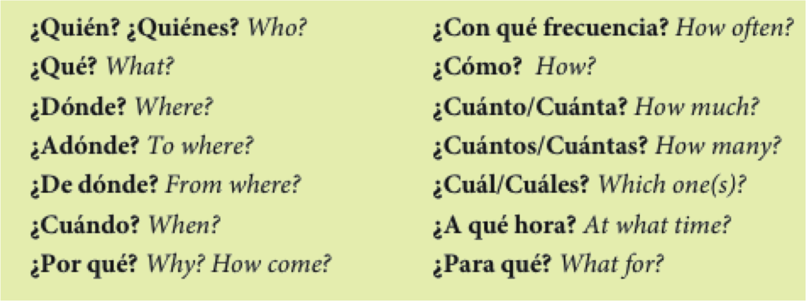

```{r setup, include=FALSE, cache=FALSE}
options(htmltools.dir.version = FALSE)
```

class: inverse, center, middle

# Repaso

---

background-image: url(./assets/img/abc.png)
background-size: contain
background-position: 120%
class: title-slide-section-blue

# El abecedario

---
background-image: url(./assets/img/sala1.png)
background-size: 750px
background-position: 50% 80%

# ¿Qué es esto? ¿Cómo se escribe?

---
background-image: url(./assets/img/ahorcado.gif)
background-size: contain
background-position: 120%
class: title-slide-section-blue

# El ahorcado

---
class: inverse, center, middle

# Los interrogativos

---

# Las preguntas

- de sí/no
- de información

---

# Preguntas de sí/no

- Inversión del sujeto/verbo

| Verbo   | Sujeto    | Otros elementos      |
|:--------|:----------|:---------------------|
| ¿Vive   | Martín    | en Madrid?           |
| ¿Comes  | (tú)      | fruta todos los días?|
| ¿Tenemos| (nosotros)| tarea?               |


</br>

- Sí, Martín vive en Madrid.

--

- No, no como fruta todos los días.

--

- No, no tenemos tarea.

---

# Preguntas de información

- Requieren una expressión interrogativa

| Expression interrogativa | Verbo    |  Sujeto     |
|:-------------------------|:---------|:------------|
| ¿Dónde                   | vive     | Martín?     |
| ¿Qué                     | comes    | (tú)?       |
| ¿Cuándo                  | es       | la reunión? |

---

# Con un compañero

<div align="center">
  
</div>

</br>

- Haced una lista de 4 preguntas (2 sí/no, 2 de información)
- Tened en cuenta la entonación

---
background-image: url(./assets/img/estados.png)
background-size: 650px
background-position: 100% 70%

# ¿Cómo estás?: Los estados y el verbo estar

**Yo estoy \_\_\_\_**  

Ej. Yo estoy cansado(a)

---

# Los pronombres personales

</br>

|    |    |  Singular      |    | Plural              |
|:---| :- | :--------------| :- | :------------------ |
| 1a |    |  yo            |    | nosotros/as         |
| 2a |    |  tú            |    | vosotros/as         |
| 3a |    |  él/ella/usted |    | ellos/ellas/ustedes |
| | &nbsp; &nbsp; &nbsp; | | &nbsp; &nbsp; &nbsp; | |

--

Pronombres no binarios: elle, elles, nosotres, vosotres

---

# El verbo estar

</br>

|    |    |  Singular              |    | Plural                        |
|:---| :- | :--------------------- | :- | :---------------------------- |
| 1a |    | yo **estoy**           |    | nosotros/as **estamos**       |
| 2a |    | tú **estás**           |    | vosotros/as **estáis**        |
| 3a |    | él/ella/usted **está** |    | ellos/ellas/ustedes **están** |
| | &nbsp; &nbsp; &nbsp; | | &nbsp; &nbsp; &nbsp; | |

---
background-image: url(../../site_libs/assets/img/confundido.png)
background-size: contain
background-position: 110% 50%

# ¿Cómo está(n)?

---
background-image: url(./assets/img/esta1.png)
background-size: 600px
background-position: 50% 60%

# ¿Cómo está(n)?

---
background-image: url(./assets/img/esta2.png)
background-size: 600px
background-position: 50% 70%

# ¿Cómo está(n)?

---
background-image: url(./assets/img/esta3.png)
background-size: contain
background-position: 100%

# ¿Cómo está(n)?

---
background-image: url(./assets/img/esta4.png)
background-size: contain
background-position: 100%

# ¿Cómo está(n)?

---
background-image: url(./assets/img/esta5.png)
background-size: contain
background-position: 100%

# ¿Cómo está(n)?

---
background-image: url(./assets/img/esta6.png)
background-size: contain
background-position: 100%

# ¿Cómo está(n)?

---
background-image: url(./assets/img/esta7.png)
background-size: contain
background-position: 100%

# ¿Cómo está(n)?

---
background-image: url(./assets/img/esta8.png)
background-size: contain
background-position: 100%

# ¿Cómo está(n)?

---

# Estrategias para la comunicación oral  

### ¿Cómo se hace una presentación?

--

- ¡Ensayar! ¡Ensayar! ¡Ensayar!

--

- Hablar lentamente

--

- Vocales puras

--

- Tensión bucal

--

- Practicad palabras largas por sílabas

---
class: inverse, center, middle

# Repaso

---

# Hemos visto

- Los saludos y las despedidas (cómo presentarse)

- El verbo ser

- El verbo estar

- Los pronombres personales

- Los interrogativos

<p></p>

- Tarea  
    - Usar **estar**, **ser** en conversaciones reales (mesa zunzún, o en alguna actividad co-curricular)
    - Estudiar el vocabulario


