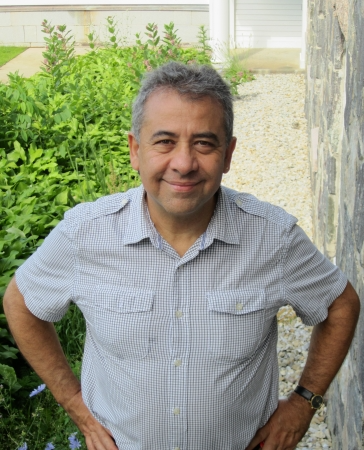
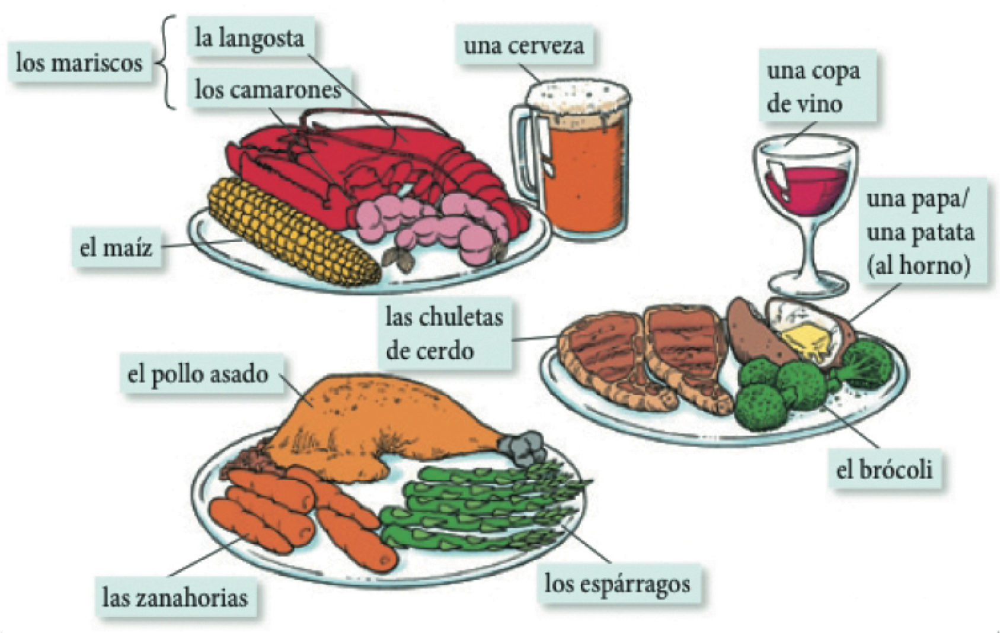
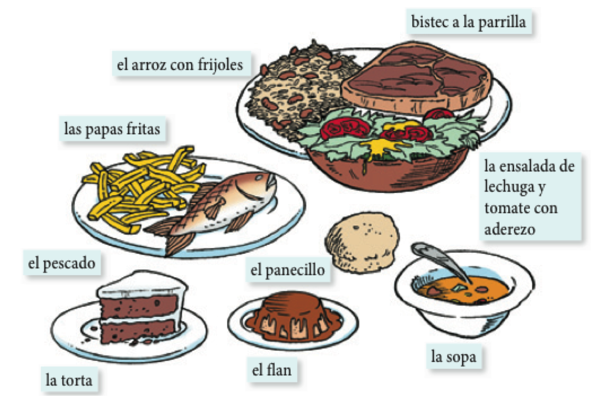
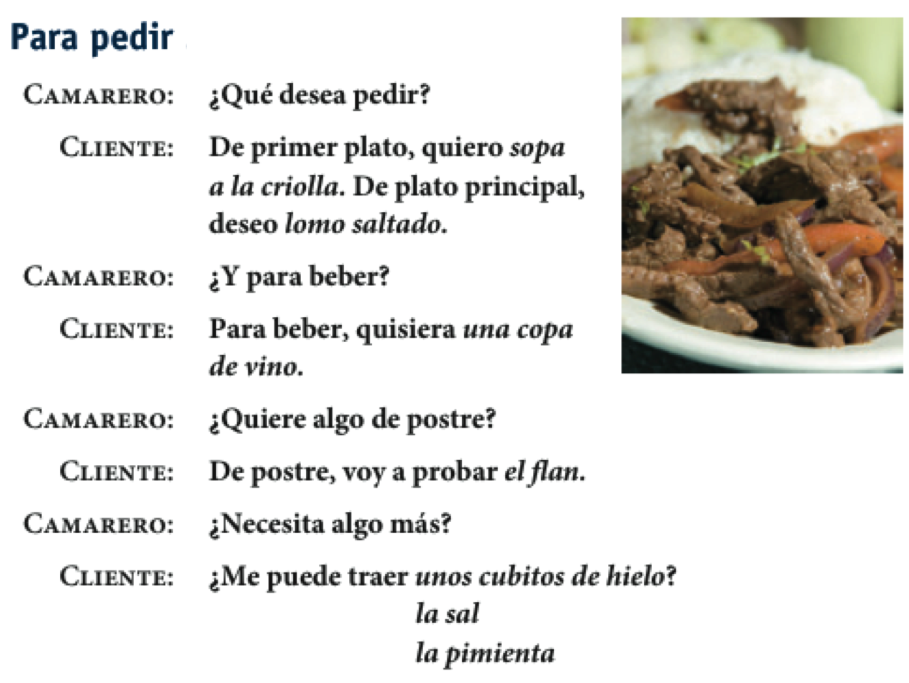

```{r setup, include=FALSE, cache=FALSE}
options(htmltools.dir.version = FALSE)
```


# Precalentamiento

## Con un/a compañer@...

1. **Escoged** un sitio en el mundo al cual te gustaría viajar (no sé lo digas 
al compañero).
2. Formad 3-5 frases completas que **incluyan**:
  - una descripción de lo que te gusta o no te gusta del sitio
  - el verbo .RUred[gustar]
3. **Compartid** las frases con el compañero para que ***adivine*** el sitio

--

¡**PISTA**!

- Es mejor usar frases que dan mucha información acerca del sitio
- Ej. 
  - (A mí) me gusta tomar el sol. 
  - (A mí) me gusta la arena. 
  - (A mí) me gusta nadar. 

---

# Presentación: Mi plato preferido

### Primeros pasos

--

- Escoge tu plato favorito (o un plato que *no* te guste)
- ¿Por qué te gusta? (o no)
- ¿Qué vocabulario necesitas para describirlo?


---
class: title-slide-section-grey, center, middle

<!-- día siguiente -->

# Más gustar

---
background-image: url(./assets/img/tiempolibre1.png)
background-size: 900px
background-position: 50% 70%

# ¿Qué le gusta hacer en su tiempo libre?

---
background-image: url(./assets/img/tiempolibre2.png)
background-size: 850px
background-position: 50% 70%

# ¿Qué le gusta hacer en su tiempo libre?

---

# El verbo gustar

### El verbo gustar tiene DOS formas<sup>1</sup>: **gusta** y **gustan**

| .RUred[Comp. Indirecto]  &nbsp; &nbsp; &nbsp; | .RUred[gusta]/.RUred[gustan] &nbsp; &nbsp; &nbsp; | .RUred[Sujeto] |
|:----------------------|:-------------|:--------------|
| Me                    | gust**a**    | jugar al tenis|
| Te                    | gust**a**    | el tenis      |
| Le                    | gust**a**    | el deporte    |
| Nos                   | gust**a**    | la clase      |
| Os                    | gust**a**    | Middlebury    |
| Les                   | gust**a**    | la lluvia     |

.footnote[
<sup>1</sup> Mentira.
]

---

# El verbo gustar

### El verbo gustar tiene DOS formas<sup>1</sup>: **gusta** y **gustan**

| .RUred[Comp. Indirecto]  &nbsp; &nbsp; &nbsp; | .RUred[gusta]/.RUred[gustan] &nbsp; &nbsp; &nbsp; | .RUred[Sujeto] |
|:----------------------|:-------------|:---------------------|
| Me                    | gust**an**   | los árboles          |
| Te                    | gust**an**   | el tenis y el fútbol |
| Le                    | gust**an**   | los deportes         |
| Nos                   | gust**an**   | las clases           |
| Os                    | gust**an**   | los edificios        |
| Les                   | gust**an**   | las nubes            |

.footnote[
<sup>1</sup> Mentira.
]

---

# ¿A ti qué te gusta hacer en tu tiempo libre?

- montar en bicicleta 

- jugar videojuegos 

- practicar el tenis 

- mirar una película de terror 

- bailar en una fiesta 

- ir de compras 

- correr por el campus 

- leer el periódico 

- practicar el básquetbol

---

# ¿Con qué frecuencia...

.pull-left[

</br>
</br>
</br>
</br>

- vas de compras?

- vas al cine?

]

.pull-right[

</br>
</br>
</br>

- a menudo

- a veces

- casi todos los días

- casi nunca

- nunca

]

---

# El énfasis y aclaración con gustar y los nombres.

| .RUred[Comp. Indirecto]  &nbsp; &nbsp; &nbsp; | .RUred[gusta]/.RUred[gustan] &nbsp; &nbsp; &nbsp; | .RUred[Sujeto] |
|:---------------------|:-------------|:--------------|
| **A mí** me          | gust**a**    | jugar al tenis|
| **A ti** te          | gust**a**    | el tenis      |
| **A él** le          | gust**a**    | el deporte    |
| **A nosotros** nos   | gust**a**    | la clase      |
| **A vosotros** os    | gust**a**    | Middlebury    |
| **A ellas** les      | gust**a**    | la lluvia     |

--

<midd-blockquote>

.center[
### **A Carlos** .RUred[le] .black[gusta] .white[pasar su tiempo libre en la residencia,] 

### .white[pero] **a Juan** .RUred[le] .black[gusta] .white[estudiar en su cuarto.]
]

</midd-blockquote>

---

# El énfasis y aclaración con gustar y los nombres.

| .RUred[Comp. Indirecto]  &nbsp; &nbsp; &nbsp; | .RUred[gusta]/.RUred[gustan] &nbsp; &nbsp; &nbsp; | .RUred[Sujeto] |
|:----------------------|:-------------|:--------------------|
| **A mí** me           | gust**an**   | los árboles         |
| **A ti** te           | gust**an**   | el tenis y el fútbol|
| **A él** le           | gust**an**   | los deportes        |
| **A nosotros** nos    | gust**an**   | las clases          |
| **A vosotros** os     | gust**an**   | los edificios       |
| **A ellas** les       | gust**an**   | las nubes           |

--

<midd-blockquote>

.center[
### **A Carlos** .RUred[le] .black[gustan] .white[los plátanos,] 

### .white[pero] **a Juan** .RUred[le] .black[gustan] .white[las manzanas.]
]

</midd-blockquote>

---

# ¿A tus amigos y a ti les gusta...

.pull-left[

</br>
</br>
</br>

- jugar videojuegos?

- patinar sobre el hielo?

- nadar?

]

.pull-right[

</br>
</br>
</br>

- Sí, nos gusta mucho.

</br>

- No, no tanto.

]

---

# Cuando NO usamos gustar

.center[



¿Me gusta el director?

]

- ¡NO! 
--
(o sí 🤷🏽‍♀️)

--

- Me cae bien el director.

--

- Me llevo bien con el director.

---
class: title-slide-section-grey, middle

# Los verbos .RUred[tener] e .RUred[ir]

---

# El verbo *tener*

.center[

|             |                        | .blue[Singular] |                       | .blue[Plural]  |
| :---------- | :--------------------- | :-------------- | :-------------------- | :------------- |
| .RUred[1a]  | .grey[yo]              | tengo           | nosotros/as           | tenemos        |
| .RUred[2a]  | .grey[tú]              | tienes          | vosotros/as           | tenéis         |
| .RUred[3a]  | .grey[él, ella, usted] | tiene           | ellos, ellas, ustedes | tienen         |

]

--

- Posesión
  - Tengo tres gatos
  - Tienes una casa bonita
  - Los estudiantes tienen un examen

- Obligación (tener que + inf.)
  - **Tengo que** estudiar.
  - Tenemos que hacer mucha tarea para aprobar la clase

- Frases/expersiones especiales

---

# El verbo *tener*

### Expresiones con el verbo *tener*

.pull-left[

- tener hambre
- tener sed
- tener frío
- tener calor
- tener celos
- tener miedo
- tener razón

]

.pull-right[

- tener suerte
- tener sueño
- tener prisa
- tener X años
- tener ganas de

]

---

# El verbo ir

|     |    | Singular             |    | Plural                      |
| :-- | :- | :------------------- | :- | :-------------------------- |
| 1a  |    | yo **voy**           |    | nosotros/as **vamos**       |
| 2a  |    | tú **vas**           |    | vosotros/as **vais**        |
| 3a  |    | él/ella/usted **va** |    | ellos/ellas/ustedes **van** |
| | &nbsp; &nbsp; &nbsp; | | &nbsp; &nbsp; &nbsp; | |

--

- Ir a + sustantivo (movimiento, ¿Adónde vas?)
  - **Voy a** la biblioteca
  - **Vamos a** la playa

- Ir a + infinitivo (futuro, ¿Qué vas a hacer?)
  - **Voy a** estudiar
  - Los estudiantes **van a** estudiar este fin de semana

---
background-image: url(./assets/img/tenerser.png)
background-size: 750px
background-position: 50% 50%

---


class: title-slide-section-grey

<!-- d'ia nuevo -->

---
background-image: url(./assets/img/1a.png)
background-size: contain

---
background-image: url(./assets/img/1b.png)
background-size: contain

---
background-image: url(./assets/img/2a.png)
background-size: contain

---
background-image: url(./assets/img/2b.png)
background-size: contain

---
class: inverse, middle
background-image: url(../../site_libs/assets/img/scared.gif)
background-position: 100% 50%
background-size: 400px

# Algunos verbos irregulares

---

# Los verbos irregulares con -go: la forma yo

</br>

.Large[
| Infinitivo |    |   Yo       |    |            Otras personas           |
| :--------- | :- | :--------- | :- | :---------------------------------- |
| hacer      |    | **hago**   |    | haces, hace, hacemos, hacéis, hacen |
| poner      |    | **pongo**  |    | pones, pone, ponemos, ponéis, ponen |
| salir      |    | **salgo**  |    | sales, sale, salimos, salís, salen  |
| traer      |    | **traigo** |    | traes, trae, traemos, traéis, traen |
| | &nbsp; &nbsp; | | &nbsp; &nbsp; | |
]

---

# Los números de 100 a 10,000,000

.center[

]

---

# ¿Sabes mucha historia?

- Haz una lista de 3 acontecimientos históricos importantes

- Cuéntale a tu compañero/a el acontecimiento para que adivine el año

- Ej. 

  - En este año, Cristóbal Colón hace un viaje al nuevo mundo buscando especias. 

--

  - **1492** (mil cuatrocientos noventa y dos)

---


class: inverse, middle, center

<!-- más descripción -->

# Más descripción

---

# La familia

<div style="float: left">
  
</div>

<div style="float: right">
  
</div>

---

# ¿Cómo es tu familia?

- Mi hermano mayor se llama...
- Mi padre tiene ... años.
- Mi tía vive en...

</br>

<div align="center">
  
</div>

<!-- 
actividad 
Describir tu familia al compañero, el/ella tiene que dibujar el árbol
-->

---

# Mi árbol genealógico

- En una hoja de papel dibujad una imagen de tu compañero.

- Debajo de la imagen, pon su nombre.

- Tu compañero/a va a describir su familia para que dibujes su árbol.

- Tienes que describir claramente tu familia y ayudar a tu compañero/a 

- Tienes que tener paciencia 

---


<!-- la comida --> 

# El desayuno: ¿Qué te gusta desayunar?

<div align="center">
  <iframe width="420" height="315" src="https://www.youtube.com/embed/SilOmnTK-z8" frameborder="0" allowfullscreen></iframe>
</div>

<!-- pregunta qué les gusta desayunar -->

---

# El desayuno: ¿Qué te gusta desayunar?

.center[

]

---

# El almuerzo: ¿Qué almuerzas?

.center[

]

<!-- preguntar al compa;ero lo que suele almorzar -->

---

# La merienda: ¿Qué meriendas?

.center[

]

<!-- que es una merienda? -->

---

# La cena: ¿Qué prefieres cenar?

.center[

]

---

# ¿A qué no puedes adivinar?

En grupos de tres...

- Cread (individualmente) una lista de 5 comidas (desayuno, almuerzo, 
merienda, cena)
- En turnos, describid una de las comidas de tu lista para que vuestros 
compañeros la adivinen

Ejemplo:

- **Tú**: Es un plato de huevos y queso
- .RUred[Compañero]: ¡Es una tortilla!

Ejemplo:

- .RUred[Compañero]: Es algo que comemos por la mañana con mermelada o mantequilla.
- **Tú**: Es el pan tostado.

---

# En el restaurante: antes de pedir

.center[

]

<!-- track 2-4 -->

---

# Para pedir en un restaurante...

.center[

]

<!-- track 2-5 --> 

---

# Después de comer: la cuenta

.center[

]

<!-- track 2-6 -->

---

# Los cubiertos

.center[

]

---

class: title-slide-section-blue, center, bottom
background-image: url("./assets/img/moana.gif")
background-size: contain
background-position: 50%, 50%

# ¿Cuáles son tus estrategias para la comprensión auditiva?

---


