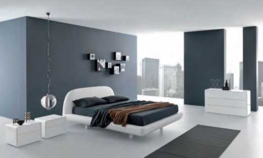

```{r setup, include=FALSE, cache=FALSE}
options(htmltools.dir.version = FALSE)
```

background-image: url(./assets/img/mascotas1.png)
background-size: 450px
background-position: 95% 50%

# Las mascotas

- ¿Cuántas mascotas tienes?

- ¿Qué tipos de mascotas hay en tu casa?

---
background-image: url("./assets/img/mayaKinoXmas.png")
background-size: contain
class: inverse

---

# La familia

<div style="float: left">
  
</div>

<div style="float: right">
  
</div>

---

# ¿Cómo es tu familia?

- Mi hermano mayor se llama...
- Mi padre tiene ... años.
- Mi tía vive en...

</br>

<div align="center">
  
</div>

---
background-image: url(./assets/img/familia2.png), url(./assets/img/familia1.png)
background-size: 500px, 700px
background-position: 5% 60%, 100% 50%

# La familia

---

# Mi árbol genealógico

- En una hoja de papel dibujad una imagen del profe

--

- Debajo de la imagen, pon "Joseph".

--

- Escuchad la descripción y rellenad el árbol.

---

# Mi árbol genealógico

- En una hoja de papel dibujad una imagen de tu compañero.

- Debajo de la imagen, pon su nombre.

- Tu compañero/a va a describir su familia para que dibujes su árbol.

- Tienes que describir claramente tu familia y ayudar a tu compañero/a 

- Tienes que tener paciencia 

---


class: inverse, center, middle

# Verbos irregulares

---

# Verbos irregulares

### Verbos con cambio en la raíz

.Large[

| El infinitivo | la raíz |     |   el cambio    |    Ej.    |
| :------------ | :-----: | :-: | :------------: | :-------- |
| &nbsp;        |         |     |                |           |
| pensar        | pens-   |     | p.RUred[ie]ns  | Yo pienso |
|               | **e**   |  →  | **ie**         |           |
| &nbsp;        |         |     |                |           |
| volver        | volv-   |     | v.RUred[ue]lv- | Yo vuelvo |
|               | **o**   |  →  | **ue**         |           |
| &nbsp;        |         |     |                |           |
| pedir         | ped-    |     | p.RUred[i]d-   | Yo pido   |
|               | **e**   |  →  | **i**          |           |

]

---

# Verbos irregulares

### Los verbos con el cambio **e** → **ie**

.center[
.large[
|     Pensar    |             | &nbsp; |                     |             |
| :------------ | :---------- | :----- | :------------------ | :---------- |
| yo            | p**ie**nso  |        | nosotros            | pensamos    |
| tú            | p**ie**nsas |        | vosotros            | pensáis     |
| él/ella/usted | p**ie**nsa  |        | ellos/ellas/ustedes | p**ie**nsan |
]
]

--

### Ejemplos

- emp.RUred[e]zar
- pref.RUred[e]rir
- qu.RUred[e]rer
- recom.RUred[e]ndar

.footnote[
.Large[¡.RUred[OJO]! No hay cambio en las formas de **nosotros**/**vosotros**]
]

---

# Verbos irregulares

### Los verbos con el cambio **o** → **ue**

.center[
.large[
|     Volver    |             | &nbsp; |                     |             |
| :------------ | :---------- | :----- | :------------------ | :---------- |
| yo            | v**ue**lvo  |        | nosotros            | volvemos    |
| tú            | v**ue**lves |        | vosotros            | volvéis     |
| él/ella/usted | v**ue**lve  |        | ellos/ellas/ustedes | v**ue**lven |
]
]

--

### Ejemplos

- c.RUred[o]star
- p.RUred[o]der
- d.RUred[o]rmir

.footnote[
.Large[¡.RUred[OJO]! No hay cambio en las formas de **nosotros**/**vosotros**]
]

---

# Verbos irregulares

### Los verbos con el cambio **e** → **i**

.center[
.large[
|     Pedir     |           | &nbsp; |                     |            |
| :------------ | :-------- | :----- | :------------------ | :--------- |
| yo            | p**i**do  |        | nosotros            | pedimos    |
| tú            | p**i**des |        | vosotros            | pedís      |
| él/ella/usted | p**i**de  |        | ellos/ellas/ustedes | p**i**den  |
]
]

--

### Ejemplos

- p.RUred[e]dir
- s.RUred[e]guir
- s.RUred[e]rvir

.footnote[
.Large[¡.RUred[OJO]! No hay cambio en las formas de **nosotros**/**vosotros**]
]

---


# Verbos irregulares

### Jugar: el cambio **u** → **ue**

.center[
.large[
|     Jugar     |            | &nbsp; |                     |            |
| :------------ | :--------- | :----- | :------------------ | :--------- |
| yo            | j**ue**go  |        | nosotros            | jugamos    |
| tú            | j**ue**gas |        | vosotros            | jugáis     |
| él/ella/usted | j**ue**ga  |        | ellos/ellas/ustedes | j**ue**gan |
]
]

--

### Ejemplo

- J.RUred[ue]go al golf todos los días.

.footnote[
.Large[¡.RUred[OJO]! No hay cambio en las formas de **nosotros**/**vosotros**]
]

---

# Actividad

.pull-left[

### Crowdsourcing un cuento

- Utilizando la lista de verbos que está a la derecha, escribe una frase 
corta en una hoja de papel. 
  - Puede ser una frase simple (SVO). 
  - Intenta usar vocabulario nuevo. 

<p></p>

- Cuando el profesor diga, mándale el cuento a alguien de tu grupo por mensaje 
**privado**.

<p></p>

- Lee lo que está escrito y añade una frase más. 
  - Tienes que usar uno de los verbos de la lista. 
  - Sólo puedes añadir **una** frase. 

<p></p>

- Repite.

]

--

.pull-right[

### Verbos

- jugar
- querer
- seguir
- servir
- pedir
- poder
- dormir
- empezar
- costar
- preferir
- recomendar

]


---

# Precalentamiento

.pull-left[

- En grupos de 3, describid la situación más 
buena/mala/divertida/rara/graciosa que habéis tenido en un restaurante

- Después de contar vuestras historias, escoged una y haced un mini diálogo 
para compartir con la clase.

]

---
background-image: url(./assets/img/spiderman.jpg)
background-size: contain
class: bottom

--

# .white[Spiderman (1) ve al Spiderman (2)]

--

# .white[Spiderman (2) ve al Spiderman (1)]

--

# .white[Ellos se ven]

---
background-image: url(./assets/img/doghug.png)
background-size: contain
background-position: 200% 50%
class: middle

--

## Kino abraza a Maya

--

## Maya abraza a Kino

--

## Ellos se abrazan

---
background-image: url(./assets/img/naruto.png)
background-size: contain
background-color: black

---
background-image: url(./assets/img/globos.jpg)
background-size: contain
background-color: black

---

# Para expresar reciprocidad

### Verbos recíprocos

- Verbos que se usan para expresar acciones mútuas

- 2 o más personas participan en una acción que hacen el uno al otro

- Incluye un pronombre recíproco, siempre en plural

--

### Ejemplos

- Marta y yo **nos** .RUred[amamos]

- Ustedes **se** .RUred[conocen]

- Rocío y Joseph **se** .RUred[casan]

- Vosotras **os** .RUred[ayudáis] con la tarea 

---

# Para expresar reciprocidad

### Pronombres recíprocos

| Persona   | Pronombre | Ejemplo                                             |
| :-------- | :-------- | :-------------------------------------------------- |
| Primera   | nos       | **Nos** .RUred[vemos] *el uno al otro* en el pasillo. |
|           |           | .white[.]                                             |
| Segunda   | os        | **Os** .RUred[escribís] *mutuamente* durante el verano. |
| \*Segunda | se        | Ustedes **se** .RUred[ayudan] *recíprocamente*.         |
|           |           | .white[.]                                             |
| Tercera   | se        | Los niños **se** .RUred[pelean] *entre sí*.             |

--

</br>

.pull-left[
.content-box-blue[
¡.RUred[OJO]! Si se trata de una contrucción de reciprocidad siempre se puede 
incluir una expresión tipo *el uno al otro*, *mutuamente*, *recíprocamente*, 
*entre sí*, *entre ellos*, etc. 
]
]

--

.pull-right[
.content-box-red[
\*En la mayoría de las variedades del español **se** representa 
semánticamente la segunda persona plural (ustedes), aunque su forma es 
gramaticalmente la tercera persona plural.
]
]

---

# Para expresar reciprocidad

### Verbos comunes

- abrazarse
- conocerse
- mirarse
- ayudarse
- despedirse
- pelearse
- besarse
- divorciarse
- reunirse
- casarse
- estrellarse

--

background-image: url(./assets/img/crash.gif)
background-size: 450px
background-position: 85% 50%

--

background-image: url(./assets/img/hug.gif)
background-size: 450px
background-position: 85% 50%

--

background-image: url(./assets/img/despedirse.gif)
background-size: 450px
background-position: 85% 50%

--

background-image: url(./assets/img/kisses.gif)
background-size: 450px
background-position: 85% 50%

--

background-image: url(./assets/img/pulgas.gif)
background-size: 450px
background-position: 85% 50%

--

background-image: url(./assets/img/scratch.gif)
background-size: 450px
background-position: 85% 50%


---


# ¿Cómo es la casa?: describir características de la casa

<div align="center">
  <div style="float: left">
  
  </div>
  <div align="right">
  
  </div>
</div>

</br>

--

- Mi casa es **nueva** (**vieja**).
- La sala es **grande** y **cómoda**.
- Los muebles son **elegantes**.


---

# ¿Cómo es la casa?: describir la casa, los cuartos y los muebles

<div align="center">
  <div style="float: left">
  
  </div>
  <div align="right">
  
  </div>
</div>

</br>

--

- Normalmente, mi cuarto está **ordenado** (**desordenado**).
- Por lo general, la cocina está **limpia**.
- Por desgracia, el **refrigerador** está **descompuesto** y la **ventana** está **rota**.

---

# ¿Dónde vive la familia?: la casa

<div align="center">
  
</div>

---

# Las relaciones espaciales - ¿Dónde está el gato?

<div align="center">
  
</div>

---

# Veo veo

- Escoge un objeto

--

- Describe su ubicación dentro de la habitación con relación a otros objetos

--

- Ej.  
Veo un objeto  
Está al lado de la lámpara  
Está encima del mueble que está al lado de la cama

--

- Si aciertas, ganas un punto

--

- Juega hasta conseguir 5 puntos

---
background-image: url(./assets/img/room.jpg)
background-size: contain

