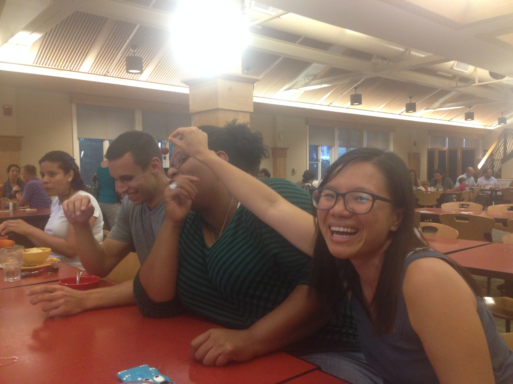
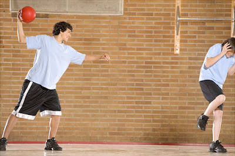

```{r setup, include=FALSE, cache=FALSE}
options(htmltools.dir.version = FALSE)
```

class: inverse, middle, center

# Complemento indirecto

---

# Los complementos indirectos

### Expresan ¿a quién? o ¿para quién?

Siempre **les** sirvo *vino* **a mis invitados**.

--

### ¿Qué sirvo? 

- *El vino*  
(el complemento directo)

--

### ¿A quién sirvo? 

- **A mis invitados**  
(el complemento indirecto)

---
background-image: url("https://www.wpclipart.com/signs_symbol/arrows/BW_arrows/arrow_BW_thin_left.png")
background-position: 47% 38%
background-size: 60px

# Los complementos indirectos

|  Singular         |    |        |    |  Plural               |    |         |
| :---------------- | :- | :----- | :- | :-------------------- | :- | :------ |
| yo                |    | **me** |    | nosotros              |    | **nos** |
| tú                |    | **te** |    | vosotros              |    | **os**  |
| usted, él, ella   |    | <blue>le</blue> |    | ustedes, ellos, ellas |    | <blue>les</blue> |
| | &nbsp; | | &nbsp; &nbsp; &nbsp; | | &nbsp; | |

</br>

- ¿**Me** puede traer una cuchara?

- Siempre **les** preparo las galletas.

---

# Los complementos indirectos

### La posición de los complementos indirectos pronominales depende de la forma verbal

--

#### Con un verbo conjugado

- ¿Cuánto **le** debo?

--

#### Con un verbo conjugado y un infinitivo

- ¿**Me** puede traer un tenedor?
- ¿Puede traer**me** un tenedor?

---

# Los complementos indirectos

### Muchas veces el complemento indirecto <blue>y</blue> el pronombre de complemento indirecto aparecen en la misma oración para evitar la confusión

- Siempre **le** sirvo platos vegetarianos **a María**.

- **Les** voy a servir una sopa **a mis invitados**.

---
class: inverse-title-slide-grey, middle

# Dos complementos...

---

# Dos complementos: directo e indirecto

.pull-left[

### <blue>CD</blue>

|        |    | singular |    |  plural  |
| :----- | :- | :------- | :- | :------- |
| 1a     |    | me       |    | nos      |
| 2a     |    | te       |    | os       |
| 3a     |    | lo, la   |    | los, las |
| | &nbsp; &nbsp; | | &nbsp; &nbsp; |

]

.pull-right[

### **CI**

|        |   | singular |    | plural |
| :----- |:- | :------- | :- | :----- |
| 1a     |   | me       |    | nos    |
| 2a     |   | te       |    | os     |
| 3a     |   | le       |    | les    |
| | &nbsp; &nbsp; | | &nbsp; &nbsp; |

]

---

# Dos complementos: directo e indirecto

</br></br></br>

.center[

### Mami, ¿**me** haces <blue>unas galletas</blue>?

]

--

.center[

### Sí, **te** <blue>las</blue> hago esta tarde.

]

---

# Dos complementos: directo e indirecto

### Mami, ¿**me** haces <blue>unas galletas</blue>?

- ¿Qué haces?  
  - unas galletas (el complemento directo)
- ¿A quién o para quién?  
  - a mí (me) (el complemento indirecto)

--

### Sí, **te** <blue>las</blue> hago esta tarde.

- Te = para ti
- las = las galletas

---

# A veces "le" y "les" cambian a "se"

</br></br>

<div align="center">
  
</div>

</br>

--

- ¿Me puede traer un menú?
- Ahora **se** lo traigo. 

---

# ¿Qué pasa?

<div align="center">
  
</div>

--

.pull-left[

### El perro come *las pelotas de tenis*

]

--

.pull-right[

### *Las* come. 

]

---

# ¿Qué pasa?

<div align="center">
  
</div>

--

.pull-left[

### Ari **le** da .RUred[una manzana] **a la maestra**.

]

--

.pull-right[

### **Se** .RUred[la] da.

]

---

# ¿Qué pasa?

<div align="center">
  
</div>

--

.pull-left[

### Jing **le** da .RUred[uvas] **a Kim**.

]

--

.pull-right[

### **Se** .RUred[las] da.

]

---

# ¿Qué pasa?

<div align="center">
  
</div>

--

.pull-left[

### El niño **le** va a regalar .RUred[una sorpresa] **a la niña**.

]

--

.pull-right[

### **Se** .RUred[la] va a regalar.  
### Va a regalár**se**.RUred[la].

]

---

# ¿Qué pasa?

<div align="center">
  
</div>

---

# ¿Qué pasa?

<div align="center">
  
</div>
