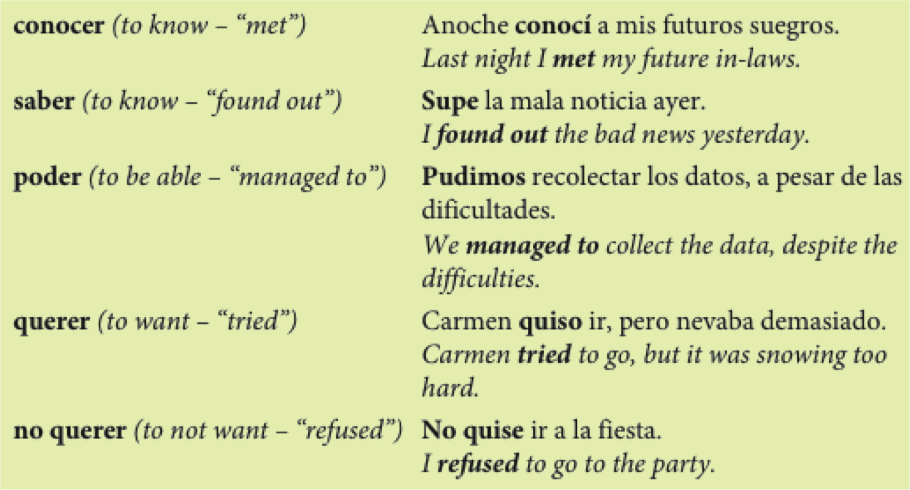

```{r setup, include=FALSE, cache=FALSE}
options(htmltools.dir.version = FALSE)
```

class: title-slide-section-grey, middle

# El pretérito (verbos irregulares)


---

# Algunos verbos irregulares en el pretérito:

|                  |    |    ir    |    |   ser    |    |   dar   |    |   ver   |
| :--------------- | :- | :------- | :- | :------- | :- | :------ | :- | :------ |
| yo               |    | fui      |    | fui      |    | di      |    | vi      |
| tú               |    | fuiste   |    | fuiste   |    | diste   |    | viste   |
| Ud./él/ella      |    | fue      |    | fue      |    | dio     |    | vio     |
| nosotros(as)     |    | fuimos   |    | fuimos   |    | dimos   |    | vimos   |
| vosotros(as)     |    | fuisteis |    | fuisteis |    | disteis |    | visteis |
| Uds./ellos/ellas |    | fueron   |    | fueron   |    | dieron  |    | vieron  |
| | &#160; &#160; | | &#160; &#160; | | &#160; &#160; | | &#160; &#160; | |

---

# Algunos verbos irregulares en el pretérito: 

### Los verbos con .RUred[u] en la raíz


|      estar      |    |     poder     |    |     poner     |    |     saber     |    |     tener     |
| :-------------- | :- | :------------ | :- | :------------ | :- | :------------ | :- | :------------ |
| estuv**e**      |    | pud**e**      |    | pus**e**      |    | sup**e**      |    | tuv**e**      |
| estuv**iste**   |    | pud**iste**   |    | pus**iste**   |    | sup**iste**   |    | tuv**iste**   |
| estuv**o**      |    | pud**o**      |    | pus**o**      |    | sup**o**      |    | tuv**o**      |
| estuv**imos**   |    | pud**imos**   |    | pus**imos**   |    | sup**imos**   |    | tuv**imos**   |
| estuv**isteis** |    | pud**isteis** |    | pus**isteis** |    | sup**isteis** |    | tuv**isteis** |
| estuv**ieron**  |    | pud**ieron**  |    | pus**ieron**  |    | sup**ieron**  |    | tuv**ieron**  |
| | &#160; &#160; | | &#160; &#160; | | &#160; &#160; | | &#160; &#160; | |

---

# Algunos verbos irregulares en el pretérito: 

### Los verbos con .RUred[i] en la raíz

|     hacer     |    |     querer     |    |     venir     |
| :------------ | :- | :------------- | :- | :------------ |
| hic**e**      |    | quis**e**      |    | vin**e**      |
| hic**iste**   |    | quis**iste**   |    | vin**iste**   |
| hiz**o**      |    | quis**o**      |    | vin**o**      |
| hic**imos**   |    | quis**imos**   |    | vin**imos**   |
| hic**isteis** |    | quis**isteis** |    | vin**isteis** |
| hic**ieron**  |    | quis**ieron**  |    | vin**ieron**  |
| | &#160; &#160; | | &#160; &#160; | |
---

# Algunos verbos irregulares en el pretérito: 

### Los verbos con .RUred[j] en la raíz

|     conducir     |    |     decir     |    |     traer      |
| :--------------- | :- | :------------ | :- | :------------- |
| conduj**e**      |    | dij**e**      |    | traj**e**      |
| condu**jiste**   |    | di**jiste**   |    | tra**jiste**   |
| condu**jo**      |    | di**jo**      |    | tra**jo**      |
| condu**jimos**   |    | di**jimos**   |    | tra**jimos**   |
| condu**jisteis** |    | di**jisteis** |    | tra**jisteis** |
| condu**jeron**   |    | di**jeron**   |    | tra**jeron**   |
| | &#160; &#160; | | &#160; &#160; | |
---

# ¿Qué pasó?

<div align="center">
  <video width="450" allowfullscreen controls>
    <source src="./assets/videos/maya.mp4" type="video/mp4">
    <source src="./assets/videos/maya.ogg" type="video/ogg">
  </video>
</div>

---

# El pretérito (irregulares)

.pull-left[

- tener
- estar
- ir
- ser
- poner
- poder
- traer
- hacer

]

.pull-right[

- haber
- saber
- querer
- decir
- venir
- ver
- dar

]

---

# El pretérito (irregulares)

<iframe width="560" height="315" src="https://www.youtube.com/embed/iFUAWMMdE7c" frameborder="0" allowfullscreen></iframe>

---

# El pretérito (irregulares)

<div style="float: right">
  
</div>

**tener** es tuve,  
**estar** es estuve  
**ir** es fui, y tambien **ser**  
**poner** es puse, **poder** es pude  
traje es para **traer**  


**hacer** hice, **haber** hube  
**saber** supe, **querer** quise  
**decir** dije, **venir** vine  
**ver** vi, **dar** di  
sin acentos

<audio controls>
  <source src="./assets/videos/pretIrreg.ogg" type="audio/ogg">
  <source src="./assets/videos/pretIrreg.m4a" type="audio/mpeg">
Your browser does not support the audio element.
</audio>

---

# Hay verbos con significados particulares en el pretérito.

<div align="center">
  
</div>

---


# Resumen - los tiempos verbales

### Las conversaciones normalmente incluyen el presente, el pasado y el futuro.

**Carmen**: Oye, Silvia, ¿Qué <black>vas a hacer</black> este fin de semana?  

.RUred[Silvia]: ¡<black>Voy a estudiar</black>! La próxima semana <black>va a ser</black> muy ajetreada.  

**Carmen**: Chica, prácticamente <black>vives</black> en la biblioteca.  

.RUred[Silvia]: Sí, <black>es</black> cierto. Pero, ¿sabes?, <black>me gusta estudiar</black>. Mis clases <black>son</black> muy interesantes y <black>me encantan</black> mis profesores.  

**Carmen**: ¿Y el profesor Suárez?  

.RUred[Silvia]: Bueno, él sí <blac>es</blac> quisquilloso. La semana pasada nos <black>dio</black> un examen sobre la época medieval y <black>fue</black> dificilísimo. 

---

# Resumen - los tiempos verbales

### El futuro puede expresarse con verbos en el tiempo presente.

- Ir + a + infinitivo
  - **Voy a estudiar** este fin de semana.

--

- Expresiones del futuro
  - La próxima semana
  - el año que viene

--

- Otros verbos que expresan el futuro
  - **Pienso vivir** en la residencia el próximo semestre.
  - **Espero trabajar** en un banco en el futuro. 

---

# Resumen - los tiempos verbales

### El tiempo presente expresa las costumbres de la vida diaria.

--

- Palabras importantes: 
  - todos los días, frecuentemente, a menudo, a veces  

Todos los días estudio por dos o tres horas.

---

# Resumen - los tiempos verbales

### Se usa **el pretérito** para expresar el pasado.  


- UNA acción o evento que ocurrió UNA vez.

--

- una SERIE de acciones en el pasado.

--

- una acción que DURÓ un tiempo específico.

--

- UN EVENTO ESPECÍFICO en el pasado.

</br>

**Palabras asociadas al pretérito:**

--

- ayer, la semana pasada, el año pasado, primero, luego
- antes de/después de + infinitivo, por último

---

# Ahora, identifiquen los tiempos verbales en esta conversación:

**Carmen**: Oye, Silvia, ¿Qué <black>vas a hacer</black> este fin de semana?  

.RUred[Silvia]: ¡<black>Voy a estudiar</black>! La próxima semana <black>va a ser</black> muy ajetreada.  

**Carmen**: Chica, prácticamente <black>vives</black> en la biblioteca.  

.RUred[Silvia]: Sí, <black>es</black> cierto. Pero, ¿sabes?, <black>me gusta estudiar</black>. Mis clases <black>son</black> muy interesantes y <black>me encantan</black> mis profesores.  

**Carmen**: ¿Y el profesor Suárez?  

.RUred[Silvia]: Bueno, él sí <blac>es</blac> quisquilloso. La semana pasada nos <black>dio</black> un examen sobre la época medieval y <black>fue</black> dificilísimo. 

---

# Cambios ortográficos en la forma yo

### -car (buscar, tocar, sacar) 

- c > qu
- **toqué**, tocaste, tocó, tocamos, tocasteis, tocaron

--

### -gar (llegar, jugar, pagar) 

- g > gu
- **llegué**, llegaste, llegó, llegamos, llegasteis, llegaron

--

### -zar (empezar, almorzar) 

- z > c
- **empecé**, empezaste, empezó, empezamos, empezasteis, empezaron

---

# Los verbos de –er y –ir con una vocal: Leer, creer y caerse

### Leer

- leí, leíste, le**y**ó, leímos, leísteis, le**y**eron

--

### Creer

- creí, creíste, cre**y**ó, creímos, creísteis, cre**y**eron

--

### Caerse

- me caí, te caíste, se ca**y**ó, nos caímos, os caísteis, se ca**y**eron

---

# Verbos con cambios en la raíz en el pretérito: 

|                  |     |       e > i        |     |     o > u     |
| :--------------- | :-- | :----------------- | :-- | :------------ |
|                  |     | <blue>div**e**rtirse</blue> | | <blue>d**o**rmir</blue>    |
| yo               |     | me divertí         |     | dormí         |
| tú               |     | te divertiste      |     | dormiste      |
| Ud./él/ella      |     | se div**i**rtió    |     | d**u**rmió    |
| nosotros(as)     |     | nos divertimos     |     | dormimos      |
| vosotros(as)     |     | os divertisteis    |     | dormisteis    |
| Uds./ellos/ellas |     | se div**i**rtieron |     | d**u**rmieron |
| | &#160; &#160; &#160; | | &#160; &#160; &#160; | |

</br>

- ¡**OJO**!: Estos cambios sólo ocurren en la tercera persona (o segunda persona formal)  
(Ud., él, ella y Uds., ellos, ellas)

---
background-image: url("http://nationalinterest.org/files/styles/main_image_on_posts/public/main_images/uss_new_jersey_6219214852.jpg?itok=gO7-Wwi6")
background-position: 50% 65%
background-size: 500px

# Batalla naval

- Poned vuestros barcos en el papel
- Conjugad los verbos en el pretérito para hundir 
los de tu compañer@

---
background-image: url(https://raw.githubusercontent.com/jvcasillas/media/master/teaching/img/think.png)
background-position: 95% 50%

# Los pronombres después de preposiciones

### ¿Recordáis?

- (<blue>A</blue> **mí**) me gusta el chocolate. 

--

- (<blue>A</blue> **nosotros**) nos interesa el tema. 

--

- (<blue>A</blue> **ellas**) les motiva el tiempo. 

--

- Les parece bien la idea (<blue>a</blue> **ustedes**). 

--

### ¿Qué tienen en común?

--

- También son pronombres

--

- También aparecen detrás de otras preposiciones

---

# Los pronombres después de preposiciones

.pull-left[

- **Rick**: ¿Este café es <black>para mí</black>?
- .RUred[Chad]: ¿<black>Para ti</black>? ¡No! Ese café es <black>para ella</black>.

<p></p>

- **Grace**: ¿Quién habla <black>de nosotros</black>?
- .RUred[Ari]: Sólo hablan <black>de ti</black>.

<p></p>

- **Sara**: ¿Vienes <black>con nosotras</black> al senderismo?
- .RUred[Aviva]: Sí. No quiero ir <black>sin ustedes</black>. 

]

--

.pull-right[

|       |                      |                       |
| :---- | :------------------: | :-------------------- |
| a     |                      | mí                    |
| de    |                      | ti                    |
| para  |                      | usted, él, ella       |
| por   |          +           | nosotros/as           |
| sin   |                      | vosotros/as           |
| sobre |                      | ustedes, ellos, ellas |
| | &#160; &#160; &#160; &#160; &#160; &#160; | |

]

--

### ¡**Ojo**! Excepciones...

--

con + mí = conmigo  
con + ti = contigo

- **Carmen**: Oye, Madeline La fiesta es mañana. ¿Quieres ir <black>conmigo</black>?
- .RUred[Madeline]: No puedo ir <black>contigo</black>, Carmen Todavía no tengo disfraz. 

<p></p>

--

<p></p>

- **Camila**: Oye, ¿crees que los profesores trabajan mucho?
- .RUred[Susan]: Dicen que sí, pero **entre tú y yo**, creo que mienten. 

---

# Actividad

### Haciendo planes

- ir al cine/teatro  
A: ***¿Cuándo puedes ir al cine conmigo?***  
B: ***Nunca puedo ir contigo.***

1. estudiar español
2. ir a Dos Hermanos
3. jugar al vóleibol
4. preparar una fiesta
